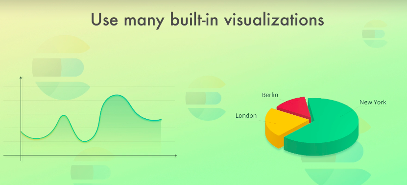

This course focuses on Elasticsearch, but I want to take a moment to talk about a fewother technologies that are related to Elasticsearch.

Together with Elasticsearch, they form what’s referred to as the Elastic Stack, so let’s talk a bit about that.

If you already know what the Elastic Stack is all about or if you just care about Elasticsearch, then you are welcome to skip this lecture, but I do recommend that you stick around.

The Elastic Stack consists of technologies developed and maintained by the company behind Elasticsearch.

We just talked about Elasticsearch, which is the heart of the Elastic Stack, meaning that the technologies that I am about to tell you about, generally interact with Elasticsearch, although it’s optional for some of them.

However, there is a strong synergy between the technologies, so they are frequently used together for various purposes.

Alright, so let’s begin by talking about something called **Kibana**.

Kibana is an analytics and visualization platform, which lets you easily visualize data from Elasticsearch and analyze it to make sense of it.

You can think of Kibana as an Elasticsearch dashboard where you can create visualizations such as pie charts, line charts, and many others.

You can plot your website’s visitors onto a map and show traffic in real time, for instance.

You can aggregate website traffic by browser and find out which browsers are important to support based on your particular audience.

Kibana is also where you configure change detection and forecasting that I mentioned in the previous lecture.

Kibana also provides an interface to manage certain parts of Elasticsearch, such as authentication and authorization.

Generally speaking, you can think of Kibana as a web interface to the data that is stored within Elasticsearch.

It uses the data from Elasticsearch and basically just sends queries using the same REST API that I previously mentioned.

It just provides an interface for building those queries and lets you configure how to display the results.

This can save you a lot of time because you don’t have to implement all of this yourself.

You can build dashboards where you place a number of metrics and visualizations.

You can create a dashboard for system administrators that monitors the performance of servers, such as CPU and memory usage.

You can then create a dashboard for developers which monitors the number of application errors and API response times.

A third dashboard could be a dashboard with KPIs (being short for Key Points of Interest) for management, keeping track of how the business performs, such as the number of sales, revenue, etc.

As you can see, you are likely to store a lot of different kinds of data in Elasticsearch, apart from data that you want to search and present to your external users.

In fact, you might not even use Elasticsearch for implementing search functionality at all; using it as an analytics platform together with Kibana, is a perfectly valid and common use case as well.

You can see a couple of screenshots from the Kibana interface, giving you an idea of what it looks like.

I cannot cover all of the features of Kibana here, because this is just a quick overview of the Elastic Stack.

There is a public demo of Kibana though, which has some pre-configured dashboards and sample data.

So if you are curious to see what it looks like in action, then be sure to check that out.

I have attached a link to it to this lecture.

Next up, we have a tool named Logstash.

Traditionally, Logstash has been used to process logs from applications and send them to Elasticsearch, hence the name.

That’s still a popular use case, but Logstash has evolved into a more general purpose tool, meaning that Logstash is a data processing pipeline.

The data that Logstash receives, will be handled as events, which can be anything of your choice.

They could be log file entries, ecommerce orders, customers, chat messages, etc.

These events are then processed by Logstash and shipped off to one or more destinations.

A couple of examples could be Elasticsearch, a Kafka queue, an e-mail message, or to an HTTP endpoint.

A Logstash pipeline consists of three parts - or stages - inputs, filters, and outputs.

Each stage can make use of a so-called plugin.

An input plugin could be a file, for instance, meaning that Logstash will read events from a given file.

It could also be that we are sending events to Logstash over HTTP, or we could look up rows from a relational database, or listen to a Kafka queue.

There are a lot of input plugins, so chances are that you will find what you need.

Okay, so while input plugins are how Logstash receives events, filter plugins are all about how Logstash should process them.

Here we can parse CSV, XML, or JSON, for instance.

We can also do data enrichment, such as looking up an IP address and resolving its geographical location, or look up data in a relational database.

An output plugin is where we send the processed events to.

Formally, those places are called stashes.

You can see a couple of examples on the right-hand side of the diagram.

So in a nutshell, Logstash receives events from one or more inputs, processes them, and sends them to one or more stashes.

You can have multiple pipelines running within the same Logstash instance if you want to, and Logstash is horizontally scalable.

A Logstash pipeline is defined in a proprietary markup format that is similar to JSON.

It’s not only a markup language, however, as we can also add conditional statements and make a pipeline dynamic.

Let’s go through a simple example before moving on to other components of the Elastic Stack.

Suppose that we want to process access logs from a web server.

We can instruct Logstash to read the access log line by line and process each line as an event.

This is easy by using the input plugin named “file,” but as you will see later in this lecture, there is a handy tool named Beats that is better for this task.

Once Logstash has received a line, we can process it.

A line from an access log file contains various pieces of information, but Logstash just receives the line as a text string, so we need to parse this string to make some sense of it.

In other words, we need to structure this piece of unstructured data.

What we can do, is to write a so-called Grok pattern, which is basically like a regular expression, to match pieces of text and store that within fields.

This means that we can have a field for the status code, one for the request path, another for the IP address, and so on.

This is very useful, because wherever we want to send the processed events off to, we surely don’t want to send a long text string.

Suppose that we want to send the log entries to Elasticsearch; we want to have designated

fields for each of the pieces of information within the documents that we add to Elasticsearch.

So for an access log entry, the document could look something like this.

So that was an example of a common use case of Logstash; to receive access log entries, process them, and send the results to Elasticsearch, or any other stash of your choice.

Of course Logstash can do much more than this, but this was just a quick overview.

Next up, let’s talk about a part of the Elastic Stack named X-Pack.

X-Pack is actually a pack of features that adds additional functionality to Elasticsearch and Kibana.

It adds functionality in various feature areas, so let’s go through the most important ones.

First, we have security.

X-Pack adds both authentication and authorization to both Kibana and Elasticsearch.

In regards to authentication, Kibana can integrate with LDAP, Active Directory and other technologies to provide authentication.

You can also add users and roles, and configure exactly what a given user or role is allowed to access.

This is very useful, as different people might need different privileges.

For example, a marketing department or management team should probably not be allowed to make any changes to data, but should have read-only access to certain data of interest to them.

Next up, X-Pack enables you to monitor the performance of the Elastic Stack, being Elasticsearch, Logstash, and Kibana.

Specifically, you can see CPU and memory usage, disk space, and many other useful metrics, which enable you to stay on top of the performance and easily detect any problems.

What’s more, is that you can even set up alerting and be notified if something unusual happens.

Alerting is not specific to the monitoring of the Elastic Stack though, as you can set up alerting for anything you want.

For example, you might want to be alerted if CPU or memory usage of your web servers go through the roof, or if there is a spike in application errors.

Or perhaps you want to stay on top of suspicious user behavior, such as if a given user has signed in from three different countries within the past hour.

You can then be notified by e-mail, Slack, or others when something goes wrong.

With reporting, you can export the Kibana visualizations and dashboards to PDF files.

You can generate reports on demand, or schedule them and then receive them directly within your e-mail inbox.

You might want daily or weekly reports of your company’s key performance indicators, or any useful information to engineers or system administrators.

Reports can also be triggered by specifying conditions, kind of as with alerting, so you define rules for when the reports should be generated and delivered.

You can even have the reports generated with your own logo for a more professional look, or perhaps for sharing reports with customers.

Apart from exporting visualizations and data as PDF files, you can also export data as CSV files, which could be useful for importing data into a spreadsheet, for instance.

X-Pack is also what enables Kibana to do the machine learning that we talked about in the previous lecture.

So basically, the functionality is provided by X-Pack, and the interface is provided by Kibana.

Let’s quickly recap on what you can do with machine learning.

First, we can do abnormality detection, such as detecting unusual changes in data based on what the neural network believes is normal.

This can be tied together with alerting, so we could have a machine learning job watching the number of daily visits to our website.

If there is a significant drop - or increase for that matter - this will be identified, and we can optionally be notified by e-mail or something like that.

The other thing we can do, is to forecast future values.

This is especially useful for capacity planning, such as figuring out how many visitors our website is going to get in the future.

This could be helpful for spinning up additional servers if not using auto scaling, or to have more support agents available.

An example could be that a webshop gets a lot more traffic in both November and December due to Black Friday and Christmas sales.

Next, let’s talk about a feature called Graph.

Graph is all about the relationships in your data.

An example could be that when someone is viewing a product on an ecommerce website, we want to show related products on that page as well.

Or perhaps suggest the next song in a music playing app such as Spotify, based on what the listener likes.

For example, if you like The Beatles, there is a good chance that you also like Pink Floyd.

But to make this work, it is important to distinguish between popular and relevant.

Suppose that a lot of people listen to Linkin Park and they also enjoy listening to Mozart every now and then.

That does not suggest that the two are related, but the strong link between them is just caused by the fact that they are both relatively popular.

For example, if you go out on the street and ask 10 people if they use Google, most of them will say yes.

But that doesn’t mean that they have anything else in common; that’s just because Google is so popular for all kinds of different people.

On the other hand, if you ask ten people if they use Stackoverflow, the ones that say yes do have something in common, because Stackoverflow is specifically related to programming.

So essentially what we are looking for, is the uncommonly common, because that says something about relevance and not popularity.

The point is that purely looking at the relationships in data without looking at relevance, can be misleading.

That’s why Graph uses the relevance capabilities of Elasticsearch when determining what is related and what isn’t.

Graph exposes an API that you can use to integrate this into applications.

Apart from the aforementioned examples, another example could be to send out product recommendations in a newsletter based on a person’s purchase history.

Graph also provides a plugin for Kibana where you can visualize your data as an interactive graph.

This is both very useful when you know what you are looking for, but it is perhaps even more useful when you don’t.

The UI lets you drill down, navigate, and explore the relations in your data that you maybe didn’t know existed.

So that’s a quick introduction to Graph.

It works out of the box, so you don’t need to index data in a specific way or change anything to use it.

The last feature of X-Pack is one named SQL.

If you have worked with relational databases, then you are familiar with their query language, being SQL.

In Elasticsearch, we query documents with a proprietary query language named the Query DSL.

This is essentially a JSON object defining the query.

The Query DSL is really flexible and you can do everything with it, but it might be a bit verbose at times.

For developers who come from a background of working with relational databases, it would be easier to just work with SQL, wouldn’t it?

That’s possible, so you can send SQL queries to Elasticsearch over HTTP, or alternatively use the provided JDBC driver.

What Elasticsearch does, is to translate the SQL query into the Query DSL format behind the scenes, so internally the query is handled the same way after that translation.

What’s cool, is that there is a Translate API where we can send SQL queries to, and Elasticsearch will respond with the Query DSL that the SQL query was translated into.

So if you need some help writing the Query DSL query, you can write it as SQL, translate it, and get a great starting point for your query.

That’s a great way to get started if you really want to stick with SQL.

Personally, I see this as a helper tool for development and for getting started.

Once you get familiar with the Query DSL, I do think that’s what you should use, but that’s just my personal opinion.

And that’s it for X-Pack!

Finally, right?

Now we just have one thing left to cover; something called Beats.

Beats is a collection of so-called data shippers.

They are lightweight agents with a single purpose that you install on servers, which then send data to Logstash or Elasticsearch.

There are a number data shippers - called beats - that collect different kinds of data nd serve different purposes.

For example, there is a beat named Filebeat, which is used for collecting log files and sending the log entries off to either Logstash or Elasticsearch.

Filebeat ships with modules for common log files, such as nginx, the Apache web server, or MySQL.

This is very useful for collecting log files such as access logs or error logs.

Another beat worth mentioning, is Metricbeat, which collects system-level and/or service metrics.

You can use it for collecting CPU and memory usage for the operating system, and any services running on the system as well.

Metricbeat also ships with modules for popular services such as nginx or MySQL, so you can monitor how they perform.

There are more beats available as you can see here, but Filebeat and Metricbeat are the ones that are most commonly used, so be sure to check out the documentation in case you need something other than we have just talked about.

Alright, so let’s put all of the pieces together now.

The center of it all is Elasticsearch which contains the data.

Ingesting data into Elasticsearch can be done with Beats and/or Logstash, but also directly through Elasticsearch’s API.

Kibana is a user interface that sits on top of Elasticsearch and lets you visualize the data that it retrieves from Elasticsearch through the API.

There is nothing Kibana does that you cannot build yourself, and all of the data that it retrieves is accessible through the Elasticsearch API.

That being said, it’s a really powerful tool that will likely save you a lot of time, as you probably won’t have to build your own dashboards from scratch.

Then we have X-Pack which enables additional features, such as machine learning for Elasticsearch

and Kibana, or management of Logstash pipelines in Kibana.

This is all referred to as the Elastic Stack.

You might, however, have heard of something called the ELK stack before.

This refers to Elasticsearch, Logstash, and Kibana, because these three tools are so frequently used together.

The term originates from before there was something called Beats and X-Pack, creating what is now known as the Elastic Stack.

So the Elastic Stack is a superset of the ELK stack, but these days you will mainly refer to the Elastic Stack.

As you can hopefully see, covering all of this in a single course is nearly impossible, as each of these tools provide so many capabilities, and if I were to include all of them in the course, I would just barely scratch the surface.

Now that you know what the Elastic Stack is all about, let’s take a moment to talk about some common architectures and how these technologies are used together.

