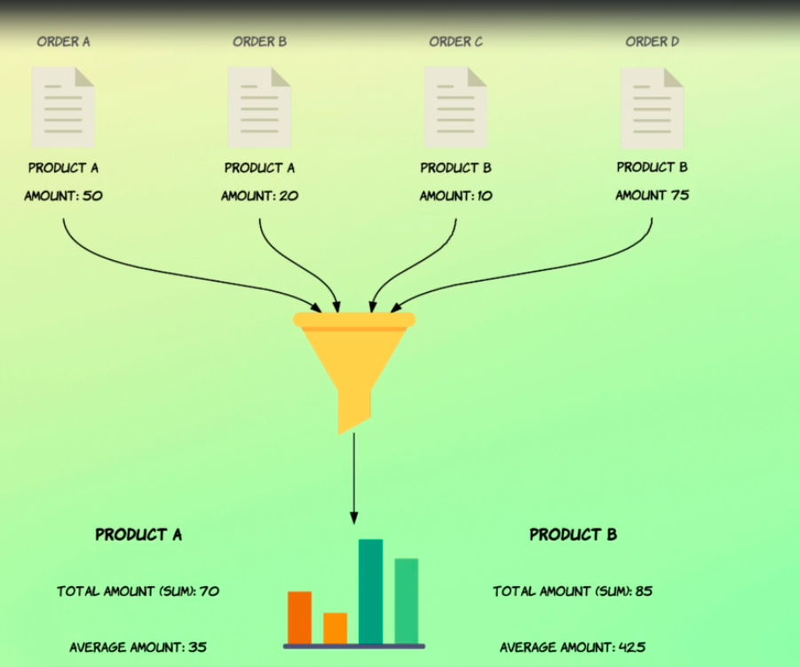

# Introduction to aggregations

In this section of the course, we're going to look at something called aggregations.

You might know what this is all about from relational databases, but aggregations in Elasticsearch are much more powerful than that.

So aggregations are a way of grouping and extracting statistics and summaries from your data, and aggregation works on a set of documents which is defined by the execution context.

I know that sounds fancy and all, but you will see what I mean in the upcoming lectures, so don't worry about it for now.



Suppose that we have an index where each document corresponds to an order and each order contains an amount and a product.

ID A simple example of what you can do with aggregations is denser group orders by product ID and then some the amounts to see how much each product sold for.

Similarly, we could calculate the average order amounts for each product and see which products generate the most revenue per order.

You can do much more complex things than that with aggregations, which you will see throughout this section.

During this section, I'll make use of some new test data which is more appropriate for working with aggregations.

Specifically, a number of orders start within an index named order.

## Adding `orders` index with field mappings

I've added this mappings you should add before importing the test data.

```
PUT /orders
{
  "mappings": {
    "properties": {
      "purchased_at": {
        "type": "date"
      },
      "lines": {
        "type": "nested",
        "properties": {
          "product_id": {
            "type": "integer"
          },
          "amount": {
            "type": "double"
          },
          "quantity": {
            "type": "short"
          }
        }
      },
      "total_amount": {
        "type": "double"
      },
      "status": {
        "type": "keyword"
      },
      "sales_channel": {
        "type": "keyword"
      },
      "salesman": {
        "type": "object",
        "properties": {
          "id": {
            "type": "integer"
          },
          "name": {
            "type": "text"
          }
        }
      }
    }
  }
}
```

You can find this test data attached [here](docs/orders-bulk.json).

## Populating the `orders` index with test data

If you are using a cloud hosted Elasticsearch deployment, remove the `--cacert` argument.

```
# macOS & Linux
curl --cacert config/certs/http_ca.crt -u elastic -H "Content-Type:application/x-ndjson" -X POST https://localhost:9200/orders/_bulk --data-binary "@orders-bulk.json"
# Windows
curl --cacert config\certs\http_ca.crt -u elastic -H "Content-Type:application/x-ndjson" -X POST https://localhost:9200/orders/_bulk --data-binary "@orders-bulk.json"
```
so let's take a moment to walk through the mapping so you know which fields are at our disposal for the upcoming lectures.

I've already typed out the query to see the mapping.
```
GET /orders/_mapping

```
so let's just go ahead and run it.
```
{
  "orders" : {
    "mappings" : {
      "properties" : {
        "lines" : {
          "type" : "nested",
          "properties" : {
            "amount" : {
              "type" : "double"
            },
            "product_id" : {
              "type" : "integer"
            },
            "quantity" : {
              "type" : "short"
            }
          }
        },
        "purchased_at" : {
          "type" : "date"
        },
        "sales_channel" : {
          "type" : "keyword"
        },
        "salesman" : {
          "properties" : {
            "id" : {
              "type" : "integer"
            },
            "name" : {
              "type" : "text"
            }
          }
        },
        "status" : {
          "type" : "keyword"
        },
        "total_amount" : {
          "type" : "double"
        }
      }
    }
  }
}
```
So we have a Lancefield, which is of the type nested because it contains objects that we need to be able to distinguish from each other.

That's because the test data includes objects within an array.

Each order line contains an amount, a product, ID and the quantity.

We also have a timestamp of when the order was placed which is stored within the purchase underscore add field.

Next we have a field for storing where the order originated from, i.e. the sales channel.

Each order has a salesman object consisting of both the ID and the name of the person who made the sale.

Last but not least, we have a status field and a convenient field named "total_amount", which is just a sum of all of the amounts stored within the order lines.

Those are the fields that we'll be using in the upcoming lectures.

Now there are a number of different groups of aggregations which we'll look at separately, beginning with so called metric aggregations.

So let's get started.