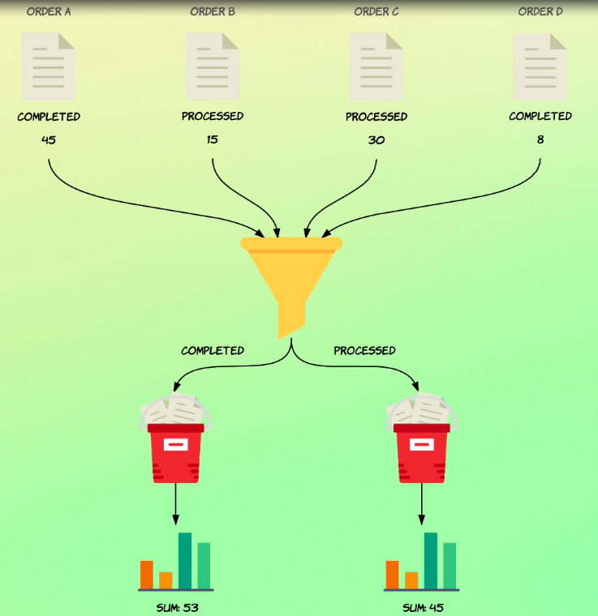

# Nested aggregations

I mentioned earlier that aggregations in Elasticsearch are extremely powerful and that you can do super cool things with them.

It's time to unveil the mystery and show you some of the tricks that Elasticsearch has up the sleeves.

You just saw the term segregation, which is a perfect aggregation.

As you know, bucket aggregations, place documents within buckets, which are sets of documents.

This is not so useful in itself other than for retrieving the document counts for groups of documents.



However, what's cool about bucket aggregations is that they can have nested aggregations also referred to as sub aggregations.

You can do this by using the aggs or aggregations key exactly as we've done before.

So this is a recursive kind of thing.

This is unlike metric aggregations that just produce a value.

But since bucket aggregations produce buckets of documents, we can use those buckets for other aggregations.

We can even nest bucket aggregations within bucket aggregations.

But just to keep things simple, at first, I'll nest a metric aggregation within the term bucket aggregation.

I hope that makes sense.

What I'll do is to nest the stats aggregation, although I could just as well have used some or avg aggregations for instance, before explaining the details, let me just show you how it works.
## Retrieving statistics for each status

```
GET /orders/_search
{
  "size": 0,
  "aggs": {
    "status_terms": {
      "terms": {
        "field": "status"
      },
      "aggs": {
        "status_stats": {
          "stats": {
            "field": "total_amount"
          }
        }
      }
    }
  }
}
```
So I've prepared a query in advance which just includes the terms aggregation on the status fields exactly as you've seen before.

Now I'll add a key named aggs within the existing aggregation subjects.

This key is going to contain an object of the exact same structure as any other aggregation.

So in that regard, there is nothing new here.

So let's go ahead and add a new key named aggs within this aggregation object that we had already and give the sub aggregation or rather the bucket aggregation a name, I'll name it status_stats because I want to use the stats aggregation.

So that's also the aggregation type that I'll answer here.

Stats and the field will be total underscore amount.

So basically this new aggregation that I just added runs in the context of the bucket that the parent aggregation created.

Let's run the query and see what the results look like.
```
{
  "took" : 10,
  "timed_out" : false,
  "_shards" : {
    "total" : 1,
    "successful" : 1,
    "skipped" : 0,
    "failed" : 0
  },
  "hits" : {
    "total" : {
      "value" : 1000,
      "relation" : "eq"
    },
    "max_score" : null,
    "hits" : [ ]
  },
  "aggregations" : {
    "status_terms" : {
      "doc_count_error_upper_bound" : 0,
      "sum_other_doc_count" : 0,
      "buckets" : [
        {
          "key" : "processed",
          "doc_count" : 209,
          "status_stats" : {
            "count" : 209,
            "min" : 10.27,
            "max" : 281.77,
            "avg" : 109.30703349282295,
            "sum" : 22845.17
          }
        },
        {
          "key" : "completed",
          "doc_count" : 204,
          "status_stats" : {
            "count" : 204,
            "min" : 10.93,
            "max" : 260.59,
            "avg" : 113.54058823529411,
            "sum" : 23162.28
          }
        },
        {
          "key" : "pending",
          "doc_count" : 199,
          "status_stats" : {
            "count" : 199,
            "min" : 10.8,
            "max" : 260.03,
            "avg" : 115.66125628140703,
            "sum" : 23016.59
          }
        },
        {
          "key" : "cancelled",
          "doc_count" : 196,
          "status_stats" : {
            "count" : 196,
            "min" : 10.7,
            "max" : 272.9,
            "avg" : 107.19158163265305,
            "sum" : 21009.55
          }
        },
        {
          "key" : "confirmed",
          "doc_count" : 192,
          "status_stats" : {
            "count" : 192,
            "min" : 11.01,
            "max" : 246.89,
            "avg" : 99.87510416666667,
            "sum" : 19176.02
          }
        }
      ]
    }
  }
}
```
We see the same results as in the previous lectures.

But apart from that, an object named after our nested aggregation has been added within each bucket.

These objects contain the output of the nested aggregation.

In this case we used a multi value metric aggregation, but had we just used the sum aggregation, for instance, we would just see a number here.

So the takeaway here is that the statistics that you see here are specific to the bucket that they appear within.

This means that we now get to some errors, etc.

for each status.

So we can see that there are **209** orders with a status of processed with a total underscore amount field between 10.27 and 281.77.

When we previously use the stats aggregation, the statistics were for all of the documents matching the query, which was implicitly the match all query.

This time around, the statistics are now specific to a given term.

The way this works is that aggregations are run based on the context that they are in.

In this particular example, the terms aggregation is a top level aggregation, so it runs in the context of the query parameter.

In this case, we haven't explicitly added a query, so Elasticsearch implicitly uses a match all query.

Suppose that we had specified a query matching only orders totalling more than 100.

In that case, the terms aggregation would run in the context of the matches that this query produces.

If we were to do that, we would see the document counts drop within the aggregations.

Let's quickly do that just to prove that I'm not filling you with lies.
## Narrowing down the aggregation context

```
GET /orders/_search
{
  "size": 0,
  "query": {
    "range": {
      "total_amount": {
        "gte": 100
      }
    }
  },
  "aggs": {
    "status_terms": {
      "terms": {
        "field": "status"
      },
      "aggs": {
        "status_stats": {
          "stats": {
            "field": "total_amount"
          }
        }
      }
    }
  }
}
```
Okay, so I'll add a query parameter and arrange query for the total amount fields saying that the value should be greater than or equal to 100.

And then I'll run the query.
```
{
  "took" : 13,
  "timed_out" : false,
  "_shards" : {
    "total" : 1,
    "successful" : 1,
    "skipped" : 0,
    "failed" : 0
  },
  "hits" : {
    "total" : {
      "value" : 489,
      "relation" : "eq"
    },
    "max_score" : null,
    "hits" : [ ]
  },
  "aggregations" : {
    "status_terms" : {
      "doc_count_error_upper_bound" : 0,
      "sum_other_doc_count" : 0,
      "buckets" : [
        {
          "key" : "pending",
          "doc_count" : 110,
          "status_stats" : {
            "count" : 110,
            "min" : 100.07,
            "max" : 260.03,
            "avg" : 159.29090909090908,
            "sum" : 17522.0
          }
        },
        {
          "key" : "completed",
          "doc_count" : 103,
          "status_stats" : {
            "count" : 103,
            "min" : 103.38,
            "max" : 260.59,
            "avg" : 162.43087378640777,
            "sum" : 16730.38
          }
        },
        {
          "key" : "processed",
          "doc_count" : 103,
          "status_stats" : {
            "count" : 103,
            "min" : 100.83,
            "max" : 281.77,
            "avg" : 155.7231067961165,
            "sum" : 16039.48
          }
        },
        {
          "key" : "cancelled",
          "doc_count" : 96,
          "status_stats" : {
            "count" : 96,
            "min" : 100.05,
            "max" : 272.9,
            "avg" : 152.56229166666665,
            "sum" : 14645.98
          }
        },
        {
          "key" : "confirmed",
          "doc_count" : 77,
          "status_stats" : {
            "count" : 77,
            "min" : 100.98,
            "max" : 246.89,
            "avg" : 155.78025974025974,
            "sum" : 11995.08
          }
        }
      ]
    }
  }
}
```
And sure enough, now we see the document counts drop because the query now only matches 489 documents instead of 1000.

So the term's aggregation runs in the context of the query, while the stats aggregation runs in the context of its parent aggregation being a bucket aggregation.

This means that it operates on the buckets produced by that aggregation.

I hope that makes sense.

So to recap, metric aggregations produce simple results and cannot contain sub aggregations.

Bucket aggregations, on the other hand, may contain sub aggregations, which then operate on the buckets produced by the parent bucket aggregation.

Aggregations run based on the context in which they are defined.

Aggregations added at the top level of the root aggregation object run in the context of the request, query and sub aggregations run in the context of their parent aggregation.

You can list both metric and bucket aggregations within bucket aggregations, so both aggregation groups can be combined.

You can kind of think of metric aggregations as being equivalent to leaf level queries and bucket aggregations being equivalent of compound queries.

That's because bucket aggregations can contain other bucket aggregations or metric aggregations in the same way that compound queries can contain other compound queries or leaf level queries.

In this lecture, you didn't see any newer aggregation types, but now it's time to continue with some more bucket aggregations.

I wanted to show you how to nest aggregations now because we'll be using this in the next lectures.

