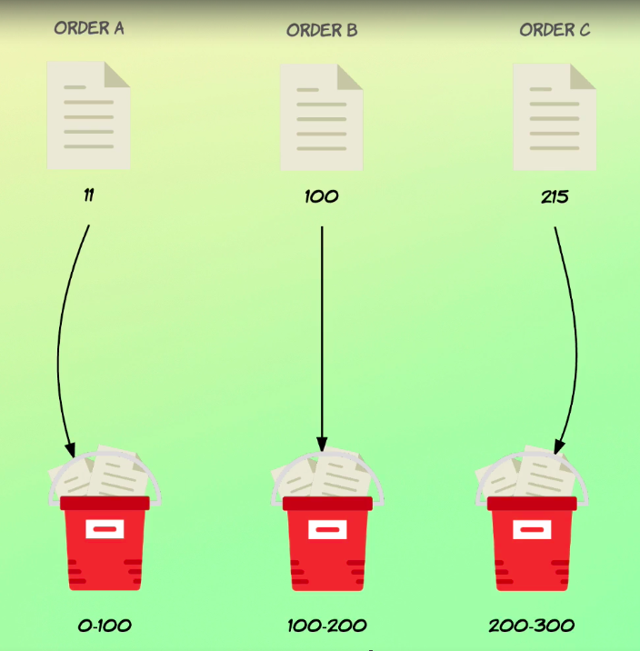

# Range aggregations

Another way of specifying which documents should be placed within the bucket is with range aggregations.



There are two range aggregations, one named range and one name date on the score range.

They are basically the same, except that the date range aggregation is dedicated to working with date values.

They both work in the way that you define ranges where each range represents a bucket of documents.

We then specify which filter should be used for placing documents within the appropriate buckets.

Let's begin with the range aggregation, which is similar to the range query that you saw earlier in the course.

Perhaps we want to know how the order amounts are distributed.

More specifically, we want to know how many orders are between zero and 50, between 50 and 100, and how many are more than 100?

Let's write a range aggregation that does that.

## `range` aggregation

```
GET /orders/_search
{
  "size": 0,
  "aggs": {
    "amount_distribution": {
      "range": {
        "field": "total_amount",
        "ranges": [
          {
            "to": 50
          },
          {
            "from": 50,
            "to": 100
          },
          {
            "from": 100
          }
        ]
      }
    }
  }
}
```
So I'll give it a name of amount_distribution and set the type to range.

The field will be total underscore amounts and within the ranges parameter we can define ranges as objects because this parameter contains an array.

The first range I'm interested in is the one from 0 to 50.

So I can just go ahead and remove the from key within this object and change the to key to 50.

Note that the first key is included and the to key is excluded.

So let's add another range being an object set to from key to 50 and the to key to 100.

And the last range will just contain a firm key with a value of 100.

So any document with a value of more than 100 for the total underscore amount fields would be placed in this bucket.

Okay, let's run this query.
```
{
  "took" : 10,
  "timed_out" : false,
  "_shards" : {
    "total" : 1,
    "successful" : 1,
    "skipped" : 0,
    "failed" : 0
  },
  "hits" : {
    "total" : {
      "value" : 1000,
      "relation" : "eq"
    },
    "max_score" : null,
    "hits" : [ ]
  },
  "aggregations" : {
    "amount_distribution" : {
      "buckets" : [
        {
          "key" : "*-50.0",
          "to" : 50.0,
          "doc_count" : 164
        },
        {
          "key" : "50.0-100.0",
          "from" : 50.0,
          "to" : 100.0,
          "doc_count" : 347
        },
        {
          "key" : "100.0-*",
          "from" : 100.0,
          "doc_count" : 489
        }
      ]
    }
  }
}
```
So the results contain a bucket for each of the ranges that we specified.

Each bucket contains the document count as with any other bucket aggregation, but it also contains the from and so values used for placing documents within that bucket.

Lastly, a key is included, which is just a textual representation of the range by default.

We can change this, which I will show you after looking at the date range aggregation.

So the date_range aggregation is conceptually the same thing, except that it works with dates.

The aggregation therefore enables us to do date specific things such as using date map, as you saw earlier in the course.

That works in exactly the same way as what you saw earlier.

We can also just provide plain dates if we prefer, but let's use a bit of date math just to make things more interesting.

What I want to do is to create two buckets one for the first half of 2016 and one for the second half of the year.

For that, I'll be making use of the purchased underscore add field.

## `date_range` aggregation

```
GET /orders/_search
{
  "size": 0,
  "aggs": {
    "purchased_ranges": {
      "date_range": {
        "field": "purchased_at",
        "ranges": [
          {
            "from": "2016-01-01",
            "to": "2016-01-01||+6M"
          },
          {
            "from": "2016-01-01||+6M",
            "to": "2016-01-01||+1y"
          }
        ]
      }
    }
  }
}
```
So I'll just make a copy of this existing query and get rid of these ranges that we had already.

Then I'll change the name of the aggregation to purchased on the score ranges and the fields should be purchased_ranges and I'll also need to change the aggregation type to date on the score range.

So the objects within the ranges parameter should also contain the from and to key.

So no difference there, but the values should be different.

So the 1st of January 2016.

Then for the two key, I'll be using some date math, so I'll take the same date as above.

And then I'll add two pipes using date math and write plus six m for six months.

So that's one range.

Then let's get to work on the other one.

From.

And for this key, I can use this date map expression right here like.

So let's add two key as well.

So 2016 zero one.

So one the 1st of January two pipes plus one year.

Let's run the query and take a look at the results.
```
{
  "took" : 2,
  "timed_out" : false,
  "_shards" : {
    "total" : 1,
    "successful" : 1,
    "skipped" : 0,
    "failed" : 0
  },
  "hits" : {
    "total" : {
      "value" : 1000,
      "relation" : "eq"
    },
    "max_score" : null,
    "hits" : [ ]
  },
  "aggregations" : {
    "purchased_ranges" : {
      "buckets" : [
        {
          "key" : "2016-01-01T00:00:00.000Z-2016-07-01T00:00:00.000Z",
          "from" : 1.4516064E12,
          "from_as_string" : "2016-01-01T00:00:00.000Z",
          "to" : 1.4673312E12,
          "to_as_string" : "2016-07-01T00:00:00.000Z",
          "doc_count" : 481
        },
        {
          "key" : "2016-07-01T00:00:00.000Z-2017-01-01T00:00:00.000Z",
          "from" : 1.4673312E12,
          "from_as_string" : "2016-07-01T00:00:00.000Z",
          "to" : 1.4832288E12,
          "to_as_string" : "2017-01-01T00:00:00.000Z",
          "doc_count" : 519
        }
      ]
    }
  }
}
```
We get both textual representations and a number of milliseconds since the Epoch Back will change the keys to be more readable in a moment.

But first I want to direct your attention at the from_as_string and to_as_string values.

Notice how the value for the two string key for the first pocket is the 1st of July 2016.

You might wonder if that wasn't supposed to be the 30th of June instead and if we made a mistake when using date math, the values are actually correct.

Remember that different value is included and the term value is excluded.

This is also the case for the date range aggregation.

So we essentially specified that the date for the first bucket must be before midnight on the 1st of July 2016.

That's why the dates are correct.

If the two value was included, this would be a different story.

Okay, so the texture representations of the from and to values are not so pretty.

And that might be fine if we're using the fields to pass the dates in our application, but maybe we just want dates back with our times.

Or maybe we just want the dates to be returned in a different format.

We can specify this by adding a format parameter to the date range aggregation.

So let's do that.

## Specifying the date format

```
GET /orders/_search
{
  "size": 0,
  "aggs": {
    "purchased_ranges": {
      "date_range": {
        "field": "purchased_at",
        "format": "yyyy-MM-dd",
        "ranges": [
          {
            "from": "2016-01-01",
            "to": "2016-01-01||+6M"
          },
          {
            "from": "2016-01-01||+6M",
            "to": "2016-01-01||+1y"
          }
        ]
      }
    }
  }
}
```

I'll add a format parameter, like I said.

And here we can specify the format of the dates.

I'll just get rid of this because I want the year first, then the month and then the day.

Let's refresh the query.
```
{
  "took" : 10,
  "timed_out" : false,
  "_shards" : {
    "total" : 1,
    "successful" : 1,
    "skipped" : 0,
    "failed" : 0
  },
  "hits" : {
    "total" : {
      "value" : 1000,
      "relation" : "eq"
    },
    "max_score" : null,
    "hits" : [ ]
  },
  "aggregations" : {
    "purchased_ranges" : {
      "buckets" : [
        {
          "key" : "2016-01-01-2016-07-01",
          "from" : 1.4516064E12,
          "from_as_string" : "2016-01-01",
          "to" : 1.4673312E12,
          "to_as_string" : "2016-07-01",
          "doc_count" : 481
        },
        {
          "key" : "2016-07-01-2017-01-01",
          "from" : 1.4673312E12,
          "from_as_string" : "2016-07-01",
          "to" : 1.4832288E12,
          "to_as_string" : "2017-01-01",
          "doc_count" : 519
        }
      ]
    }
  }
}
```
you can now see that both the keys and the textual representations of the ranges are more readable.

I recommend using the format only if you need to receive a different data format for your application and not for the sake of formatting dates for end users.

In my opinion, that's something that you should do within your application, but you're of course free to choose the approach that you prefer.

Let's now see how we can customize the keys that are returned for each bucket.

The first way is not related to changing the key names, but rather how the buckets are structured.

Let's try to add a new parameter named keyed with a value of true and see what happens.
## Enabling keys for the buckets

```
GET /orders/_search
{
  "size": 0,
  "aggs": {
    "purchased_ranges": {
      "date_range": {
        "field": "purchased_at",
        "format": "yyyy-MM-dd",
        "keyed": true,
        "ranges": [
          {
            "from": "2016-01-01",
            "to": "2016-01-01||+6M"
          },
          {
            "from": "2016-01-01||+6M",
            "to": "2016-01-01||+1y"
          }
        ]
      }
    }
  }
}
```

So let's run it.
```
{
  "took" : 1,
  "timed_out" : false,
  "_shards" : {
    "total" : 1,
    "successful" : 1,
    "skipped" : 0,
    "failed" : 0
  },
  "hits" : {
    "total" : {
      "value" : 1000,
      "relation" : "eq"
    },
    "max_score" : null,
    "hits" : [ ]
  },
  "aggregations" : {
    "purchased_ranges" : {
      "buckets" : {
        "2016-01-01-2016-07-01" : {
          "from" : 1.4516064E12,
          "from_as_string" : "2016-01-01",
          "to" : 1.4673312E12,
          "to_as_string" : "2016-07-01",
          "doc_count" : 481
        },
        "2016-07-01-2017-01-01" : {
          "from" : 1.4673312E12,
          "from_as_string" : "2016-07-01",
          "to" : 1.4832288E12,
          "to_as_string" : "2017-01-01",
          "doc_count" : 519
        }
      }
    }
  }
}
```
You can now see that the buckets now have a key instead of being anonymous objects.

The key keys from within the bucket objects have now been moved to be the keys for the objects instead.

But the key names are the same.

So let's see how we can change that.
## Defining the bucket keys

```
GET /orders/_search
{
  "size": 0,
  "aggs": {
    "purchased_ranges": {
      "date_range": {
        "field": "purchased_at",
        "format": "yyyy-MM-dd",
        "keyed": true,
        "ranges": [
          {
            "from": "2016-01-01",
            "to": "2016-01-01||+6M",
            "key": "first_half"
          },
          {
            "from": "2016-01-01||+6M",
            "to": "2016-01-01||+1y",
            "key": "second_half"
          }
        ]
      }
    }
  }
}
```
We simply do that by adding a key parameter to each range of objects.

Okay, great.
```
{
  "took" : 1,
  "timed_out" : false,
  "_shards" : {
    "total" : 1,
    "successful" : 1,
    "skipped" : 0,
    "failed" : 0
  },
  "hits" : {
    "total" : {
      "value" : 1000,
      "relation" : "eq"
    },
    "max_score" : null,
    "hits" : [ ]
  },
  "aggregations" : {
    "purchased_ranges" : {
      "buckets" : {
        "first_half" : {
          "from" : 1.4516064E12,
          "from_as_string" : "2016-01-01",
          "to" : 1.4673312E12,
          "to_as_string" : "2016-07-01",
          "doc_count" : 481
        },
        "second_half" : {
          "from" : 1.4673312E12,
          "from_as_string" : "2016-07-01",
          "to" : 1.4832288E12,
          "to_as_string" : "2017-01-01",
          "doc_count" : 519
        }
      }
    }
  }
}
```
But just receiving the number of orders is not that much fun.

Let's add a stats aggregation as a sub aggregation to retrieve some more information about the buckets.

I'll use the total_amount field for the statistics.

## Adding a sub-aggregation

```
GET /orders/_search
{
  "size": 0,
  "aggs": {
    "purchased_ranges": {
      "date_range": {
        "field": "purchased_at",
        "format": "yyyy-MM-dd",
        "keyed": true,
        "ranges": [
          {
            "from": "2016-01-01",
            "to": "2016-01-01||+6M",
            "key": "first_half"
          },
          {
            "from": "2016-01-01||+6M",
            "to": "2016-01-01||+1y",
            "key": "second_half"
          }
        ]
      },
      "aggs": {
        "bucket_stats": {
          "stats": {
            "field": "total_amount"
          }
        }
      }
    }
  }
}
```
So let's go ahead and add an aggs key.

And name the aggregation pocket on the score stats and set the type to stats and the field to total on the score amounts.

And of course, run it.
```
{
  "took" : 9,
  "timed_out" : false,
  "_shards" : {
    "total" : 1,
    "successful" : 1,
    "skipped" : 0,
    "failed" : 0
  },
  "hits" : {
    "total" : {
      "value" : 1000,
      "relation" : "eq"
    },
    "max_score" : null,
    "hits" : [ ]
  },
  "aggregations" : {
    "purchased_ranges" : {
      "buckets" : {
        "first_half" : {
          "from" : 1.4516064E12,
          "from_as_string" : "2016-01-01",
          "to" : 1.4673312E12,
          "to_as_string" : "2016-07-01",
          "doc_count" : 481,
          "bucket_stats" : {
            "count" : 481,
            "min" : 10.27,
            "max" : 260.59,
            "avg" : 106.78817047817049,
            "sum" : 51365.11
          }
        },
        "second_half" : {
          "from" : 1.4673312E12,
          "from_as_string" : "2016-07-01",
          "to" : 1.4832288E12,
          "to_as_string" : "2017-01-01",
          "doc_count" : 519,
          "bucket_stats" : {
            "count" : 519,
            "min" : 10.7,
            "max" : 281.77,
            "avg" : 111.45375722543352,
            "sum" : 57844.5
          }
        }
      }
    }
  }
}
```
And now we get statistics in the context of each of the buckets.

That's not something specific to the range of aggregations, and you've seen that before, but I just wanted to show it once again because I think it's a really cool and powerful feature anyways.

That's how to use range aggregations.

