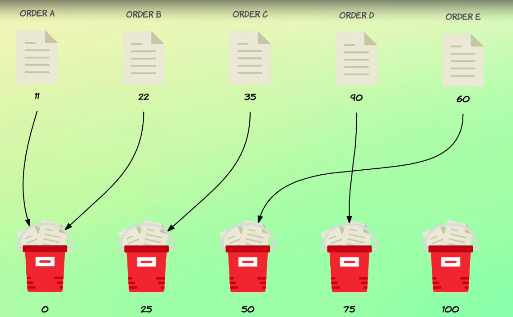

# Histograms

We just looked at range aggregations, which enabled us to specify a number of ranges determining which bucket the documents should be put into.

But when doing that, we explicitly had to define the ranges ahead of time.

What if we wanted to specify intervals of 25 for the order amounts?

That requires us to know the minimum and maximum amounts.

Unless we can accept missing out on some orders, which we probably can't.

And even so, we would have to add a lot of ranges explicitly.

Sure, we could automate this within the application that sends the query to Elasticsearch, but fortunately there is a better way.

Using something called histograms.



A histogram dynamically builds buckets from a numeric field's value based on a specified interval.

Take our total amount field, for example.

We might want to know the distribution of order amounts.

By using a histogram aggregation, we can specify an interval of 25, for example, in which case Elasticsearch will dynamically make buckets for each step of the interval between the minimum and maximum value for the field.

I apologize if that sounded confusing, so let's take an example.

Suppose that we have orders with amounts between zero and 100, and let's assume that we have a document with each of the possible values with the interval set to 25.

Elasticsearch will create five buckets for us.

Buckets with the key zero 25, 50, 75 and 100.

These buckets will then be filled with documents, but what determines which bucket the document falls into?

The total underscore amount fields is evaluated for each document, and the value will be rounded down to the closest buckets.

So if we have a document with an amount of 60, this number will be rounded down to 50 and placed in the bucket with a key of 50.

Hopefully that makes sense, but let's write the example that I just mentioned because that makes it much easier to understand what histograms are all about.

## Distribution of `total_amount` with interval `25`

```
GET /orders/_search
{
  "size": 0,
  "aggs": {
    "amount_distribution": {
      "histogram": {
        "field": "total_amount",
        "interval": 25
      }
    }
  }
}
```
So let's add an aggregation named amount_distribution, and set the type to histogram.

The field will be total amounts and the interval will be 25.

Let's go ahead and run it.
```
{
  "took" : 12,
  "timed_out" : false,
  "_shards" : {
    "total" : 1,
    "successful" : 1,
    "skipped" : 0,
    "failed" : 0
  },
  "hits" : {
    "total" : {
      "value" : 1000,
      "relation" : "eq"
    },
    "max_score" : null,
    "hits" : [ ]
  },
  "aggregations" : {
    "amount_distribution" : {
      "buckets" : [
        {
          "key" : 0.0,
          "doc_count" : 42
        },
        {
          "key" : 25.0,
          "doc_count" : 122
        },
        {
          "key" : 50.0,
          "doc_count" : 153
        },
        {
          "key" : 75.0,
          "doc_count" : 194
        },
        {
          "key" : 100.0,
          "doc_count" : 124
        },
        {
          "key" : 125.0,
          "doc_count" : 125
        },
        {
          "key" : 150.0,
          "doc_count" : 89
        },
        {
          "key" : 175.0,
          "doc_count" : 71
        },
        {
          "key" : 200.0,
          "doc_count" : 42
        },
        {
          "key" : 225.0,
          "doc_count" : 33
        },
        {
          "key" : 250.0,
          "doc_count" : 4
        },
        {
          "key" : 275.0,
          "doc_count" : 1
        }
      ]
    }
  }
}
```
Looking at the results.

Notice how we have buckets following an interval of 25.

The bucket at zero and go all the way up to 275.

The bucket stopped there because the maximum amount is 281 and that document then falls into the bucket with the key of 275 because the value is rounded down to the nearest bucket.

Now, by default, buckets will be created for each interval between the minimum and maximum values for the field, regardless of whether or not any documents fall into the buckets.

That's why you might potentially see buckets with a document count of zero.

We don't see that within our results because the values within our test data are pretty evenly distributed and we haven't filtered the documents in any way.

But if this were not the case, then you might experience empty buckets.

If you don't want that, then there is a convenient parameter named min underscore doc underscore counts.

This parameter simply lets us configure how many documents must fall into a bucket for it to be included within the results.

This means that we can simply specify a value of one to ensure that no empty buckets are returned within the results.

If that's what you want, of course.

So let's try to do that.

## Requiring minimum 1 document per bucket

```
GET /orders/_search
{
  "size": 0,
  "aggs": {
    "amount_distribution": {
      "histogram": {
        "field": "total_amount",
        "interval": 25,
        "min_doc_count": 1
      }
    }
  }
}
```
So min dot counts and I'll set it to one.
```
{
  "took" : 2,
  "timed_out" : false,
  "_shards" : {
    "total" : 1,
    "successful" : 1,
    "skipped" : 0,
    "failed" : 0
  },
  "hits" : {
    "total" : {
      "value" : 1000,
      "relation" : "eq"
    },
    "max_score" : null,
    "hits" : [ ]
  },
  "aggregations" : {
    "amount_distribution" : {
      "buckets" : [
        {
          "key" : 0.0,
          "doc_count" : 42
        },
        {
          "key" : 25.0,
          "doc_count" : 122
        },
        {
          "key" : 50.0,
          "doc_count" : 153
        },
        {
          "key" : 75.0,
          "doc_count" : 194
        },
        {
          "key" : 100.0,
          "doc_count" : 124
        },
        {
          "key" : 125.0,
          "doc_count" : 125
        },
        {
          "key" : 150.0,
          "doc_count" : 89
        },
        {
          "key" : 175.0,
          "doc_count" : 71
        },
        {
          "key" : 200.0,
          "doc_count" : 42
        },
        {
          "key" : 225.0,
          "doc_count" : 33
        },
        {
          "key" : 250.0,
          "doc_count" : 4
        },
        {
          "key" : 275.0,
          "doc_count" : 1
        }
      ]
    }
  }
}
```
Like I said, this doesn't make any difference with the current query, but now I want to show you something else.

For that I need to filter the documents a bit, so I'll just add a query that only matches orders with a total amount field of at least 100.

```
GET /orders/_search
{
  "size": 0,
  "query": {
    "range": {
      "total_amount": {
        "gte": 100
      }
    }
  },
  "aggs": {
    "amount_distribution": {
      "histogram": {
        "field": "total_amount",
        "interval": 25,
        "min_doc_count": 1
      }
    }
  }
}
```
So I'll do that above the aggregation right here.

So query.

And arrange query the total amount field.

And greater than or equal to 100.

Okay, let's run it.
```
{
  "took" : 10,
  "timed_out" : false,
  "_shards" : {
    "total" : 1,
    "successful" : 1,
    "skipped" : 0,
    "failed" : 0
  },
  "hits" : {
    "total" : {
      "value" : 489,
      "relation" : "eq"
    },
    "max_score" : null,
    "hits" : [ ]
  },
  "aggregations" : {
    "amount_distribution" : {
      "buckets" : [
        {
          "key" : 100.0,
          "doc_count" : 124
        },
        {
          "key" : 125.0,
          "doc_count" : 125
        },
        {
          "key" : 150.0,
          "doc_count" : 89
        },
        {
          "key" : 175.0,
          "doc_count" : 71
        },
        {
          "key" : 200.0,
          "doc_count" : 42
        },
        {
          "key" : 225.0,
          "doc_count" : 33
        },
        {
          "key" : 250.0,
          "doc_count" : 4
        },
        {
          "key" : 275.0,
          "doc_count" : 1
        }
      ]
    }
  }
}
```
And now we can see that the first bucket has a key of 100.

So we just removed a handful of buckets.

Those buckets are not part of the results anymore because the histogram aggregation has no idea about any documents with a lower value than 100 for the total amount field.

The aggregation includes buckets based on the documents that are present within the context that the aggregation is run within.

But what if you still wanted the buckets below 100 to be part of the results, even if they contain no documents?

Or perhaps you don't know if the buckets will contain any documents based on the aggregation context, because you probably don't know which documents are meshed ahead of time to force buckets to be present within to boundaries.

We can use the parameter named extended_bounds.

This parameter should contain an object with the min and max keys.

Let's add that objects and specify zero and 500 as the minimum and maximum values respectively.

## Specifying fixed bucket boundaries

```
GET /orders/_search
{
  "size": 0,
  "query": {
    "range": {
      "total_amount": {
        "gte": 100
      }
    }
  },
  "aggs": {
    "amount_distribution": {
      "histogram": {
        "field": "total_amount",
        "interval": 25,
        "min_doc_count": 1,
        "extended_bounds": {
          "min": 0,
          "max": 500
        }
      }
    }
  }
}
```
So let's go down here and add another parameter to the histogram objects.

So extend that.

Underscore bounds.

Being an object like assets with a min key at zero and max with a value of 500.

Let's run it.
```
{
  "took" : 0,
  "timed_out" : false,
  "_shards" : {
    "total" : 1,
    "successful" : 1,
    "skipped" : 0,
    "failed" : 0
  },
  "hits" : {
    "total" : {
      "value" : 489,
      "relation" : "eq"
    },
    "max_score" : null,
    "hits" : [ ]
  },
  "aggregations" : {
    "amount_distribution" : {
      "buckets" : [
        {
          "key" : 100.0,
          "doc_count" : 124
        },
        {
          "key" : 125.0,
          "doc_count" : 125
        },
        {
          "key" : 150.0,
          "doc_count" : 89
        },
        {
          "key" : 175.0,
          "doc_count" : 71
        },
        {
          "key" : 200.0,
          "doc_count" : 42
        },
        {
          "key" : 225.0,
          "doc_count" : 33
        },
        {
          "key" : 250.0,
          "doc_count" : 4
        },
        {
          "key" : 275.0,
          "doc_count" : 1
        }
      ]
    }
  }
}
```
This means that buckets will be created between zero and 500 according to the specified interval.

Regardless of whether or not any documents fall into those buckets compared to the mean dark count parameter, the extended bounds parameter is a way to extend the boundaries of the buckets or at least force the configured boundaries.

Let's take a look at the results.

We don't really see any difference.

That's because we have the mint doc count parameter set to one, causing the buckets to be filtered out.

Let's try to reset this parameter to zero, in which case we shall see the buckets appear.

```
GET /orders/_search
{
  "size": 0,
  "query": {
    "range": {
      "total_amount": {
        "gte": 100
      }
    }
  },
  "aggs": {
    "amount_distribution": {
      "histogram": {
        "field": "total_amount",
        "interval": 25,
        "min_doc_count": 0,
        "extended_bounds": {
          "min": 0,
          "max": 500
        }
      }
    }
  }
}
```
And let's run it again.
```
{
  "took" : 1,
  "timed_out" : false,
  "_shards" : {
    "total" : 1,
    "successful" : 1,
    "skipped" : 0,
    "failed" : 0
  },
  "hits" : {
    "total" : {
      "value" : 489,
      "relation" : "eq"
    },
    "max_score" : null,
    "hits" : [ ]
  },
  "aggregations" : {
    "amount_distribution" : {
      "buckets" : [
        {
          "key" : 0.0,
          "doc_count" : 0
        },
        {
          "key" : 25.0,
          "doc_count" : 0
        },
        {
          "key" : 50.0,
          "doc_count" : 0
        },
        {
          "key" : 75.0,
          "doc_count" : 0
        },
        {
          "key" : 100.0,
          "doc_count" : 124
        },
        {
          "key" : 125.0,
          "doc_count" : 125
        },
        {
          "key" : 150.0,
          "doc_count" : 89
        },
        {
          "key" : 175.0,
          "doc_count" : 71
        },
        {
          "key" : 200.0,
          "doc_count" : 42
        },
        {
          "key" : 225.0,
          "doc_count" : 33
        },
        {
          "key" : 250.0,
          "doc_count" : 4
        },
        {
          "key" : 275.0,
          "doc_count" : 1
        },
        {
          "key" : 300.0,
          "doc_count" : 0
        },
        {
          "key" : 325.0,
          "doc_count" : 0
        },
        {
          "key" : 350.0,
          "doc_count" : 0
        },
        {
          "key" : 375.0,
          "doc_count" : 0
        },
        {
          "key" : 400.0,
          "doc_count" : 0
        },
        {
          "key" : 425.0,
          "doc_count" : 0
        },
        {
          "key" : 450.0,
          "doc_count" : 0
        },
        {
          "key" : 475.0,
          "doc_count" : 0
        },
        {
          "key" : 500.0,
          "doc_count" : 0
        }
      ]
    }
  }
}
```
And sure enough, we now see a number of buckets with values lower than 100, but also with values higher than the highest amount, which is 281.

Very similar to the histogram aggregation.

There is a date underscore histogram aggregation.

It's probably no surprise to you that it does the same thing just for date values.

The functionality is almost the same with the main difference being the use of an expression for the interval parameter.

Specifically, we can choose one of the following values year, quarter, month, week, day, our minute or second.

Let's write an example date histogram that shows the number of orders for each month.

## Aggregating by month with the `date_histogram` aggregation

```
GET /orders/_search
{
  "size": 0,
  "aggs": {
    "orders_over_time": {
      "date_histogram": {
        "field": "purchased_at",
        "calendar_interval": "month"
      }
    }
  }
}
```
```

  "took" : 19,
  "timed_out" : false,
  "_shards" : {
    "total" : 1,
    "successful" : 1,
    "skipped" : 0,
    "failed" : 0
  },
  "hits" : {
    "total" : {
      "value" : 1000,
      "relation" : "eq"
    },
    "max_score" : null,
    "hits" : [ ]
  },
  "aggregations" : {
    "orders_over_time" : {
      "buckets" : [
        {
          "key_as_string" : "2016-01-01T00:00:00.000Z",
          "key" : 1451606400000,
          "doc_count" : 78
        },
        {
          "key_as_string" : "2016-02-01T00:00:00.000Z",
          "key" : 1454284800000,
          "doc_count" : 72
        },
        {
          "key_as_string" : "2016-03-01T00:00:00.000Z",
          "key" : 1456790400000,
          "doc_count" : 82
        },
        {
          "key_as_string" : "2016-04-01T00:00:00.000Z",
          "key" : 1459468800000,
          "doc_count" : 79
        },
        {
          "key_as_string" : "2016-05-01T00:00:00.000Z",
          "key" : 1462060800000,
          "doc_count" : 85
        },
        {
          "key_as_string" : "2016-06-01T00:00:00.000Z",
          "key" : 1464739200000,
          "doc_count" : 85
        },
        {
          "key_as_string" : "2016-07-01T00:00:00.000Z",
          "key" : 1467331200000,
          "doc_count" : 101
        },
        {
          "key_as_string" : "2016-08-01T00:00:00.000Z",
          "key" : 1470009600000,
          "doc_count" : 75
        },
        {
          "key_as_string" : "2016-09-01T00:00:00.000Z",
          "key" : 1472688000000,
          "doc_count" : 88
        },
        {
          "key_as_string" : "2016-10-01T00:00:00.000Z",
          "key" : 1475280000000,
          "doc_count" : 83
        },
        {
          "key_as_string" : "2016-11-01T00:00:00.000Z",
          "key" : 1477958400000,
          "doc_count" : 90
        },
        {
          "key_as_string" : "2016-12-01T00:00:00.000Z",
          "key" : 1480550400000,
          "doc_count" : 82
        }
      ]
    }
  }
}
```
The same rules apply for determining which buckets a document belongs to.

As with the histogram aggregation scoring for the results, we can see that we now have a bucket for each month if you want or need, so you can customize the key format by specifying a date format for parameter named formats.

Last but not least, I want to mention that in case you need to, both the histogram and data underscore histogram aggregations support an offset parameter.

This offset is useful if you want to add or subtract from each bucket key for the histogram aggregation, you would specify a number and for the date histogram aggregation, you should specify a date math expression such as one D for instance.

