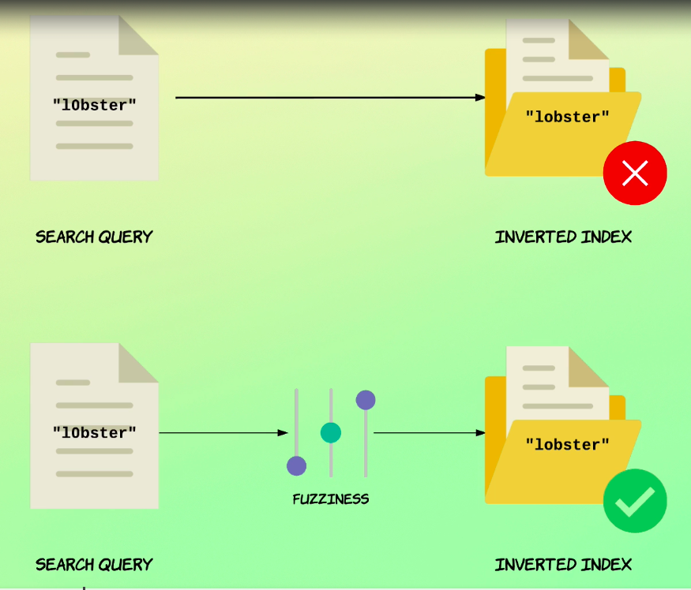
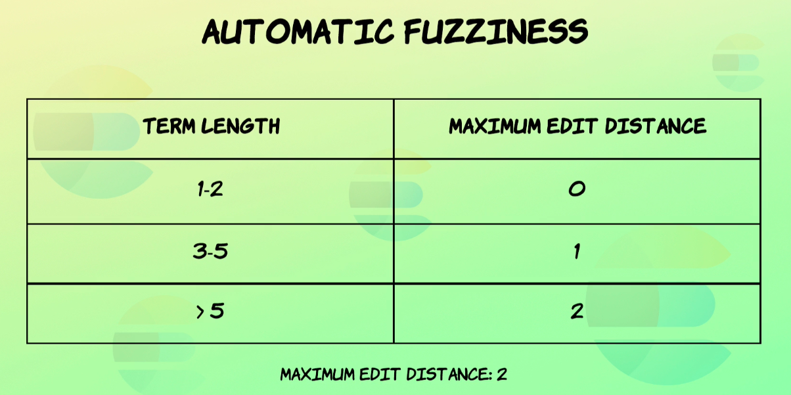

# Fuzzy `match` query

Until now, you've seen quite a few search queries, but we as developers had full control of the input for all of them.

Oftentimes, end users will be writing search queries and we'll be passing that along to an Elasticsearch cluster.

What if the user makes a typo or just make spelling mistakes?


Under normal circumstances, that would potentially cause documents to not match a given query, even if documents are actually relevant for the user.

We might want to handle this so the user still gets relevant results even if he or she hits the wrong key.

Fortunately, this is easy with Elasticsearch by using something called fuzziness.

There are a few ways you can do this, but the most common way is to add a parameter named Fussiness to the match query.

So that's what we will start out with.

Before diving deeper into how fuzziness works, let's see an example.

```
GET /products/_search
{
  "query": {
    "match": {
      "name": {
        "query": "lobster",
      }
    }
  }
}
```
We have a simple match query searching for lobster within the name fields within the product index.
```
{
  "took" : 11,
  "timed_out" : false,
  "_shards" : {
    "total" : 1,
    "successful" : 1,
    "skipped" : 0,
    "failed" : 0
  },
  "hits" : {
    "total" : {
      "value" : 5,
      "relation" : "eq"
    },
    "max_score" : 5.8983326,
    "hits" : [
      {
        "_index" : "products",
        "_type" : "_doc",
        "_id" : "19",
        "_score" : 5.8983326,
        "_ignored" : [
          "description.keyword"
        ],
        "_source" : {
          "name" : "Lobster - Live",
          "price" : 79,
          "in_stock" : 43,
          "sold" : 370,
          "tags" : [
            "Meat",
            "Seafood"
          ],
          "description" : "Integer non velit. Donec diam neque, vestibulum eget, vulputate ut, ultrices vel, augue. Vestibulum ante ipsum primis in faucibus orci luctus et ultrices posuere cubilia Curae; Donec pharetra, magna vestibulum aliquet ultrices, erat tortor sollicitudin mi, sit amet lobortis sapien sapien non mi. Integer ac neque. Duis bibendum. Morbi non quam nec dui luctus rutrum.",
          "is_active" : false,
          "created" : "2007/08/10"
        }
      },
      {
        "_index" : "products",
        "_type" : "_doc",
        "_id" : "55",
        "_score" : 5.0624013,
        "_source" : {
          "name" : "Lobster - Baby Boiled",
          "price" : 134,
          "in_stock" : 41,
          "sold" : 207,
          "tags" : [
            "Meat",
            "Seafood"
          ],
          "description" : "Nulla tellus. In sagittis dui vel nisl. Duis ac nibh. Fusce lacus purus, aliquet at, feugiat non, pretium quis, lectus. Suspendisse potenti. In eleifend quam a odio.",
          "is_active" : false,
          "created" : "2016/01/19"
        }
      },
      {
        "_index" : "products",
        "_type" : "_doc",
        "_id" : "373",
        "_score" : 4.4339995,
        "_ignored" : [
          "description.keyword"
        ],
        "_source" : {
          "name" : "Appetizer - Lobster Phyllo Roll",
          "price" : 153,
          "in_stock" : 32,
          "sold" : 92,
          "tags" : [
            "Meat",
            "Seafood"
          ],
          "description" : "Ut tellus. Nulla ut erat id mauris vulputate elementum. Nullam varius. Nulla facilisi. Cras non velit nec nisi vulputate nonummy. Maecenas tincidunt lacus at velit. Vivamus vel nulla eget eros elementum pellentesque. Quisque porta volutpat erat. Quisque erat eros, viverra eget, congue eget, semper rutrum, nulla. Nunc purus.",
          "is_active" : true,
          "created" : "2012/10/10"
        }
      },
      {
        "_index" : "products",
        "_type" : "_doc",
        "_id" : "471",
        "_score" : 4.4339995,
        "_source" : {
          "name" : "Lobster - Tail 6 Oz",
          "price" : 197,
          "in_stock" : 9,
          "sold" : 47,
          "tags" : [
            "Meat",
            "Seafood"
          ],
          "description" : "Aenean lectus. Pellentesque eget nunc. Donec quis orci eget orci vehicula condimentum. Curabitur in libero ut massa volutpat convallis. Morbi odio odio, elementum eu, interdum eu, tincidunt in, leo.",
          "is_active" : true,
          "created" : "2014/10/01"
        }
      },
      {
        "_index" : "products",
        "_type" : "_doc",
        "_id" : "500",
        "_score" : 3.9443793,
        "_source" : {
          "name" : "Lobster - Tail 3 - 4 Oz",
          "price" : 46,
          "in_stock" : 33,
          "sold" : 188,
          "tags" : [
            "Meat",
            "Seafood"
          ],
          "description" : "Integer a nibh. In quis justo. Maecenas rhoncus aliquam lacus. Morbi quis tortor id nulla ultrices aliquet. Maecenas leo odio, condimentum id, luctus nec, molestie sed, justo. Pellentesque viverra pede ac diam.",
          "is_active" : false,
          "created" : "2015/08/26"
        }
      }
    ]
  }
}
```
Running the query, we get five matches, all containing the term lobster.

But suppose that we hit the wrong key and accidentally hit the zero key instead of.

```
GET /products/_search
{
  "query": {
    "match": {
      "name": {
        "query": "l0bster"
      }
    }
  }
}
```
Oh.

So let's try to change the query.

And then sort of a zero like so and run the query again.
```
{
  "took" : 15,
  "timed_out" : false,
  "_shards" : {
    "total" : 1,
    "successful" : 1,
    "skipped" : 0,
    "failed" : 0
  },
  "hits" : {
    "total" : {
      "value" : 0,
      "relation" : "eq"
    },
    "max_score" : null,
    "hits" : [ ]
  }
}

```
Now we no longer get any matches, which is pretty unfortunate because obviously the intention was to search for the term lobster.

Let's fix that by adding a parameter named Fussiness.

For now, I'll just specify a value of auto and get back to the possible values that you can specify.

## Searching with `fuzziness` set to `auto`

```
GET /products/_search
{
  "query": {
    "match": {
      "name": {
        "query": "l0bster",
        "fuzziness": "auto"
      }
    }
  }
}
```
And let's run it now.
```
{
  "took" : 12,
  "timed_out" : false,
  "_shards" : {
    "total" : 1,
    "successful" : 1,
    "skipped" : 0,
    "failed" : 0
  },
  "hits" : {
    "total" : {
      "value" : 5,
      "relation" : "eq"
    },
    "max_score" : 5.055713,
    "hits" : [
      {
        "_index" : "products",
        "_type" : "_doc",
        "_id" : "19",
        "_score" : 5.055713,
        "_ignored" : [
          "description.keyword"
        ],
        "_source" : {
          "name" : "Lobster - Live",
          "price" : 79,
          "in_stock" : 43,
          "sold" : 370,
          "tags" : [
            "Meat",
            "Seafood"
          ],
          "description" : "Integer non velit. Donec diam neque, vestibulum eget, vulputate ut, ultrices vel, augue. Vestibulum ante ipsum primis in faucibus orci luctus et ultrices posuere cubilia Curae; Donec pharetra, magna vestibulum aliquet ultrices, erat tortor sollicitudin mi, sit amet lobortis sapien sapien non mi. Integer ac neque. Duis bibendum. Morbi non quam nec dui luctus rutrum.",
          "is_active" : false,
          "created" : "2007/08/10"
        }
      },
      {
        "_index" : "products",
        "_type" : "_doc",
        "_id" : "55",
        "_score" : 4.3392005,
        "_source" : {
          "name" : "Lobster - Baby Boiled",
          "price" : 134,
          "in_stock" : 41,
          "sold" : 207,
          "tags" : [
            "Meat",
            "Seafood"
          ],
          "description" : "Nulla tellus. In sagittis dui vel nisl. Duis ac nibh. Fusce lacus purus, aliquet at, feugiat non, pretium quis, lectus. Suspendisse potenti. In eleifend quam a odio.",
          "is_active" : false,
          "created" : "2016/01/19"
        }
      },
      {
        "_index" : "products",
        "_type" : "_doc",
        "_id" : "373",
        "_score" : 3.800571,
        "_ignored" : [
          "description.keyword"
        ],
        "_source" : {
          "name" : "Appetizer - Lobster Phyllo Roll",
          "price" : 153,
          "in_stock" : 32,
          "sold" : 92,
          "tags" : [
            "Meat",
            "Seafood"
          ],
          "description" : "Ut tellus. Nulla ut erat id mauris vulputate elementum. Nullam varius. Nulla facilisi. Cras non velit nec nisi vulputate nonummy. Maecenas tincidunt lacus at velit. Vivamus vel nulla eget eros elementum pellentesque. Quisque porta volutpat erat. Quisque erat eros, viverra eget, congue eget, semper rutrum, nulla. Nunc purus.",
          "is_active" : true,
          "created" : "2012/10/10"
        }
      },
      {
        "_index" : "products",
        "_type" : "_doc",
        "_id" : "471",
        "_score" : 3.800571,
        "_source" : {
          "name" : "Lobster - Tail 6 Oz",
          "price" : 197,
          "in_stock" : 9,
          "sold" : 47,
          "tags" : [
            "Meat",
            "Seafood"
          ],
          "description" : "Aenean lectus. Pellentesque eget nunc. Donec quis orci eget orci vehicula condimentum. Curabitur in libero ut massa volutpat convallis. Morbi odio odio, elementum eu, interdum eu, tincidunt in, leo.",
          "is_active" : true,
          "created" : "2014/10/01"
        }
      },
      {
        "_index" : "products",
        "_type" : "_doc",
        "_id" : "500",
        "_score" : 3.3808966,
        "_source" : {
          "name" : "Lobster - Tail 3 - 4 Oz",
          "price" : 46,
          "in_stock" : 33,
          "sold" : 188,
          "tags" : [
            "Meat",
            "Seafood"
          ],
          "description" : "Integer a nibh. In quis justo. Maecenas rhoncus aliquam lacus. Morbi quis tortor id nulla ultrices aliquet. Maecenas leo odio, condimentum id, luctus nec, molestie sed, justo. Pellentesque viverra pede ac diam.",
          "is_active" : false,
          "created" : "2015/08/26"
        }
      }
    ]
  }
}
```
We get five matches once again because we're now allowing a number of characters to be inserted, deleted or substituted.

So make a query Match a given document.

So now that you have seen an example of rustiness in action, let's take a step back and look at how it actually works.

Fussiness is implemented by calculating something called the Levenstein Distance, which I'll just refer to as the edit distance.

Suppose that we have two words in this case lobster and lobster with a zero.

The added distance between the two is then the minimum number of single character edits that are needed to change one of the words into the other one.

A single character edit can either be an insertion deletion or substitution.

In this example, the edit distance would only be one because we only have to substitute zero by the letter O for the words to match.

Before continuing, I just want to mention that a different algorithm is used for calculating fuzziness than the match phrase query that you saw earlier.

So you cannot compare the slope and fuzziness parameters because the edit distances are calculated differently.

With the Levenstein Distance, we're not moving characters around as we were with the match phrase query.

I just wanted to mention that in case you're confused, or if you were just wondering, okay, so what's the deal with specifying the string also for the fuzziness parameter?



As you can probably tell, we're telling Elasticsearch to automatically handle fuzziness for us.

It does so by looking at the length of each term and uses the following rules.

If the length is one or two, then the term must be an exact match.

I.e.

fuzziness is not used if the length is between three and five.

A maximum edit distance of one is used and if the length is more than five.

Two edits are allowed.

I should mention that the maximum edit distance that can be used is two.

This is the case for two reasons.

First of all, studies have shown that 80% of human misspellings can be corrected with an edit distance of just one.

So a value of one or two will catch almost all mistakes.

Secondly, being able to specify a higher fuzziness value would quickly reduce performance.

Also, a higher fuzziness value would mean that you would begin to see strange and unpredictable results.

For instance, if we enter a term consisting of five characters and were able to specify a maximum edit distance of four.

The results would be all over the place, so clearly there wouldn't be a good idea.

That's also why leaving the value add also is generally the best idea, because otherwise you would quickly find yourself writing a similar algorithm, determining the appropriate value based on the input length to avoid strange matches.

If you have control over the query, then you can indeed specify the value yourself.

But situations where that makes sense are pretty rare.

So unless you know what you're doing, you should leave the value add.

Also, if you want to enable fuzziness.

Let's make a copy of the query and change the query back to Luster, this time without a zero.

```
GET /products/_search
{
  "query": {
    "match": {
      "name": {
        "query": "lobster",
        "fuzziness": "auto"
      }
    }
  }
}
```

So let's run the query again.
```
{
  "took" : 4,
  "timed_out" : false,
  "_shards" : {
    "total" : 1,
    "successful" : 1,
    "skipped" : 0,
    "failed" : 0
  },
  "hits" : {
    "total" : {
      "value" : 7,
      "relation" : "eq"
    },
    "max_score" : 5.8983326,
    "hits" : [
      {
        "_index" : "products",
        "_type" : "_doc",
        "_id" : "19",
        "_score" : 5.8983326,
        "_ignored" : [
          "description.keyword"
        ],
        "_source" : {
          "name" : "Lobster - Live",
          "price" : 79,
          "in_stock" : 43,
          "sold" : 370,
          "tags" : [
            "Meat",
            "Seafood"
          ],
          "description" : "Integer non velit. Donec diam neque, vestibulum eget, vulputate ut, ultrices vel, augue. Vestibulum ante ipsum primis in faucibus orci luctus et ultrices posuere cubilia Curae; Donec pharetra, magna vestibulum aliquet ultrices, erat tortor sollicitudin mi, sit amet lobortis sapien sapien non mi. Integer ac neque. Duis bibendum. Morbi non quam nec dui luctus rutrum.",
          "is_active" : false,
          "created" : "2007/08/10"
        }
      },
      {
        "_index" : "products",
        "_type" : "_doc",
        "_id" : "55",
        "_score" : 5.0624013,
        "_source" : {
          "name" : "Lobster - Baby Boiled",
          "price" : 134,
          "in_stock" : 41,
          "sold" : 207,
          "tags" : [
            "Meat",
            "Seafood"
          ],
          "description" : "Nulla tellus. In sagittis dui vel nisl. Duis ac nibh. Fusce lacus purus, aliquet at, feugiat non, pretium quis, lectus. Suspendisse potenti. In eleifend quam a odio.",
          "is_active" : false,
          "created" : "2016/01/19"
        }
      },
      {
        "_index" : "products",
        "_type" : "_doc",
        "_id" : "44",
        "_score" : 5.046381,
        "_source" : {
          "name" : "Toaster",
          "price" : 151,
          "in_stock" : 7,
          "sold" : 467,
          "tags" : [ ],
          "description" : "Good for toasting bread.",
          "is_active" : true,
          "created" : "2012/04/10"
        }
      },
      {
        "_index" : "products",
        "_type" : "_doc",
        "_id" : "373",
        "_score" : 4.4339995,
        "_ignored" : [
          "description.keyword"
        ],
        "_source" : {
          "name" : "Appetizer - Lobster Phyllo Roll",
          "price" : 153,
          "in_stock" : 32,
          "sold" : 92,
          "tags" : [
            "Meat",
            "Seafood"
          ],
          "description" : "Ut tellus. Nulla ut erat id mauris vulputate elementum. Nullam varius. Nulla facilisi. Cras non velit nec nisi vulputate nonummy. Maecenas tincidunt lacus at velit. Vivamus vel nulla eget eros elementum pellentesque. Quisque porta volutpat erat. Quisque erat eros, viverra eget, congue eget, semper rutrum, nulla. Nunc purus.",
          "is_active" : true,
          "created" : "2012/10/10"
        }
      },
      {
        "_index" : "products",
        "_type" : "_doc",
        "_id" : "471",
        "_score" : 4.4339995,
        "_source" : {
          "name" : "Lobster - Tail 6 Oz",
          "price" : 197,
          "in_stock" : 9,
          "sold" : 47,
          "tags" : [
            "Meat",
            "Seafood"
          ],
          "description" : "Aenean lectus. Pellentesque eget nunc. Donec quis orci eget orci vehicula condimentum. Curabitur in libero ut massa volutpat convallis. Morbi odio odio, elementum eu, interdum eu, tincidunt in, leo.",
          "is_active" : true,
          "created" : "2014/10/01"
        }
      },
      {
        "_index" : "products",
        "_type" : "_doc",
        "_id" : "500",
        "_score" : 3.9443793,
        "_source" : {
          "name" : "Lobster - Tail 3 - 4 Oz",
          "price" : 46,
          "in_stock" : 33,
          "sold" : 188,
          "tags" : [
            "Meat",
            "Seafood"
          ],
          "description" : "Integer a nibh. In quis justo. Maecenas rhoncus aliquam lacus. Morbi quis tortor id nulla ultrices aliquet. Maecenas leo odio, condimentum id, luctus nec, molestie sed, justo. Pellentesque viverra pede ac diam.",
          "is_active" : false,
          "created" : "2015/08/26"
        }
      },
      {
        "_index" : "products",
        "_type" : "_doc",
        "_id" : "610",
        "_score" : 3.9322214,
        "_source" : {
          "name" : "Sauce - Oyster",
          "price" : 99,
          "in_stock" : 11,
          "sold" : 31,
          "tags" : [
            "Seafood"
          ],
          "description" : "Morbi quis tortor id nulla ultrices aliquet. Maecenas leo odio, condimentum id, luctus nec, molestie sed, justo.",
          "is_active" : true,
          "created" : "2013/08/22"
        }
      }
    ]
  }
}
```
Perhaps you'll recall that we got five matches for the query without fussiness, and now we can see that we get seven.

If we scroll through, the results will eventually find a document that doesn't contain the term lobster within this name field.

Instead it contains the term oyster.

Let's take a look at why this document is matched by the query.

Since the first fitness parameter is set to auto and the length of the queries term is seven and eight, a distance of two is allowed.

So make the word lobster match oyster.

We need to first remove the leading L and then substitute the B with a y.

Since that's only two edits.

This means that the document actually matches the query, even though we're actually dealing with an entirely different word.

This doesn't happen very often, but it's definitely possible.

All right.

So I mentioned that the fussiness is on a per term basis, but let me just quickly prove that to you.

I'll just make a copy of the existing query and set the Boolean operator to end.

And the first name is params.

That's a one.

And I'll also change the query.

So let's get going with that.

## Fuzziness is per term (and specifying an integer)

```
GET /products/_search
{
  "query": {
    "match": {
      "name": {
        "query": "l0bster love",
        "operator": "and",
        "fuzziness": 1
      }
    }
  }
}
```
Specify the boolean operator and set it to end.

Then I'll change the first in this parameter to one and also change the query to lobster with a zero and love.

The idea here is to simulate a user intending to search for the phrase lobster live.

So let's run the query.
```
{
  "took" : 20,
  "timed_out" : false,
  "_shards" : {
    "total" : 1,
    "successful" : 1,
    "skipped" : 0,
    "failed" : 0
  },
  "hits" : {
    "total" : {
      "value" : 1,
      "relation" : "eq"
    },
    "max_score" : 10.583939,
    "hits" : [
      {
        "_index" : "products",
        "_type" : "_doc",
        "_id" : "19",
        "_score" : 10.583939,
        "_ignored" : [
          "description.keyword"
        ],
        "_source" : {
          "name" : "Lobster - Live",
          "price" : 79,
          "in_stock" : 43,
          "sold" : 370,
          "tags" : [
            "Meat",
            "Seafood"
          ],
          "description" : "Integer non velit. Donec diam neque, vestibulum eget, vulputate ut, ultrices vel, augue. Vestibulum ante ipsum primis in faucibus orci luctus et ultrices posuere cubilia Curae; Donec pharetra, magna vestibulum aliquet ultrices, erat tortor sollicitudin mi, sit amet lobortis sapien sapien non mi. Integer ac neque. Duis bibendum. Morbi non quam nec dui luctus rutrum.",
          "is_active" : false,
          "created" : "2007/08/10"
        }
      }
    ]
  }
}
```
And notice how it matches a product with the name Lobster Live since we misspelled both terms and edit distance of two ways required for the query in total.

But since the fussiness parameter is applied to each term individually, a value of one is enough because only a single edit needs to be made for each term.

If the value was for the query as a whole, two edits would need to be made.

But that's not the case.

So that's why the document matches with the first in this parameter of one and not two.

All right.

One last thing.

I mentioned that the Levenstein Distance was the number of insertions, deletions and substitutions of single characters for one string to match another.

There is an addition to this, though.

A guy named Frederic Amaro expanded the Levenstein algorithm with so-called transpositions.


A trans position basically means to switch two adjacent characters around.

This means that if we have the characters A and B next to each other, they may be switched around to be followed by an A trans positions count as a single edit.

So let me show you an example of that.

## Switching letters around with transpositions

```
GET /products/_search
{
  "query": {
    "match": {
      "name": {
        "query": "lvie",
        "fuzziness": 1
      }
    }
  }
}
```
I'll leave the first nest parameter at one and let's change the query.

So **l v i e**.

And this is to simulate a user making a spelling mistake when searching for the term live.
```
{
  "took" : 2,
  "timed_out" : false,
  "_shards" : {
    "total" : 1,
    "successful" : 1,
    "skipped" : 0,
    "failed" : 0
  },
  "hits" : {
    "total" : {
      "value" : 1,
      "relation" : "eq"
    },
    "max_score" : 5.528226,
    "hits" : [
      {
        "_index" : "products",
        "_type" : "_doc",
        "_id" : "19",
        "_score" : 5.528226,
        "_ignored" : [
          "description.keyword"
        ],
        "_source" : {
          "name" : "Lobster - Live",
          "price" : 79,
          "in_stock" : 43,
          "sold" : 370,
          "tags" : [
            "Meat",
            "Seafood"
          ],
          "description" : "Integer non velit. Donec diam neque, vestibulum eget, vulputate ut, ultrices vel, augue. Vestibulum ante ipsum primis in faucibus orci luctus et ultrices posuere cubilia Curae; Donec pharetra, magna vestibulum aliquet ultrices, erat tortor sollicitudin mi, sit amet lobortis sapien sapien non mi. Integer ac neque. Duis bibendum. Morbi non quam nec dui luctus rutrum.",
          "is_active" : false,
          "created" : "2007/08/10"
        }
      }
    ]
  }
}
```
Within the results.

Notice how the document with the term live matches the query.

This is because the letters V and I can be switched around as a transposition which only counts as one edits since does satisfied the maximum edit distance the document matches.

Note that there is no single edit that can be made to satisfy a maximum edit distance of one without transitions.

We can see this if we disable transposition by setting the first e underscore transposition parameter to false since we can disable trans positions.

This means that they are enabled by default.

Okay, so let's disable them.

## Disabling transpositions

```
GET /products/_search
{
  "query": {
    "match": {
      "name": {
        "query": "lvie",
        "fuzziness": 1,
        "fuzzy_transpositions": false
      }
    }
  }
}
```
Let's run the query.
```
{
  "took" : 3,
  "timed_out" : false,
  "_shards" : {
    "total" : 1,
    "successful" : 1,
    "skipped" : 0,
    "failed" : 0
  },
  "hits" : {
    "total" : {
      "value" : 0,
      "relation" : "eq"
    },
    "max_score" : null,
    "hits" : [ ]
  }
}
```
And now the document does not match anymore because two edits would be needed without trans positions.

And that is how to add fuzziness to match queries.

