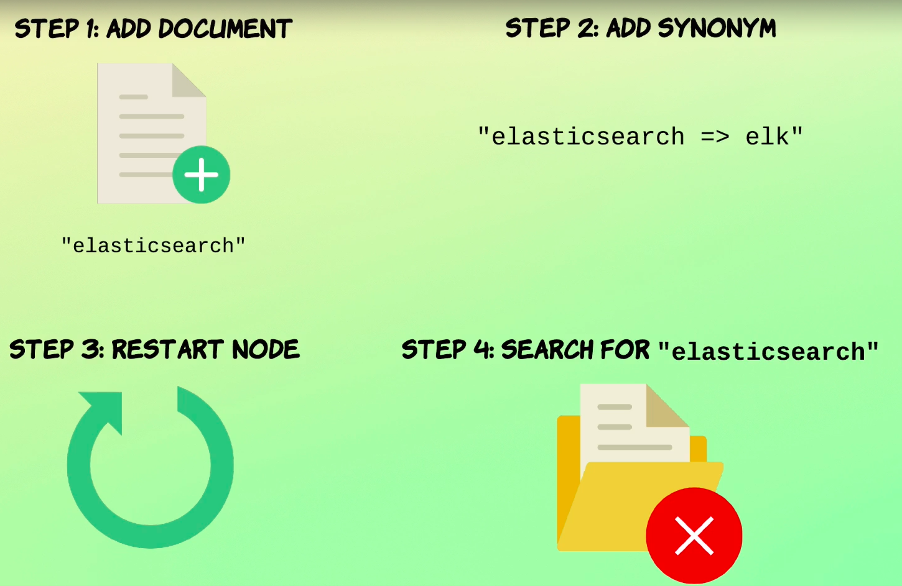
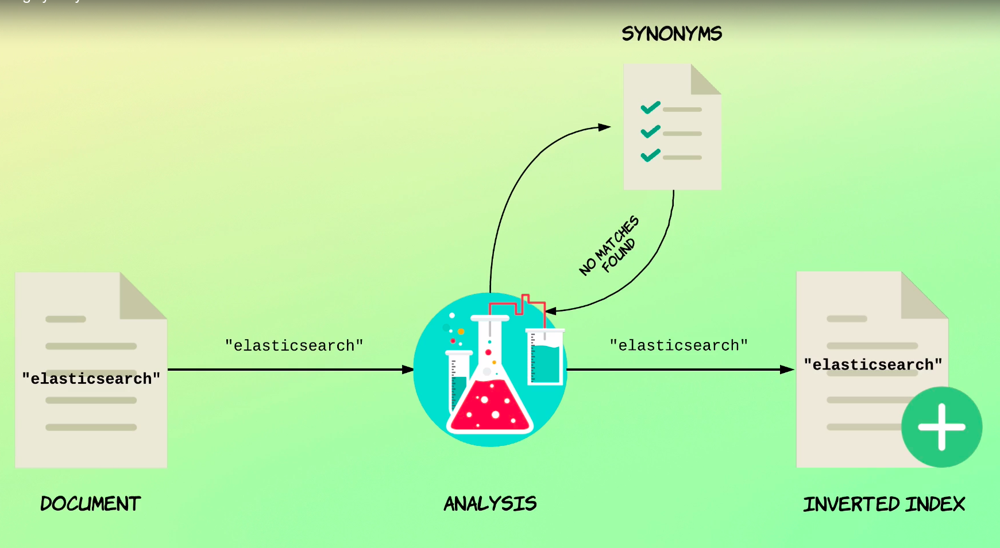
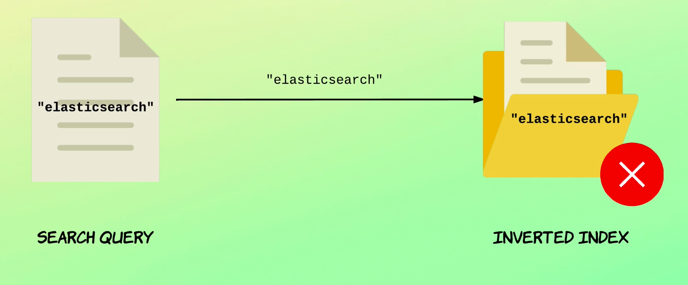
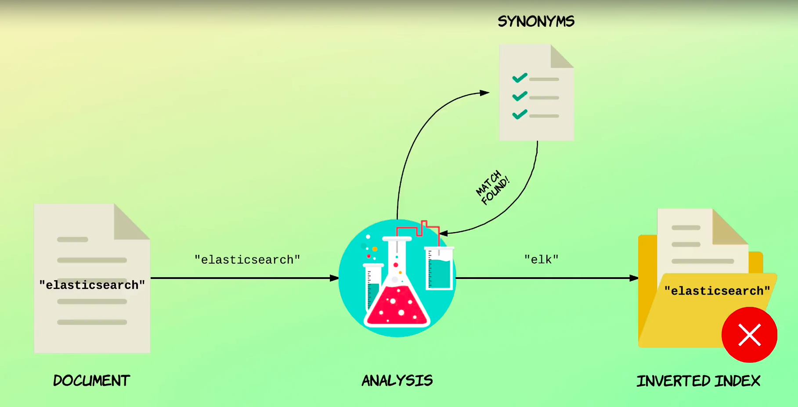
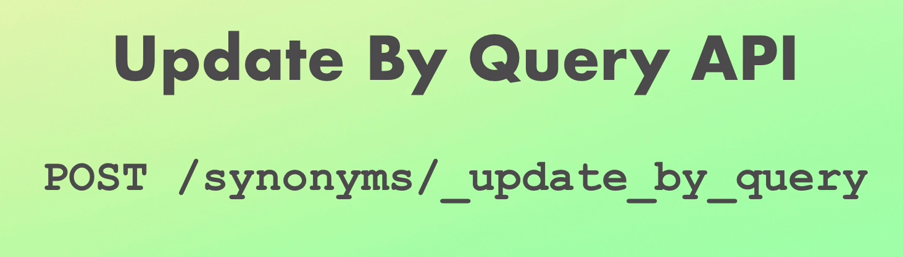

# Adding synonyms from file

You just saw how to define synonyms.

But what if you have lots of synonyms that quickly becomes inconvenient?

Both because we cannot modify the synonyms without deleting the index, but also because we would end up with a very large array within our index definition.

To solve those problems, you can define the synonyms within the file, something that you will usually want to do.

We do that by specifying a parameter named synonyms underscore path containing the path to the file.

The file should be a text file containing the same format as you saw in the previous lecture.

Just with a rule per line and without quotation marks, the path to the synonyms file should be either an absolute path or relative to the conflict directory.

let's take a moment to look at that.

If you have just installed Elasticsearch directly on your operating system, then you can just navigate to config directory within the command prompt or terminal, or with an explorer or finder or whatever your file explorer is named.

Anyways, I'll just navigate to the config directory since I'm running my Elasticsearch cluster within a Docker container

I have created a directory named analysis in which I have a file name synonyms.text.

So if you running it within ubuntu it will be here **etc/elasticsearch/analysis/synonyms.txt**.

Let's take a look at the contents of this [file](analysis/synonyms.txt).

As you can see, the format is the same as you saw in the previous lecture, but instead of an array, we just add one rule per line.

Let's head back to Cabana.

## Adding index with custom analyzer

```
PUT /synonyms
{
  "settings": {
    "analysis": {
      "filter": {
        "synonym_test": {
          "type": "synonym",
          "synonyms_path": "analysis/synonyms.txt"
        }
      },
      "analyzer": {
        "my_analyzer": {
          "tokenizer": "standard",
          "filter": [
            "lowercase",
            "synonym_test"
          ]
        }
      }
    }
  },
  "mappings": {
    "properties": {
      "description": {
        "type": "text",
        "analyzer": "my_analyzer"
      }
    }
  }
}
```
You probably noticed that I modified the query from the previous lecture in advance.

I have just specified a path relative to the config directory.

Like I mentioned before, I could also have specified an absolute path if I wanted to.

If you are on **windows**, make sure that you specify a path with back slashes instead of forward slashes.

Anyways, let's run the query, but make sure that you restart the note before doing so.

Also note that I have removed the existing index from the previous lecture in advance In case you are following along.

Let's test that.
```
{
  "acknowledged" : true,
  "shards_acknowledged" : true,
  "index" : "synonyms"
}
```
The analyser works in the same way as in the previous lecture, just to show that the synonyms file is indeed being used.

## Testing the analyzer

```
POST /synonyms/_analyze
{
  "analyzer": "my_analyzer",
  "text": "Elasticsearch"
}
```
```
{
  "tokens" : [
    {
      "token" : "elk",
      "start_offset" : 0,
      "end_offset" : 13,
      "type" : "SYNONYM",
      "position" : 0
    }
  ]
}
```
The result is that the classic search term is replaced with l k exactly as you saw in the previous lecture.

Okay.

So everything works as before now.

But I just want to mention a few things before ending this lecture.

First of all, the synonym file should be available on all nodes storing documents for the index, using the analyzer.

To keep things simple, the easiest way is probably to store the file on all nodes.

There is one more important thing that I want to mention.

If you add new synonyms to the file and restart nodes, you might think that everything is good to go.

That might be the case, but you might already have index documents containing whichever synonym you are adding.

Let's take a look at an example and see why that is problematic.



suppose I will index a document containing the term Elasticsearch and then we add a synonym of l k for that term.

Afterwards we restart the appropriate nodes and expect everything to be good.

But if we perform a search query for Elasticsearch, it won't match anything.



The reason for that may be a bit tricky to understand, but at the time of indexing the document, there is no synonym for the term Elasticsearch, so the term is just added as is to the inverted index.

At a later point in time, a synonym is added.

That synonym is effective immediately after restarting a node, but only when indexing new documents or updating existing ones.

That's because Elasticsearch picks up the new synonym when restarting a node, but it does not re index documents when starting back up.



So at this point, the inverted index contains the term Elasticsearch, which is what we are searching for.

So why doesn't the document match?


Because the search query goes through the same analysis process as the full text fields do.

A part of that process is to look for synonyms.

So when we run the search query, Elasticsearch has picked up the new synonyms.

So instead of searching for Elasticsearch, we are actually searching for elk behind the scenes.

And since the inverted index contains the term Elasticsearch, the document does not match.

Hopefully you understand what the problem is.

So what is the solution?

It's actually something that you've seen before.


```
POST /synonyms/_update_by_query
``
The update by Query API simply run the query that you saw earlier in the course and you'll be all good.

After doing that, the query should match because then the documents have been re indexed.

And with that enough about synonyms for now.

