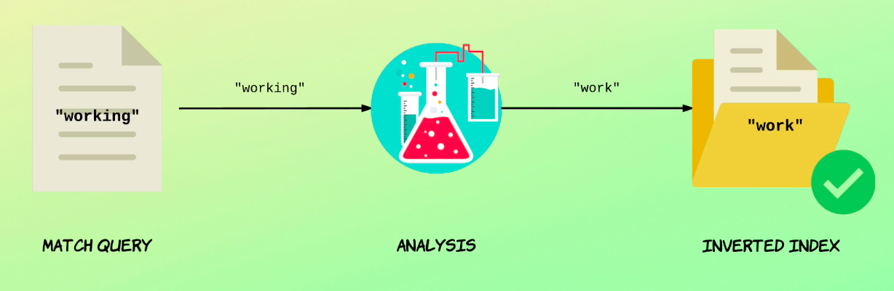

# Stemming

In this lecture, we're going to talk a bit about stemming of words.

We already talked a bit about it earlier in the course, and you even saw an example of how to use stemming when we talked about mapping.

But I want to recap on that.

Since Deming is one of the ways in which you can improve the matches of search queries, this lecture is therefore more of a recap than showing you something new, except that you'll see how a highlighter will highlight stemmed words as well.


## Creating a test index

```
PUT /stemming_test
{
  "settings": {
    "analysis": {
      "filter": {
        "synonym_test": {
          "type": "synonym",
          "synonyms": [
            "firm => company",
            "love, enjoy"
          ]
        },
        "stemmer_test" : {
          "type" : "stemmer",
          "name" : "english"
        }
      },
      "analyzer": {
        "my_analyzer": {
          "tokenizer": "standard",
          "filter": [
            "lowercase",
            "synonym_test",
            "stemmer_test"
          ]
        }
      }
    }
  },
  "mappings": {
    "properties": {
      "description": {
        "type": "text",
        "analyzer": "my_analyzer"
      }
    }
  }
}
```

This analyzer uses a custom token filter named Stemmer_test, which is of the type stemmer.

The language is that to English through the name parameter, but you could name the parameter language as well.

Apart from this Deming, I have also added a couple of synonyms to a token filter named synonym_test, which the analyzer also makes use of.

Specifically, I've defined a synonym for the terms firm and.

Anyways, let's also index a document because let's face it, an index is not much fun without any documents.

## Adding a test document

```
PUT /stemming_test/_doc/1
{
  "description": "I love working for my firm!"
}
```

As you can see, the description contains two synonyms and the word working, which will be stemmed to work.

Okay, let's run it.
```
{
  "_index" : "stemming_test",
  "_type" : "_doc",
  "_id" : "1",
  "_version" : 1,
  "result" : "created",
  "_shards" : {
    "total" : 2,
    "successful" : 1,
    "failed" : 0
  },
  "_seq_no" : 0,
  "_primary_term" : 1
}
```
Now that we've indexed the document, let's write a simple match query that searches for the terms, enjoy and work.

## Matching the document with the base word (`work`)

```
GET /stemming_test/_search
{
  "query": {
    "match": {
      "description": "enjoy work"
    }
  }
}
```
```
{
  "took" : 18,
  "timed_out" : false,
  "_shards" : {
    "total" : 1,
    "successful" : 1,
    "skipped" : 0,
    "failed" : 0
  },
  "hits" : {
    "total" : {
      "value" : 1,
      "relation" : "eq"
    },
    "max_score" : 0.7176595,
    "hits" : [
      {
        "_index" : "stemming_test",
        "_type" : "_doc",
        "_id" : "1",
        "_score" : 0.7176595,
        "_source" : {
          "description" : "I love working for my firm!"
        }
      }
    ]
  }
}
```
Running the query the document matches, even though the source document contains the terms, love and working.

The reason it matches is of course due to synonyms and stemming respectively.

I already gave you an explanation of how synonyms work in one of the previous lectures, so let's focus on stemming for now.

I just wanted to combine the two, just to give you an idea of how powerful a search engine they enable you to build.

So the query matches with the term work.

But what would happen if we changed it to working?

Well, let's see.

And while we're at it, we might as well change the term enjoy to love as well.

## The query is stemmed, so the document still matches

```
GET /stemming_test/_search
{
  "query": {
    "match": {
      "description": "love working"
    }
  }
}
```
run it again.
```
{
  "took" : 2,
  "timed_out" : false,
  "_shards" : {
    "total" : 1,
    "successful" : 1,
    "skipped" : 0,
    "failed" : 0
  },
  "hits" : {
    "total" : {
      "value" : 1,
      "relation" : "eq"
    },
    "max_score" : 0.7176595,
    "hits" : [
      {
        "_index" : "stemming_test",
        "_type" : "_doc",
        "_id" : "1",
        "_score" : 0.7176595,
        "_source" : {
          "description" : "I love working for my firm!"
        }
      }
    ]
  }
}
```
The document still matches.



What happens is that the search query is analyzed and during the analysis process the term working is stemmed to work.

This also happens when the document was indexed, so that's the term that stored within the inverted index.

So when Elasticsearch looks up the inverted index for matches, there is a match.

This means that we can effectively search for both the term work and working, and we'll still get a match.

This makes the search engine more flexible because the two words are so closely related.

So we probably don't want to exclude documents if users use one over the other.

Okay.

Just one more thing.

When talking about highlighters in the previous lecture, I mentioned that synonyms are highlighted, even if we're searching for a different word.

For example, we might search for the term enjoy while the source document contained the term love.

In this case, the term love will be highlighted within the results.

So let me just show you an example of this by adding highlighting to our query.

I'll also revert the search query to the original one.

## Synonyms and stemmed words are still highlighted

```
GET /stemming_test/_search
{
  "query": {
    "match": {
      "description": "enjoy work"
    }
  },
  "highlight": {
    "fields": {
      "description": {}
    }
  }
}
```

Okay, let's run the query.
```
{
  "took" : 60,
  "timed_out" : false,
  "_shards" : {
    "total" : 1,
    "successful" : 1,
    "skipped" : 0,
    "failed" : 0
  },
  "hits" : {
    "total" : {
      "value" : 1,
      "relation" : "eq"
    },
    "max_score" : 0.7176595,
    "hits" : [
      {
        "_index" : "stemming_test",
        "_type" : "_doc",
        "_id" : "1",
        "_score" : 0.7176595,
        "_source" : {
          "description" : "I love working for my firm!"
        },
        "highlight" : {
          "description" : [
            "I <em>love</em> <em>working</em> for my firm!"
          ]
        }
      }
    ]
  }
}
```
So what does this have to do with stemming?

Well, if we look at the results, we can see that both the terms, love and working are highlighted.

The first is an example of how a synonym is highlighted, even though we didn't actually search for the term love in regards to the term working.

This word is still highlighted even though we searched for the term work.

That's because the word is stored as the term work within the inverted index.

Despite of this, the original word is still highlighted because the inverted index also stores the offsets of the original term, which are then used by the highlighter.

And that was just a quick recap of how to apply a stemmer to a field and how Elasticsearch still highlights the original words, even after stemming has been applied to a text field.

