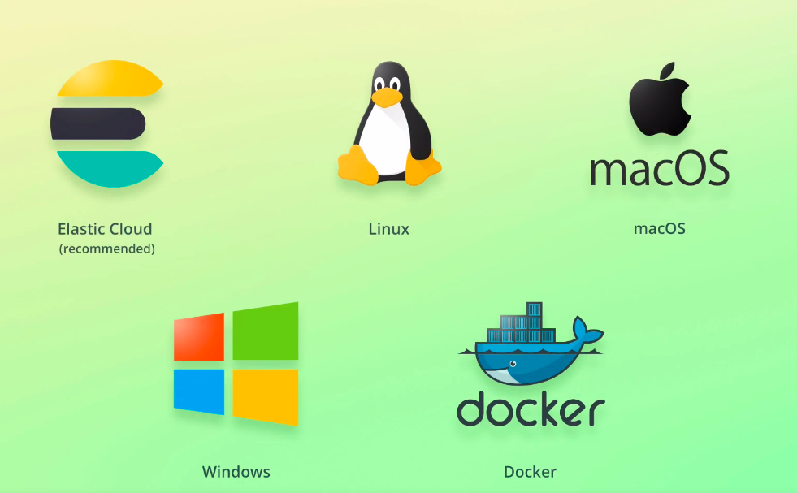

# Overview of installation options

Now that you know what Elasticsearch and the Elastic Stack is all about, let's get started ctually doing something with it.

The first step in doing so is to install Elasticsearch and Kibana.

The reason we need Kibana, is that it has a very convenient development tool named Console, which lets us easily send queries to Elasticsearch.

The next handful of lectures are going to cover how to set up both Elasticsearch and Kibana on Linux, macOS, and Windows.

While it's fairly easy, there is actually a shortcut where you don't have to install anything at all.

That's because the company behind Elasticsearch and the Elastic Stack has a cloud solution.

There is a free trial, which is sufficient for working your way through this course.

So if you don't want to deal with installation and any issues that may come from it, then this is the easiest approach.

You just have to click a few buttons, and everything is ready and set up for you, so you don't need to deal with any configuration files at all.

If you are just getting started with Elasticsearch, then that's the approach that I recommend.

When you have gained some experience with Elasticsearch - or if your trial expires - then you can always go ahead and install everything on your own machine.

I have attached a link to the Elastic Cloud trial to this lecture, and I will show you how to set everything up in the next lecture.

The other alternative is to set things up the traditional way, being on your machine.

As I mentioned a moment ago, I will cover how to do this on both Linux based systems, and on Windows.

Actually there is another approach as well; running Elasticsearch and Kibana within Docker containers.

If you are not familiar with Docker, then you can simply ignore this option.

I don't officially support that approach in this course, but I have attached a link to the documentation if you want to give it a try.

As you can see, you have a couple of options, so please find the lectures that are relevant to the approach that you prefer, and you can skip the ones that cover platforms that are not relevant to you.

Alright, let's get started setting up Elasticsearch and Kibana!