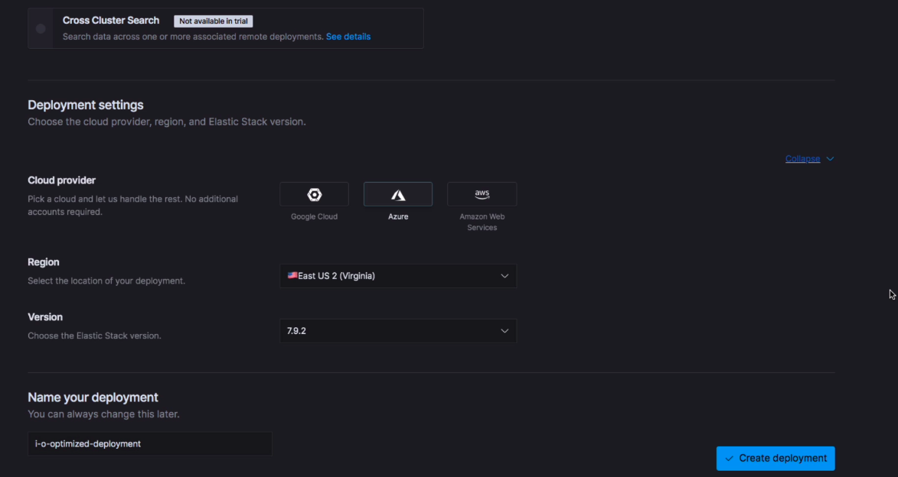

Let’s begin by seeing how to set up Elasticsearch and Kibana on Elastic Cloud, which is the easiest approach.

Elastic Cloud is a hosted and managed solution for those who want to easily deploy an Elasticsearch cluster and avoid managing the underlying infrastructure.

I have the sign up page opened up.

You can find the link [here](https://info.elastic.co/elasticsearch-service-trial-course.html?blade=udemy&hulk=partner&gambit=guide-to-es).

All we need to do is to enter our email address.

The trial is free, and no credit card information is required.

After the 14 days, your deployment will automatically be shut down, and you will not be charged anything.

The trial should be sufficient for you to mess around with Kibana while you work your way through this course.

Anyway, let’s click the button to register for the trial.

Once that’s done, you will get an email asking you to verify your email address.

Clicking the link within that email will lead you to this page where we should enter the password for our account.

The validation rules for the password are pretty strict to be honest, which can be a bit annoying — especially if you are not using a password manager.

Anyway, I will just paste in a password that passes the validation.

Clicking the button will set the password and take us to the Elastic Cloud console.

Note that your trial hasn’t started yet; the 14 days only begin when you create a deployment.

Let’s do that now by clicking this blue button.

The first thing we need to do when creating a deployment is to choose a pre-configured solution.

These are essentially templates that use different hardware configurations based on our use case.

In our case, we should choose the "Elastic Stack" solution, which is an all-purpose solution.

Next, we can choose a hardware profile.

Some of these are also intended for specific use cases, so let’s just go with the default one, again being an all-purpose solution.

Next, we have a couple of deployment settings.

Elastic Cloud deployments are hosted on a cloud provider of our choice.

This is all managed on our behalf, so we don’t need an account for any of the providers.

We can then choose the region in which we want our deployment to be created.

For the purpose of this course, I will just leave the cloud provider and region at the default values.

Lastly, we can choose which version of the Elastic Stack that we want to deploy.

The most recent release is chosen by default, which is also the one you should go with.

There are a couple of more options, none of which are relevant to us, so let’s give our deployment a name and create it.

It doesn’t really matter what you type here.

Our deployment is now being created in the background, which is going to take a few minutes.

We are presented with the credentials for our Elasticsearch cluster and Kibana instance.

We will need these, so be sure to save them.

The username is always "elastic" and cannot be changed.

If you lose the password somehow, you are able to reset it within the Elastic Cloud console.

I will just grab a copy of the password myself.

The "Download" button will just save the credentials as a CSV file.

Anyway, the deployment is still being created, so I will be back when it’s done.

Alright, our deployment has now been created, and both  Elasticsearch and Kibana are ready for use!

On this page, we can manage our deployment as well as find more details about it.

At the bottom, for instance, we can see which instances were started up for the deployment.

We won’t go into detail with that.

The page also includes the endpoints to Elasticsearch and Kibana, both of which we will need in this course.

In a couple of lectures you will need the Elasticsearch endpoint, so this is where you can go to grab it.

This is also where we launch Kibana.

You can copy the endpoint for Kibana as well, but you will need to provide the password for the "elastic" user — being the credentials that popped up when we created the deployment.

Clicking the "Launch" link will automatically sign us in.

That’s slightly more convenient, so let’s do that.

Since we don’t have any data within our Elasticsearch cluster, we are presented with this dialog when loading Kibana.

Basically we have the choice of importing some test data provided by Elastic, or continuing without any data.

Since we will import our own test data soon, let’s go with the latter and click the "Explore on my own" link.

And there we go, everything is now ready.

That was pretty easy, right?

I’ll see you in the next lecture.

