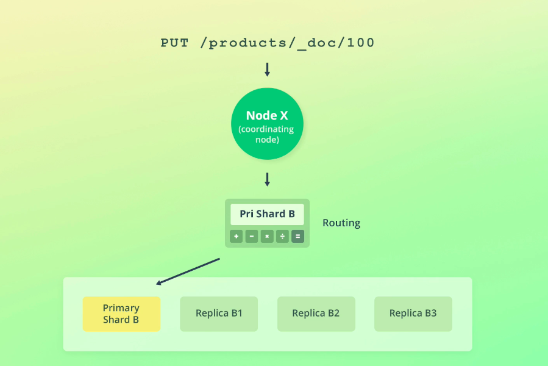
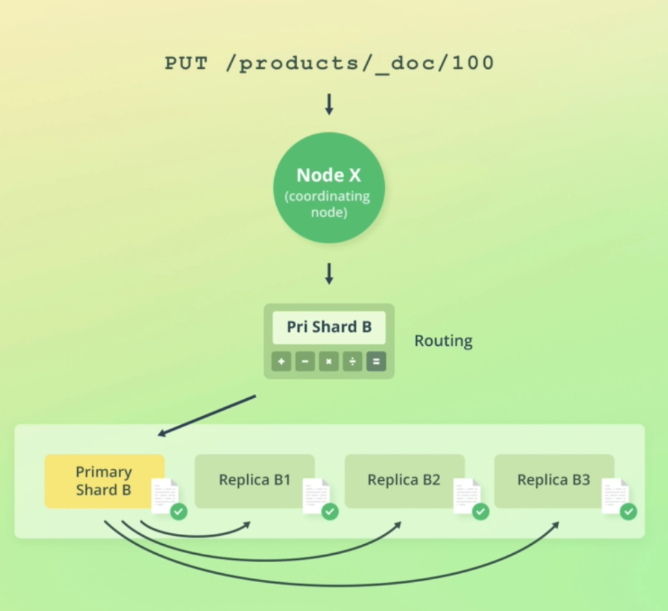
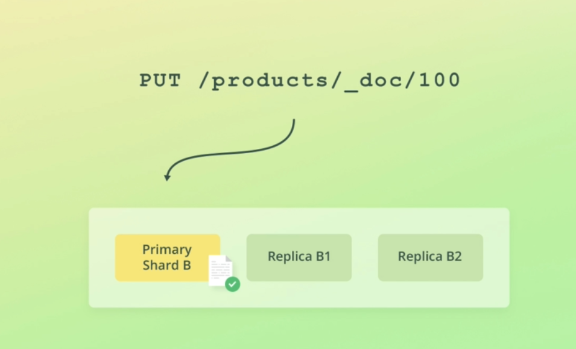
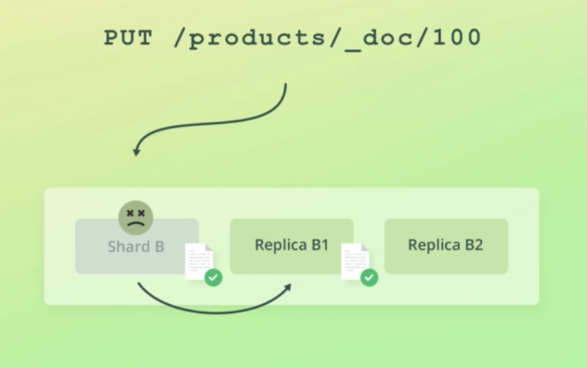
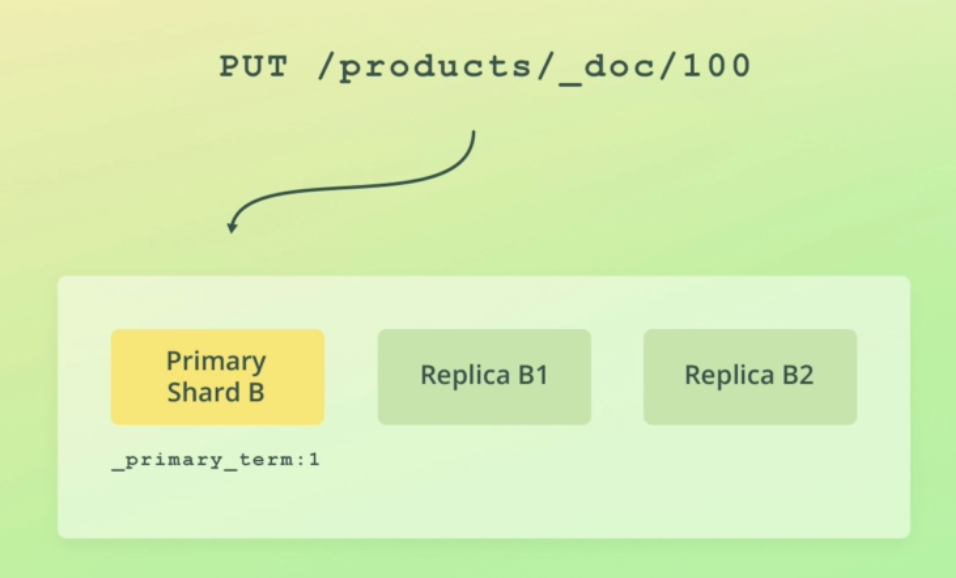

# How Elasticsearch writes data

Now that you know how Elasticsearch reads data, how does it write data?

First of all, the request goes through the same routing process that we have already discussed.

The request is resolved to the replication group that stores - or should store - the document.

Instead of routing the request to any of the shards within the replication group, write requests are always routed to the primary shard.

The primary shard is first of all responsible for validating the request.

This involves validating the structure of the request, as well as validating field values.

For instance, attempting to add an object for a numeric field would cause a validation error.

The primary shard then performs the write operation locally, before forwarding it to the replica shards to keep those up to date as well.

To improve performance, the primary shard forwards the operation to its replica shards in parallel.

Note that the operation will succeed even if the operation cannot be replicated to the replica shards.

More on that in a moment.

So to recap, a write request is routed to a primary shard, which then validates the operation, performs it locally, and distributes it to its replica shards, if any.

That's the write model at a high level, but I want to dive a little deeper.

In particular, into how Elasticsearch handles failures in regards to data replication.

Since Elasticsearch is distributed and many operations happen asynchronously, a lot of things can go wrong, such as hardware failures.

If such a failure comes at the wrong time, things can get ugly.

I guess there is no such thing as a "right" time for failures, but some failures can cause more trouble than others.

Let me give you an example.

Suppose that we index a new document.

The primary shard validates the operation and indexes the document locally.

There are two replica shards in the replication group, and the primary shard sends the operation to both.

The operation only reaches one of the replica shards, however, before the primary shard goes down, perhaps due to a hardware failure.

When this happens, Elasticsearch goes through a recovery process.

I won't get into the details of this now, because that is a large subject on its own.

That being said, it involves one of the replica shards being promoted to being the new primary shard, because each replication group must have a primary shard.

The problem is now that the two remaining shards do not share the same state, because one of them indexed the new document, while the other didn't.

The replica shard that didn't receive the index operation, thinks it's up to date, but that's not the case.

I'm sure you can imagine that things would get weird from here, because the new document would only be found half of the time, depending on which shard serves a request to retrieve the document.

That's just one example of things that can go wrong.

A lot of things can go wrong at any given time.

Sure, the chances of this happening are pretty low, but Elasticsearch needs to be able to handle this.

Especially because both the risk and consequences increase the more nodes a cluster contains, and the more writes an index needs to handle.

Elasticsearch solves this and a number of other issues with something called primary terms and sequence numbers, among others.

I won't go into too much detail, because things will get a bit complicated, but I will give you a general idea of what these two concepts are about.

**Primary terms** are a way for Elasticsearch to distinguish between old and new primary shards when the primary shard of a replication group has changed.

The primary term for a replication group is essentially just a counter for how many times the primary shard has changed.

In the example that you just saw, the primary term for the replication group would be increased

by one, because the primary shard failed, and one of the replica shards was promoted to being the new primary shard.

The primary terms for all replication groups are persisted in the cluster's state.

What happens as part of write operations, is that the current primary term is appended to the operations that are sent to the replica shards.

This enables the replica shards to tell whether or not the primary shard has changed since the operation was forwarded.

This by itself enables Elasticsearch to avoid a number of issues, but it's not quite enough.

Apart from associating each operation with a primary term, a **sequence number** is also given to operations.

This sequence number is essentially just a counter that is incremented for each operation, at least until the primary shard changes.

The primary shard is responsible for increasing this number when it processes a write request.

Sequence numbers enable Elasticsearch to know in which order operations happened on a given primary shard.

Primary terms and sequence numbers enable Elasticsearch to recover from situations where a primary shard changes, for instance due to a networking error.

Instead of having to compare data on disk, it can use primary terms and sequence numbers to figure out which operations have already been performed, and which are needed to bring a given shard up to date.

However, if you have a large index, it is not feasible to compare millions of operations to figure this out, especially not if data is being indexed and queried at a high rate at the same time.

To speed up this process, Elasticsearch maintains global and local checkpoints.

Both of these checkpoints are essentially sequence numbers.

A global checkpoint exists for each replication group, while a local checkpoint is kept for each replica shard.

The global checkpoint is the sequence number that all of the active shards within a replication group have been aligned at least up to.

This means that any operations containing a sequence number lower than the global checkpoint, have already been performed on all shards within the replication group.

If a primary shard fails and rejoins the cluster at a later point, Elasticsearch only needs to compare the operations that are above the global checkpoint that it last knew about.

Likewise, if a replica shard fails, only the operations that have a sequence number higher than its local checkpoint need to be applied when it comes back.

This essentially means that to recover, Elasticsearch only needs to compare the operations that happened while the shard was "gone," instead of the entire history of the replication group.

There is a bit more to it than this, but I don't want to overcomplicate things.

Now you know the basics of primary terms and sequence numbers, and even global and local checkpoints.

If some of it went over your head, then don't worry about it, as you will still be able to follow along perfectly fine.

Both the primary term and sequence number are actually available within the response to write requests, as well as when retrieving a document by its ID.

If you go back and take a look at the responses to the previous queries, you will see these two fields.

Or, you can just join me in the next two lectures, where we will put the two fields to use.

