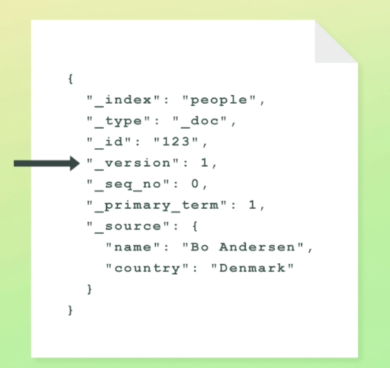

# Understanding document versioning

## Introduction to versioning

- Not a revision history of documents
- Elasticsearch stores an version metadata field with every document
 - The value is an integer
 - It is incremented by one when modifying a document
 - The value is retained for 60 seconds when deleting a document
   - Configured with the index.gc deletes setting
 - The version field is returned when retrieving documents


Elasticsearch actually versions the documents that we index.

Before you get too excited, I should mention that it's a very simple form of versioning and not a revision history of documents. Elasticsearch only stores the most recent version of a document, so the versioning doesn't mean that you can go back in time and see what a given document looked like in the past.

What Elasticsearch does, is to store an "_version" metadata field together with the documents that we index.

The field's value starts at one, and is incremented by one every time a document is updated or deleted.
In the case of deleting a document, Elasticsearch will retain the version number for 60 seconds by default. If we index a new document with the same ID within 60 seconds, the version will be incremented; otherwise it will be reset to one.

If you retrieve a document by its ID, you will see this metadata field within the response.



For search requests - which we will get to later in the course - the field is not included within the results automatically, but Elasticsearch can easily be instructed to do so.


## Types of versioning

 - The default versioning type is called internal versioning
 - There is also an external versioning type
   - Useful when versions are maintained outside of Elasticsearch
   - E.g. when documents are also stored in a RDBMS

This is the default type of versioning that is used, and is referred to as "internal" versioning. There is another type of versioning that you can use, which is called "external" versioning.

This versioning type is meant for situations where you maintain a document's version outside of Elasticsearch, such as within a database. An example could be that you use a relational database as the primary data store, and index data into Elasticsearch to make it searchable.

To use external versioning, you specify both the version that Elasticsearch should store, as well as the version type. 

The version that you specify, is constrained to being a natural number.

```
PUT /products/_doc/123?version=521&version_type=external
{
     "name": "Coffee Maker", 
     "price":64, 
     "in atook: 10
}
```

you can see an example of how that is done with the Index API.

## What's the point of versioning?
 - You can tell how many times a document has been modified
   - Probably not that useful
 - Versioning is hardly used anymore, and is mostly a thing from the past
 - It was previously the way to do optimistic concurrency control
   - Now there is a better way, though
 - You might see this field being used for clusters running old versions

First of all, it enables you to tell how many times a document has been modified, although that is probably of limited value.

To be honest with you, this form of versioning is not really used anymore - or at least it shouldn't be. 
The reason is that it has previously been the way to do optimistic concurrency control.
We'll get into what that is in the next section.

However, with the addition of primary terms and sequence numbers, this way of versioning is not best practice anymore. 
The "_version" metadata field is still available for whatever you might want to do with it, but its use is probably quite limited.

So why did I even bother telling you about it?

Because you might encounter this field in one way or another, such as for doing optimistic locking for applications that use a legacy version of Elasticsearch.

Alright, so enough talking; let's see how we can accomplish optimistic concurrency control with Elasticsearch.