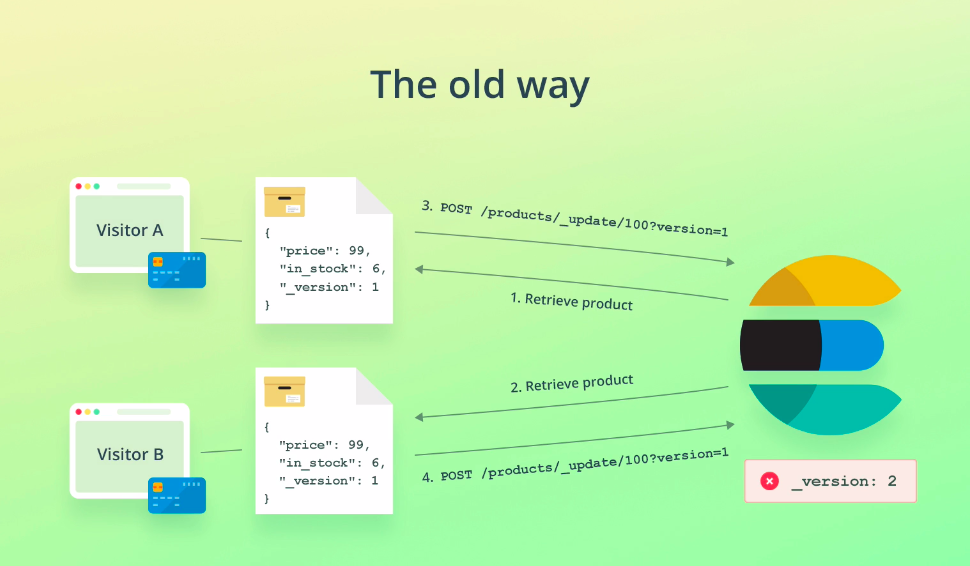
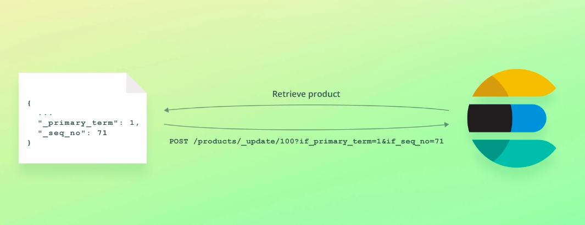

# Optimistic concurrency control

This is essentially a way to prevent that an old version of a document overwrites a more recent one, i.e. if write operations arrive out of sequence.

Since Elasticsearch is distributed and there is networking involved, such a scenario can occur.

There are quite a few examples of when the ordering of write operations may be incorrect,

but let's go with a simple example; when a web application updates a field.

More specifically, an ecommerce application.



Suppose that a website visitor has added an item to the cart, and completed the checkout flow.

Once that happens, the application retrieves the product from Elasticsearch.

At this particular point in time, another visitor completes the checkout flow for the same product, and a different thread on the web server also retrieves the product.

At this point, both threads have retrieved the same product.

The first thread subtracts the product's "in_stock" field by one and updates the product through the Elasticsearch API.

The second thread does the same thing, and this is where we run into trouble.

The second thread thinks it has the latest value for the "in_stock" field, but it has been updated from six to five since the product was retrieved.

One is subtracted from the incorrect value, and the product is updated again, but with the same field value.

There are no errors indicating that anything went wrong, and the application believes everything is okay.

The "in_stock" field, however, now has a value of five, where the value should have been four.

The consequences of this vary based on the application, but in this case we could be selling products that are not in stock, resulting in a bad customer experience.

So how do we prevent this from happening?

We need our update to fail if the document has been modified since we retrieved it.

This is where versioning comes in.

Well, or at least it used to.

The old way of accomplishing this was to use the "_version" field returned by the document retrieval and send that along with the update request as a query parameter.

The update operation would then fail if the supplied version did not match the one stored within the index.

That approach worked well in most cases, but it had some flaws when things went wrong.

Pretty much the problems that primary terms and sequence numbers solve.

Therefore the new approach is to use primary terms and sequence numbers instead.

Let's walk through an example.



When we retrieve the product, the current primary term and sequence number are included within the results.

I will show you these fields in just a moment.

What we can do, is to take the values and add them to the POST request that we send to update the document.

To do that, we use the "if_seq_no" and "if_primary_term" parameters.

Elasticsearch will then use these two values to ensure that we won't overwrite a document inadvertently if it has changed since we retrieved it.

If that happens, the operation will fail, and we can try the process again.

Let's head over to Kibana and see that in action.

## Retrieve the document (and its primary term and sequence number)
```
GET /products/_doc/100
```

We begin by retrieving a document, because I want to show you the primary term and sequence number within the results.

```
{
  "_index" : "products",
  "_type" : "_doc",
  "_id" : "100",
  "_version" : 5,
  "_seq_no" : 5,
  "_primary_term" : 1,
  "found" : true,
  "_source" : {
    "name" : "Toaster",
    "price" : 49,
    "in_stock" : 6
  }
}

```
Notice the "_primary_term" and "_seq_no" fields within the results.

*Don't worry if the values that you see are different if you are following along.*

I have another query, which just updates the "in_stock" field to an arbitrary number.

## Update the `in_stock` field only if the document has not been updated since retrieving it
```
POST /products/_update/100?if_primary_term=1&if_seq_no=5
{
  "doc": {
    "in_stock": 123
  }
}
```
As you can see, I have added two query parameters, but I haven't given them a proper value yet.

Let's take the primary term and sequence number from the query results and fill those in What this means, is that the document will only be updated if the document's primary term and sequence number match the supplied values.

Let's run the query.

```
{
  "_index" : "products",
  "_type" : "_doc",
  "_id" : "100",
  "_version" : 6,
  "result" : "updated",
  "_shards" : {
    "total" : 2,
    "successful" : 1,
    "failed" : 0
  },
  "_seq_no" : 11,
  "_primary_term" : 3
}
```
As we can see within the results, the document was updated, and the new sequence number is now 11. 

Let's run the query again without updating the sequence number, just to demonstrate that this won't work.

```
{
  "error" : {
    "root_cause" : [
      {
        "type" : "version_conflict_engine_exception",
        "reason" : "[100]: version conflict, required seqNo [5], primary term [1]. current document has seqNo [11] and primary term [3]",
        "index_uuid" : "-PS_oCgnQWaoCiEP2XJOQw",
        "shard" : "0",
        "index" : "products"
      }
    ],
    "type" : "version_conflict_engine_exception",
    "reason" : "[100]: version conflict, required seqNo [5], primary term [1]. current document has seqNo [11] and primary term [3]",
    "index_uuid" : "-PS_oCgnQWaoCiEP2XJOQw",
    "shard" : "0",
    "index" : "products"
  },
  "status" : 409
}
```
This time we get an error stating that the combination of the primary term and sequence number does not match.

It was of course ourselves who updated the document in this case, but the same would happen in the scenario that you saw a few moments ago.

Using this technique therefore prevents the concurrency issue where a document has been updated between it being retrieved and updated.

Okay, so we are not able to overwrite field values if a document has been updated without our knowledge.

But how do we proceed when getting this error, then?

### How do we handle failures?
 - Handle the situation at the application level
   - Retrieve the document again
   - Use_primary_term and _seq_no for a new update request
   - Remember to perform any calculations that use field values again

When updating documents this way, you will need to handle this within your application, meaning that you should retrieve the document again, and use the new primary term and sequence number when retrying the update.

Remember to perform any calculations again since field values might have changed.

**That's how to do optimistic concurrency control with Elasticsearch.**
 - Sending write requests to Elasticsearch concurrently may overwrite changes made by other concurrent processes
 - Traditionally, the_version field was used to prevent this
 - Today, we use the primary_term and _seq_no fields
 - Elasticsearch will reject a write operation if it contains the wrong primary term or sequence number
   - This should be handled at the application level


You don't always need to do this depending on your use case.

But if you have processes or threads that might update the same document concurrently,

then you should definitely consider using this approach.


