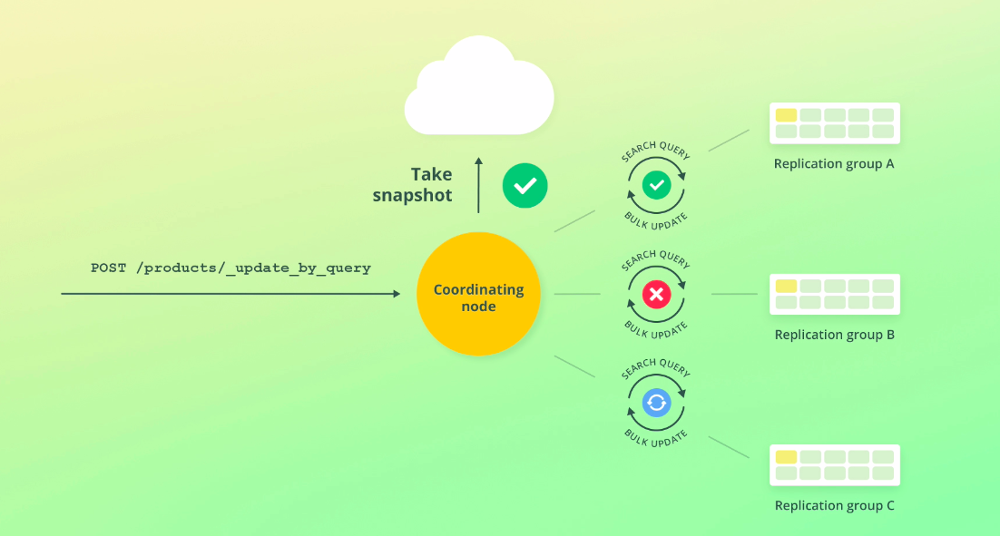

# Update by query

A bit earlier in this section, you learned how to update a single document with a script.

But what if we want to update multiple documents in one query? You might have experience with relational databases, where this functionality is available as an UPDATE query containing a WHERE clause.

Elasticsearch supports this in a similar, although simpler way. 
The reason I didn't mention it at the time, is that we had not covered primary terms and sequence numbers yet, as well as optimistic concurrency control.
 
To understand how the query that I am about to show you works internally, knowledge of these principles is required. Before getting to that, though, let's write the query.

## Updating documents


```
POST /products/_update_by_query
{
  "script": {
    "source": "ctx._source.in_stock--"
  }
}
```

Suppose that someone has purchased multiple products and we need to reduce the "in_stock" field value by one for each of the products. 
For simplicity, we will just assume that each product has been ordered with a quantity of one. 
We could of course update each document separately, but let's update them within a single query instead.

To accomplish this, we need to use the Update By Query API. Let's type in the HTTP verb and request path first of all.

Within the request body, we need to supply a script, which is done in exactly the same way as when we updated a single document with a script.

Now that we have defined how we want to update our documents, we need to apply a constraint to which documents will be affected. 
The way this is done, is by supplying a search query.

Since we haven't covered search queries yet, I will just use the simplest possible query, being one that matches all documents, just to not overcomplicate things.

Once we have covered search queries later , you will be able to go back and swap out that query with more advanced ones that match specific products. 

The option in which we will add the query, is named" "query.

" The query that I will use, is named "**match_all**."

## Updating documents matching a query

Replace the `match_all` query with any query that you would like.

```
POST /products/_update_by_query
{
  "script": {
    "source": "ctx._source.in_stock--"
  },
  "query": {
    "match_all": {}
  }
}
```

Don't worry about this search query syntax, since we will get back to that later.

What this query does, is to run the script for all documents that match the query, being all documents in this example. 

Let's give it a go.

```
{
  "took" : 76,
  "timed_out" : false,
  "total" : 2,
  "updated" : 2,
  "deleted" : 0,
  "batches" : 1,
  "version_conflicts" : 0,
  "noops" : 0,
  "retries" : {
    "bulk" : 0,
    "search" : 0
  },
  "throttled_millis" : 0,
  "requests_per_second" : -1.0,
  "throttled_until_millis" : 0,
  "failures" : [ ]
}
```
Within the results, we can see that two documents were updated.

There are a couple of other interesting things to see here, but that requires a bit of background knowledge about how the query works internally. 
If you are not interested in that, you are welcome to skip the remainder of this section.


The first thing that happens when an Update By Query request is processed, is that a snapshot of the index is created. I will get back to why this is the case in a moment.

When the snapshot has been taken, a search query is sent to each of the index' shards, in order to find all of the documents that match the supplied query.

Whenever a search query matches any documents, a bulk request is sent to update those documents. 
We haven't covered bulk requests yet, but it's a way to perform document actions on many documents with one request. Specifically, the index, update, and delete actions.

Anyway, we'll get to that soon.

The "batches" key within the results, specifies how many batches were used to retrieve the documents. 
The query uses something called the Scroll API internally, which is a way to scroll through result sets. 
The point of this is to be able to handle queries that may match thousands of documents.

Each pair of search and bulk requests are sent sequentially, i.e. one at a time. 

The reason for not doing everything simultaneously, is related to how errors are handled.

Should there be an error performing either the search query or the bulk query, Elasticsearch will automatically retry up to ten times. 

The number of retries is specified within the "retries" key, for both the search and bulk queries. 
If the affected query is still not successful, the whole query is aborted. 

The failures will then be specified in the results, within the "failures" key. 
It is important to note that the query is aborted, and not rolled back.

This means that if a number of documents have been updated when an error occurs, those documents will remain updated, even though the request failed.

The query is therefore not run within a transaction as you might be familiar with from various databases.

That is actually not something unique to this API, but rather a general design pattern.

Typically you will see that if an API can partially succeed or fail, it will return information that you can use to deal with it.



The diagram that you see now, shows that the queries were run successfully against Replication Group A, but something went wrong while sending queries to Replication Group B, causing the query to be aborted.

Any documents that may match the search query, are therefore not updated within Replication Group C. The documents that were updated within Replication Group A, will remain updated even though the query was aborted.

The reason why Elasticsearch takes a snapshot of the index, is to ensure that the updates are performed on the basis of the current state of the index. 
For an index where documents are indexed, modified, and deleted frequently, it is not unlikely that something has changed from when Elasticsearch received the query, to when it finishes processing it.

This is especially true when updating many documents.

When Elasticsearch is requested to update a given document, it uses the document's primary term and sequence number from the snapshot to ensure that it has not been changed since creating the snapshot. 

If the document has been changed, there will be a version conflict, causing the document to not be updated.

This will also cause the entire query to be aborted.

The number of conflicts is returned under the "version_conflicts" key within the query results.

If you don't want the query to be aborted when there is a version conflict, you can specify a "conflicts" key with a value of "proceed" within the request body.

Note that you can also add this as a query parameter if you prefer. 
Let me just add that to the query.

## Ignoring (counting) version conflicts

The `conflicts` key may be added as a query parameter instead, i.e. `?conflicts=proceed`.

```
POST /products/_update_by_query
{
  "conflicts": "proceed",
  "script": {
    "source": "ctx._source.in_stock--"
  },
  "query": {
    "match_all": {}
  }
}
```

What this does, is that the version conflicts will just be counted, rather than causing the query to be aborted.

Alright, let's quickly verify that our query actually worked.

For that, I have prepared a super simple search query that just matches all documents - exactly the same as the one that is embedded within the query that we just wrote.
Again, we will cover search queries later, so let's just go ahead and run it.

## Matches all of the documents within the `products` index

```
GET /products/_search
{
  "query": {
    "match_all": {}
  }
}
```
```
{
  "took" : 1,
  "timed_out" : false,
  "_shards" : {
    "total" : 2,
    "successful" : 2,
    "skipped" : 0,
    "failed" : 0
  },
  "hits" : {
    "total" : {
      "value" : 2,
      "relation" : "eq"
    },
    "max_score" : 1.0,
    "hits" : [
      {
        "_index" : "products",
        "_type" : "_doc",
        "_id" : "100",
        "_score" : 1.0,
        "_source" : {
          "price" : 49,
          "name" : "Toaster",
          "in_stock" : 122
        }
      },
      {
        "_index" : "products",
        "_type" : "_doc",
        "_id" : "i5NphIIBQIIkZQ0Tnxys",
        "_score" : 1.0,
        "_source" : {
          "price" : 64,
          "name" : "Coffee Maker",
          "in_stock" : 9
        }
      },
    ]
  }
}
```
Within the results, we can find both of the documents that we  added. They have a value of 9 and 122 for the "in_stock" field.
 
I don't expect that you have been keeping track of the values since we have changed them a few times, but luckily I have, so I can tell you that these numbers are correct.

And that's how you can update multiple documents based on a condition.


