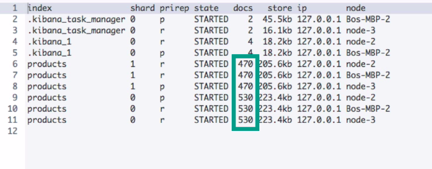

# Importing data with cURL

Now that you know how to use the Bulk API, let's use it from the command line to import some test data that we will be using throughout the course.

To do this, I will use an HTTP client called cURL, which is the most popular command-line tool for sending HTTP requests.

If you are using macOS or Linux, you should already have it installed.

The same actually applies to some Windows installations, so you might not have to install it yourself.

If it's not available on your system, I have attached a link to the download page to this lecture for your convenience.

Note that you can use any other HTTP client as well if you prefer, but I will cover that later.

The first thing you need to do is to download the file containing the test data.

You can find the file  [here](docs/products-bulk.json).

just to give you an idea of what the file contains.

As you can see, the file just contains a lot of "index" actions; 1000 to be exact.

Each document has been assigned a sequential ID.

Since the index name is not specified anywhere within the action metadata, this tells us that we need to specify the index name in the request itself.

More precisely, within the request path.

Before importing the data, I want to scroll down to the bottom of the file.

As I mentioned in the previous lecture, the file needs to end with a newline character.

In a text editor, this just means that the last line of the file should be empty.

I have already done this for the files that I have uploaded, so the import should work out for you.

However, I still see some people getting an error stating that the file needs to end with a newline character.

If that is the case for you, you just need to open up the file in a text editor and ensure that there is an empty line at the end of the file.

With that out of the way, let's type out the command that sends an HTTP request to the Bulk API.

For that, we need to open a terminal window.

The working directory should be the directory in which the downloaded file is placed, which is the desktop in my case.

## Navigating to bulk file directory

```
cd /path/to/data/file/directory
```

### Examples
```
# macOS and Linux
cd ~/Desktop

# Windows
cd C:\Users\[your_username]\Desktop
```

In case you are new to the terminal.


## Importing data into local cluster

```
curl -H "Content-Type:application/x-ndjson" -XPOST http://127.0.0.1:9200/products/_bulk --data-binary "@products-bulk.json"
```

## Importing data into Elastic Cloud 
```
curl -H "Content-Type:application/x-ndjson" -XPOST -u username:password https://elastic-cloud-endpoint.com:9243/products/_bulk --data-binary "@products-bulk.json"
```


Alright, so naturally the command begins with "curl."

Following that, we need to specify the "Content-Type" header, which we can do with the -H option.

This header needs to specify the NDJSON content type as discussed in the previous lecture.

Then we need to specify the HTTP verb.

If we leave it out, it defaults to "GET," but we need it to be "POST." We use the -X option to specify the verb.

If you are using Elastic Cloud, then remember to add the "u" option here as you saw in the previous section.

Following the HTTP verb, we enter the URL to the Bulk API.

Since we are no longer using the Console tool, we of course need to specify the fully qualified URL.

Since I am working with a local Elasticsearch cluster, that will be localhost on port 9200.

If you want the results to be formatted nicely for your eyes, you can add a "pretty" query parameter without any value.

Since the Bulk API is almost exclusively used within some kind of script, the results will also typically be processed by a script, so that is probably of limited use.

However, if you want to inspect the response for testing purposes, you can go ahead and add that query parameter.

Finally, we need to actually send some data along with the POST request.

We do that with the "data-binary" option.

Notice that this option must be prepended with two hyphens instead of just one.

We then add the file name within double quotes, prepended with an "at" (@) symbol.

This symbol tells cURL that the value is a file name and not a path.

Let's type that out.

We send the file content along as binary data, because we want to preserve the newline characters.

Other cURL options process the data, causing newlines to be removed.

That's it!

Let's run the command.

```
{
  "took" : 630,
  "timed_out" : false,
  "_shards" : {
    "total" : 1,
    "successful" : 1,
    "skipped" : 0,
    "failed" : 0
  },
  "hits" : {
    "total" : {
      "value" : 1000,
      "relation" : "eq"
    },
    "max_score" : 1.0,
    "hits" : [
      {
        "_index" : "products",
        "_type" : "_doc",
        "_id" : "1",
        "_score" : 1.0,
        "_ignored" : [
          "description.keyword"
        ],
        "_source" : {
          "name" : "Wine - Maipo Valle Cabernet",
          "price" : 152,
          "in_stock" : 38,
          "sold" : 47,
          "tags" : [
            "Beverage",
            "Alcohol",
            "Wine"
          ],
          "description" : "Aliquam augue quam, sollicitudin vitae, consectetuer eget, rutrum at, lorem. Integer tincidunt ante vel ipsum. Praesent blandit lacinia erat. Vestibulum sed magna at nunc commodo placerat. Praesent blandit. Nam nulla. Integer pede justo, lacinia eget, tincidunt eget, tempus vel, pede. Morbi porttitor lorem id ligula.",
          "is_active" : true,
          "created" : "2004/05/13"
        }
      },
      {
        "_index" : "products",
        "_type" : "_doc",
        "_id" : "2",
        "_score" : 1.0,
        "_ignored" : [
          "description.keyword"
        ],
        "_source" : {
          "name" : "Tart Shells - Savory",
          "price" : 99,
          "in_stock" : 10,
          "sold" : 430,
          "tags" : [ ],
          "description" : "Pellentesque at nulla. Suspendisse potenti. Cras in purus eu magna vulputate luctus. Cum sociis natoque penatibus et magnis dis parturient montes, nascetur ridiculus mus. Vivamus vestibulum sagittis sapien. Cum sociis natoque penatibus et magnis dis parturient montes, nascetur ridiculus mus. Etiam vel augue. Vestibulum rutrum rutrum neque. Aenean auctor gravida sem.",
          "is_active" : true,
          "created" : "2007/10/14"
        }
      },
      {
        "_index" : "products",
        "_type" : "_doc",
        "_id" : "3",
        "_score" : 1.0,
        "_source" : {
          "name" : "Chorizo and sausage pasta",
          "price" : 25,
          "in_stock" : 24,
          "sold" : 215,
          "tags" : [
            "Pasta",
            "Meat"
          ],
          "description" : "Fresh egg pasta in a sauce made from Spanish chorizo and Cumberland sausage",
          "is_active" : true,
          "created" : "2000/11/17"
        }
      },
      {
        "_index" : "products",
        "_type" : "_doc",
        "_id" : "4",
        "_score" : 1.0,
        "_source" : {
          "name" : "Martini Glass",
          "price" : 37,
          "in_stock" : 37,
          "sold" : 477,
          "tags" : [ ],
          "description" : "In the mood for a martini, or perhaps a cosmopolitan?",
          "is_active" : false,
          "created" : "2008/08/17"
        }
      },
      {
        "_index" : "products",
        "_type" : "_doc",
        "_id" : "5",
        "_score" : 1.0,
        "_source" : {
          "name" : "Venison - Liver",
          "price" : 87,
          "in_stock" : 24,
          "sold" : 261,
          "tags" : [ ],
          "description" : "Etiam pretium iaculis justo. In hac habitasse platea dictumst. Etiam faucibus cursus urna. Ut tellus.",
          "is_active" : false,
          "created" : "2002/04/26"
        }
      },
      {
        "_index" : "products",
        "_type" : "_doc",
        "_id" : "6",
        "_score" : 1.0,
        "_source" : {
          "name" : "Nestea - Iced Tea",
          "price" : 121,
          "in_stock" : 23,
          "sold" : 431,
          "tags" : [
            "Beverage"
          ],
          "description" : "Donec ut mauris eget massa tempor convallis. Nulla neque libero, convallis eget, eleifend luctus, ultricies eu, nibh. Quisque id justo sit amet sapien dignissim vestibulum.",
          "is_active" : true,
          "created" : "2011/11/06"
        }
      },
      {
        "_index" : "products",
        "_type" : "_doc",
        "_id" : "7",
        "_score" : 1.0,
        "_source" : {
          "name" : "Beets - Pickled",
          "price" : 172,
          "in_stock" : 25,
          "sold" : 290,
          "tags" : [
            "Vegetable",
            "Beets"
          ],
          "description" : "Aliquam erat volutpat. In congue. Etiam justo. Etiam pretium iaculis justo. In hac habitasse platea dictumst. Etiam faucibus cursus urna. Ut tellus. Nulla ut erat id mauris vulputate elementum.",
          "is_active" : false,
          "created" : "2008/09/20"
        }
      },
      {
        "_index" : "products",
        "_type" : "_doc",
        "_id" : "8",
        "_score" : 1.0,
        "_source" : {
          "name" : "Energy Drink Red Bull",
          "price" : 153,
          "in_stock" : 25,
          "sold" : 6,
          "tags" : [
            "Beverage"
          ],
          "description" : "Duis consequat dui nec nisi volutpat eleifend. Donec ut dolor. Morbi vel lectus in quam fringilla rhoncus. Mauris enim leo, rhoncus sed, vestibulum sit amet, cursus id, turpis.",
          "is_active" : false,
          "created" : "2017/05/17"
        }
      },
      {
        "_index" : "products",
        "_type" : "_doc",
        "_id" : "9",
        "_score" : 1.0,
        "_ignored" : [
          "description.keyword"
        ],
        "_source" : {
          "name" : "Onions - Green",
          "price" : 105,
          "in_stock" : 22,
          "sold" : 199,
          "tags" : [
            "Vegetable"
          ],
          "description" : "Ut at dolor quis odio consequat varius. Integer ac leo. Pellentesque ultrices mattis odio. Donec vitae nisi. Nam ultrices, libero non mattis pulvinar, nulla pede ullamcorper augue, a suscipit nulla elit ac nulla. Sed vel enim sit amet nunc viverra dapibus. Nulla suscipit ligula in lacus. Curabitur at ipsum ac tellus semper interdum. Mauris ullamcorper purus sit amet nulla. Quisque arcu libero, rutrum ac, lobortis vel, dapibus at, diam.",
          "is_active" : false,
          "created" : "2005/08/01"
        }
      },
      {
        "_index" : "products",
        "_type" : "_doc",
        "_id" : "10",
        "_score" : 1.0,
        "_source" : {
          "name" : "Ecolab - Hobart Washarm End Cap",
          "price" : 24,
          "in_stock" : 25,
          "sold" : 96,
          "tags" : [ ],
          "description" : "In sagittis dui vel nisl. Duis ac nibh. Fusce lacus purus, aliquet at, feugiat non, pretium quis, lectus. Suspendisse potenti.",
          "is_active" : true,
          "created" : "2006/12/26"
        }
      }
    ]
  }
}
```
After a short moment, our Elasticsearch cluster responds with a result set of the same format as you saw in the previous lecture.

If you are sending bulk requests within a script, you would inspect the results at this point, but in this case we are happy with this.

In case you were wondering why we were allowed to run this command when our index already contained a couple of documents...

That's because the bulk request contains actions with the same document IDs.

And since the actions are all set to "index," these existing documents are simply replaced, so that's why we didn't need to delete them first.

Had we used the "create" action instead, we would see that a couple of actions would have failed.

Let's quickly inspect the shards within our cluster to see how the documents have been distributed.

I have already prepared the query, because you have seen it before, so let's just go ahead and run it.

```
Get /_cat/shards?v
```
 

As you can see within the results, the documents that we just indexed, have been quite evenly distributed across the two shards that the index consists of.

The distribution is not perfect, but the default routing strategy does a pretty good job of evenly distributing the documents.

Note that it might take a couple of minutes before the number of documents are updated.

So if the document count is not one thousand within the query results, you need to wait a couple of minutes before running the query again.

That's it - we now have some data to work with.


