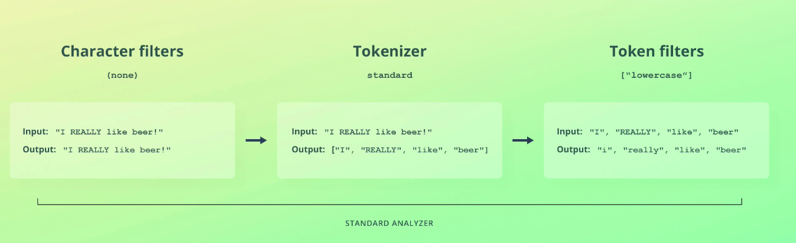

# Introduction to analysis 

The first topic that we will cover is **analysis**.

You might also see this topic being referred to as text analysis.

That’s because the concept is really only applicable to text values.

When we index a text value, it goes through an analysis process.

This process involves a number of things that I will get back to.

The purpose of it is to store the values in a data structure that is efficient for searching.

When we retrieved documents in the previous section, you saw how the values that we indexed were returned under an "_source" key.

This object contains the exact values that we specified when indexing a document.

However, those are not the values that Elasticsearch uses internally when figuring out which documents match a search query.

That’s because a long product description, for instance, cannot be searched efficiently without processing it first.

I will tell you the specifics of how Elasticsearch stores data soon, but for now the point is that text is processed before being stored.

When a text value is indexed, a so-called analyzer is used to process the text.

In other words, the value is analyzed.

An analyzer consists of three building blocks; character filters, a tokenizer, and token filters.

The result of analyzing text values is then stored in a searchable data structure.

Let’s go over the parts of an analyzer one by one, beginning with character filters.

A character filter receives the original text and may transform it by adding, removing, or changing characters.

An analyzer may have zero or more character filters, and they are applied in the order in which they are specified.

An example could be to remove HTML elements and convert HTML entities by using a character filter named "html_strip".

An analyzer must contain exactly one tokenizer, which is responsible for tokenizing the text.

By "tokenizing," I am referring to the process of splitting the text into tokens.

As part of that process, characters may be removed, such as punctuation, exclamation marks, etc.

An example of that could be to split a sentence into words by splitting the string whenever a whitespace is encountered.

The input string is therefore tokenized into a number of tokens.

Although you don’t see it in this example, the tokenizer also records the character offsets for each token in the original string.

You will learn why this is the case later in the course, so I chose to keep the example as simple as possible for now.

Next, we have token filters.

These receive the tokens that the tokenizer produced as input and they may add, remove, or modify tokens.

As with character filters, an analyzer may contain zero or more token filters, and they are applied in the order in which they are specified.

The simplest possible example of a token filter is probably the "lowercase" filter, which lowercases all letters.

Elasticsearch ships with a number of built-in character filters, tokenizers, and token filters.

As you can probably imagine, it is possible to mix and match these together to form custom analyzers.

We will get back to that later in this section, but let’s keep things simple for now.

Let’s walk through an example of what happens by default when Elasticsearch encounters a text value.

No character filter is used by default, so the text is passed on to the tokenizer as is.

The tokenizer splits the text into tokens according to the Unicode Segmentation algorithm.

Its implementation is a bit technical, but essentially it breaks sentences into words by whitespace, hyphens, and such.

In the process, it also throws away punctuation such as commas, periods, exclamation marks, etc.

It’s a bit more complicated than this, but it pretty much behaves the way you would expect.

The tokens are then passed on to a token filter named "lowercase".

This token filter does what you would expect; it lowercases all letters for the tokens.

What you just saw is the behavior of the "standard" analyzer.

This analyzer is used for all "text" fields unless configured otherwise.

There are a couple of analyzers available besides the "standard" analyzer, but that’s the one you will typically use.

It’s also possible to build your own one like I mentioned a moment ago.

I will give you an overview of the most important analyzers, character filters, tokenizers, and token filters a bit later in this section.

All you need to know for now is what analyzers do and how the "standard" analyzer behaves.

