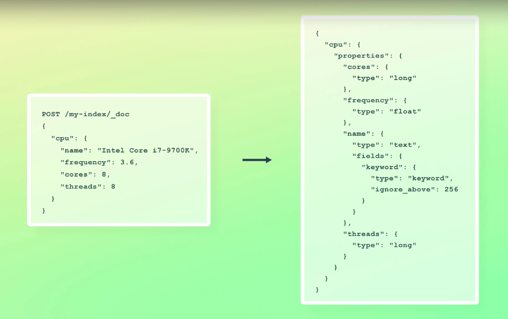
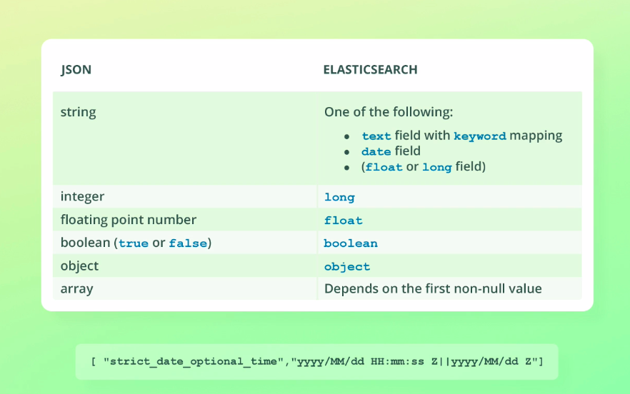

So far in this section, we have worked with explicit mappings, although I did briefly mention the concept of dynamic mapping.

Dynamic mapping is what we will be working with now.

It’s essentially a way to make Elasticsearch easier to use by not requiring us to define explicit field mappings before indexing documents.

The first time Elasticsearch encounters a field, it will automatically create a field mapping for it, which is then used for subsequent indexing requests.


Suppose that we index a document into an index that either doesn’t exist yet, or one that doesn’t contain any mappings.

We specify three fields, none of which Elasticsearch has seen before, so it automatically creates a mapping for each field.

Let’s have a look at the field mappings that would be generated.

The "created_at" field was mapped to the "date" data type, even though we specified a string as the value.

That’s because there is no "date" data type in JSON, so Elasticsearch uses a process called date detection to… well, detect dates.

I will get back to that in a moment.

The "in_stock" field was mapped to the "long" data type because we specified a numeric value without decimals.

In this case an integer would be sufficient and save us some disk space, but Elasticsearch cannot know how large numbers we intend to store for a field, so it always chooses the  "long" data type.

When storing millions of documents, it might be worth explicitly mapping the field as an integer instead.

The "tags" field was interestingly mapped as a multi-field with both the "text"  and "keyword" data types.

Notice how the keyword mapping is named "keyword", which follows the naming convention that I mentioned earlier.

The reasoning behind this mapping is that Elasticsearch doesn’t know how you intend to query fields.

That’s why it adds two mappings, which can be used for different use cases; the "text"  mapping should be used for full-text searches, while the "keyword" mapping should be used for exact matches, aggregations, and sorting.

You should think of this as a sensible default behavior, but it might not always be the best mapping.

In this example, it’s quite unlikely that we will be performing full-text searches on tags; we will probably only do two things, being to filter documents based on exact matches, and to do aggregations.

This means that the "text" mapping would be unused, and it would just cause indexing overhead and a waste of disk space.

On the contrary, a "description" field would rarely be used for aggregations or sorting, because that just wouldn’t make any sense.

We would perform full-text searches on such a field, rendering the "keyword" mapping redundant.

This brings me to the "ignore_above" parameter that has a value of 256.

This simply ignores strings that are more than 256 characters long, causing the value to not be part of the inverted index for the "keyword" mapping.

This is done because it almost never makes sense to use such long values for sorting and aggregations.

In such a case, the values just use unnecessary disk space, because the data is effectively duplicated for each mapping.

As an optimization to always provide both mappings, Elasticsearch ignores long values for the "keyword" mapping.

That’s just to avoid storing long texts twice, such as product descriptions or blog posts.

If you index values that are less than 256 characters long and you don’t make use of the "keyword" mapping, then it’s still a waste of disk space, but the impact is reduced.

Therefore you should consider this default mapping a sensible default that is used for convenience.

If you know that you won’t need either of the two mappings, then you should consider adding your own mapping as an optimization.

If you just store a few thousand documents, it’s really not a big deal, but if you anticipate that you will scale an index up to many million documents, then the savings will eventually be significant.

You just saw three examples of how Elasticsearch maps data types into field mappings.

Let’s take a look at the rules that are used to determine how fields are mapped dynamically.


When a string value is encountered, it is typically mapped to a "text" field which has a nested "keyword" mapping.

There are two exceptions to this, with the first one being if the value passes date detection.

By default, values are checked against the date formats that you see on your screen now, but this can be configured.

Perhaps you noticed how the table shows that strings can also be mapped to "float"  or "long" fields.

This is done with numeric detection, which is essentially coercion.

If a string contains only a number, numeric detection will map the field as either "float"  or "long", depending on the value.

This behavior is actually disabled by default, hence why I have listed the data types in parenthesis.

You can enable it if you want to, but that’s not the best practice.

Instead, you can map numeric fields explicitly, and if numbers are sent to Elasticsearch as strings, coercion will take care of the rest.

Even better, you should ensure that numbers are always sent to Elasticsearch as numbers instead of strings.

Numeric detection and coercion are essentially ways for Elasticsearch to be forgiving, but you should try to not rely on them.

Next, integers are mapped to the "long" data type.

As I mentioned earlier, Elasticsearch has no way of knowing how large numbers you intend to store, so it chooses the "long" data type just in case.

Floating point numbers and booleans are mapped to "float" and "boolean", so no surprises there.

Objects are mapped to… well, objects.

As you know, objects are a bit special, since there is no data type named "object",  so it’s an implicit data type you could say.

Here is an example of how an object would be mapped using dynamic mapping.



Each key-value pair within the "cpu" object will be mapped using the same rules as any other field.

Lastly, let’s talk about how arrays are mapped.



As you know, the mapping won’t be any different than other fields because every field in Elasticsearch may contain zero or more values, so there is no need to define this.

The difference is how Elasticsearch infers the data type.

It does so based on the first non-null value in the array.

That value is used to determine the data type based on the same rules as shown in the diagram.

Apart from the aforementioned rules, specifying a NULL value for a field will cause Elasticsearch to completely ignore that field and not add a mapping for it.

Remember the "products" index that we created earlier in the course?

 We indexed a thousand documents into it without adding any mappings first.

Since dynamic mapping is enabled by default, the field mappings were created for us automatically based on the field values that we supplied to the Bulk API.

Let’s take a short moment to inspect the mapping.

```
GET /products/_mapping
```

Spoiler alert, it’s going to look pretty similar to what you have already seen in this lecture.

```{
  "products" : {

    "mappings" : {
      "properties" : {
        "created" : {
          "type" : "date",
          "format" : "yyyy/MM/dd HH:mm:ss||yyyy/MM/dd||epoch_millis"
        },
        "description" : {
          "type" : "text",
          "fields" : {
            "keyword" : {
              "type" : "keyword",
              "ignore_above" : 256
            }
          }
        },
        "in_stock" : {
          "type" : "long"
        },
        "is_active" : {
          "type" : "boolean"
        },
        "name" : {
          "type" : "text",
          "fields" : {
            "keyword" : {
              "type" : "keyword",
              "ignore_above" : 256
            }
          }
        },
        "price" : {
          "type" : "long"
        },
        "sold" : {
          "type" : "long"
        },
        "tags" : {
          "type" : "text",
          "fields" : {
            "keyword" : {
              "type" : "keyword",
              "ignore_above" : 256
            }
          }
        }
      }
    }

  }
}
```
Looking at the mapping, it hopefully looks as you expected.

Just a small thing to note.

Both the "description" and "tags" fields are mapped as "text" and "keyword" fields.

Nothing new about that.

However, this is one example of how dynamic mapping does not always map things in the most efficient way.

In this case, we could do without the "keyword" mapping for the "description" field, and the "text" mapping for the "tags" field.

That would cause documents to take up less storage space and also slightly increase the indexing throughput.

Those were the very basics of dynamic mapping.

Let’s continue.
