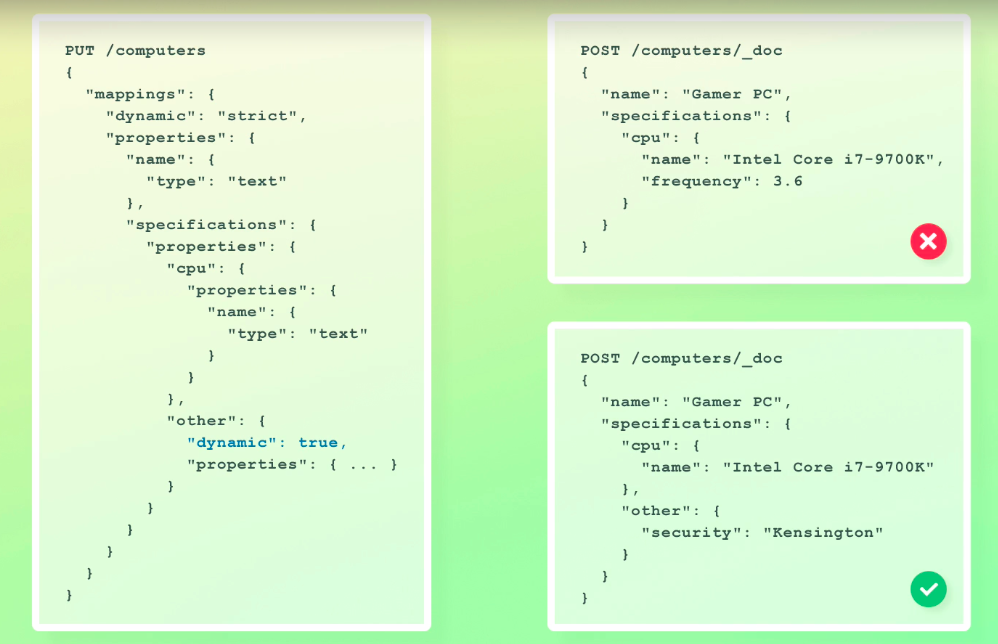
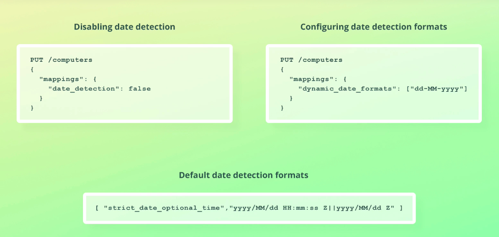

# Configuring dynamic mapping

Now that you know how dynamic mapping maps values to field mappings by default, let’s take a look at how it can be configured.

The most important thing to know is how to disable dynamic mapping, so that’s where we will start.

I have the same queries prepared as in the previous lecture.

To configure whether dynamic mapping should be enabled or disabled, we can specify a boolean value for the "dynamic" setting within the "mappings" key.

Let’s set it to "false".

## Disable dynamic mapping

```
PUT /people
{
  "mappings": {
    "dynamic": false,
    "properties": {
      "first_name": {
        "type": "text"
      }
    }
  }
}
```

Let’s run the query to add the index again.

Let’s now see what happens when we index a document containing an additional field compared to the mapping.

## Index a test document

```
POST /people/_doc
{
  "first_name": "Bo",
  "last_name": "Andersen"
}
```

The document is indexed just fine.

```
{
  "_index" : "people",
  "_type" : "_doc",
  "_id" : "68JmSIMBbOy6iyGYmTaa",
  "_version" : 1,
  "result" : "created",
  "_shards" : {
    "total" : 2,
    "successful" : 1,
    "failed" : 0
  },
  "_seq_no" : 0,
  "_primary_term" : 1
}
```

That’s probably not what you expected.

Didn’t we just disable dynamic mapping?

 Well, let’s try to retrieve the mapping and see what is going on.

## Retrieve mapping

```
GET /people/_mapping
```

```
{
  "people" : {
    "mappings" : {
      "dynamic" : "false",
      "properties" : {
        "first_name" : {
          "type" : "text"
        }
      }
    }
  }
}
```

We still only see a mapping for the "first_name" field, so something is different this time.

To check what is going on, let’s write a simple search query which searches the "first_name" field.

## Search `first_name` field

```
GET /people/_search
{
  "query": {
    "match": {
      "first_name": "Bo"
    }
  }
}
```

```
{
  "took" : 916,
  "timed_out" : false,
  "_shards" : {
    "total" : 1,
    "successful" : 1,
    "skipped" : 0,
    "failed" : 0
  },
  "hits" : {
    "total" : {
      "value" : 1,
      "relation" : "eq"
    },
    "max_score" : 0.2876821,
    "hits" : [
      {
        "_index" : "people",
        "_type" : "_doc",
        "_id" : "68JmSIMBbOy6iyGYmTaa",
        "_score" : 0.2876821,
        "_source" : {
          "first_name" : "Bo",
          "last_name" : "Andersen"
        }
      }
    ]
  }
}
```

Within the results, we can see that the document was indexed just fine and that it contains both of the fields that we specified.

Let’s make a copy of the search request and search the "last_name" field instead.

## Search `last_name` field

```
GET /people/_search
{
  "query": {
    "match": {
      "last_name": "Andersen"
    }
  }
}
```

```
{
  "took" : 2,
  "timed_out" : false,
  "_shards" : {
    "total" : 1,
    "successful" : 1,
    "skipped" : 0,
    "failed" : 0
  },
  "hits" : {
    "total" : {
      "value" : 0,
      "relation" : "eq"
    },
    "max_score" : null,
    "hits" : [ ]
  }
}
```

The document no longer matches our query.

Alright, so here is the explanation.

Setting the "dynamic" setting to "false" instructs Elasticsearch to ignore new fields.

Notice how I said "ignore" and not "reject".

What happens is that the field is still part of the "_source" object as you saw, but it is not indexed.

Remember that the "_source" object does not represent the data structure that Elasticsearch uses to perform searches.

The "last_name" field is therefore left out of that data structure, being an inverted index since we are dealing with a string value.

That’s why we see the field within the "_source" object, but we are unable to use the field within our queries.

We don’t get an error if we try to do so, because leaving fields out when indexing documents is perfectly valid, which you saw a bit earlier.

The value not being indexed is actually a consequence of no field mapping being added, since we cannot index fields that do not have a mapping.

When dynamic mapping is enabled, a mapping is created automatically before indexing field values.

In this example we disabled that behavior, causing the value to not be indexed.

When the "dynamic" setting is set to "false", new fields must be mapped explicitly if we want the field values to be indexed and thereby searchable.

While this behavior does have its uses, I generally don’t recommend it.

There is a third possible value for the "dynamic" setting besides "true" and "false".

By specifying a string with a value of "strict", Elasticsearch will reject any document that contains an unmapped field.

To index a document, all of its fields must therefore be mapped explicitly.

This behavior is similar to a relational database schema, for instance.

Let’s delete the index and set dynamic mapping to "strict".

## Clean up

```
DELETE /people
```

## Set dynamic mapping to `strict`

```
PUT /people
{
  "mappings": {
    "dynamic": "strict",
    "properties": {
      "first_name": {
        "type": "text"
      }
    }
  }
}
```

Running the index query again, we should get an error.

## Index a test document

```
POST /people/_doc
{
  "first_name": "Bo",
  "last_name": "Andersen"
}
```

```
{
  "error" : {
    "root_cause" : [
      {
        "type" : "strict_dynamic_mapping_exception",
        "reason" : "mapping set to strict, dynamic introduction of [last_name] within [_doc] is not allowed"
      }
    ],
    "type" : "strict_dynamic_mapping_exception",
    "reason" : "mapping set to strict, dynamic introduction of [last_name] within [_doc] is not allowed"
  },
  "status" : 400
}
```

Indeed we get an error stating that the "last_name" field is not allowed because the "dynamic"  setting is set to "strict".

Inheritance is actually supported for the "dynamic" setting, which gives you fine grained control of dynamic mapping.

## Inheritance for the `dynamic` parameter



The following example sets the `dynamic` parameter to `"strict"` at the root level, but overrides it with a value of 
`true` for the `specifications.other` field mapping.

### Mapping
```
PUT /computers
{
  "mappings": {
    "dynamic": "strict",
    "properties": {
      "name": {
        "type": "text"
      },
      "specifications": {
        "properties": {
          "cpu": {
            "properties": {
              "name": {
                "type": "text"
              }
            }
          },
          "other": {
            "dynamic": true,
            "properties": { ... }
          }
        }
      }
    }
  }
}
```

### Example document (invalid)
```
POST /computers/_doc
{
  "name": "Gamer PC",
  "specifications": {
    "cpu": {
      "name": "Intel Core i7-9700K",
      "frequency": 3.6
    }
  }
}
```

### Example document (OK)
```
POST /computers/_doc
{
  "name": "Gamer PC",
  "specifications": {
    "cpu": {
      "name": "Intel Core i7-9700K"
    },
    "other": {
      "security": "Kensington"
    }
  }
}
```

Suppose that we are indexing computers.

We set dynamic mapping to "strict" at the index level, because we want to be in full control of the mapping.

All of the fields within the index inherit this configuration.

At the top level, this means that both the "name" and "specifications" fields inherit the "dynamic" setting with a value of "strict".

The inheritance works on multiple levels, so the nested "cpu" and "other" fields inherit the setting from its parent field, being the "specifications" field.

Since the "cpu" field has inherited strict mapping, we can only provide a "name" field for this object.

The index query on your screen therefore fails because there is no mapping for the "frequency" field.

Remember that strict dynamic mapping doesn’t change the fact that we can leave out fields when indexing documents; fields may always contain zero or more values regardless of how dynamic mapping is configured.

The "other" field stores many different fields depending on the product, so we cannot map all of the possible fields in advance.

Instead, we can enable dynamic mapping for just that particular field, overriding the inherited value.

Since the "other" field is an object, its properties will inherit this configuration, enabling us to add new fields dynamically.

In this example, we can add a "security" field just fine.

Alright, two more things to cover in this lecture; numeric detection and date detection.

To save a bit of time, I will just be showing these on a couple of diagrams.


## Enabling numeric detection
When enabling numeric detection, Elasticsearch will check the contents of strings to see if they contain only numeric 
values - and map the fields accordingly as either `float` or `long`.


### Mapping
```
PUT /computers
{
  "mappings": {
    "numeric_detection": true
  }
}
```

### Example document
```
POST /computers/_doc
{
  "specifications": {
    "other": {
      "max_ram_gb": "32", # long
      "bluetooth": "5.2" # float
    }
  }
}
```


First, enabling numeric detection is just a matter of setting the "numeric_detection" setting to "true" at the root level of the "mappings" object — exactly as we did with the "dynamic" setting.

When numeric detection is enabled, Elasticsearch will check the contents of strings to see if they contain only numeric values.

If that is the case, the data type of a field will be set to either "float" or "long"  when mapped through dynamic mapping.

Finally, let’s talk about date detection.

## Date detection



### Disabling date detection
```
PUT /computers
{
  "mappings": {
    "date_detection": false
  }
}
```

### Configuring dynamic date formats
```
PUT /computers
{
  "mappings": {
    "dynamic_date_formats": ["dd-MM-yyyy"]
  }
}
```

By default, Elasticsearch inspects string values to look for dates in the following formats.

If there is a match, Elasticsearch will create a "date" field, provided that the field hasn’t been seen before, and that dynamic mapping is enabled.

The field is created using the default date format.

You can disable date detection altogether by setting the "date_detection" setting to "false".

You can also configure the dynamic date formats that are recognized.

This may be useful if you have applications sending dates to Elasticsearch in non-standard formats.

Those were the basic — and probably most common — ways in which you can configure dynamic mapping.

There is another way, though, which we will take a look at in the next lecture.
