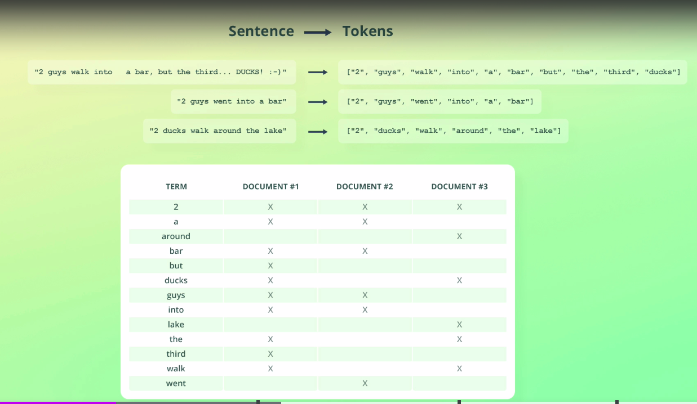

# Understanding inverted indices

Alright, now that you know the basics of text analysis in Elasticsearch, let’s take a look at what actually happens with the result, being the tokens.

A couple of different data structures are used to store field values.

The data structure that is used for a field depends on its data type.

The reason Elasticsearch uses more than one data structure, is to ensure efficient data retrieval for different access patterns.

For example, searching for a given term is handled differently than aggregating data.

Actually these data structures are all handled by Apache Lucene and not Elasticsearch.

I will get back to some of the data structures later, because I want to focus on one in this lecture; namely one called an inverted index.

An inverted index is essentially a mapping between terms and which documents contain them.

Note that by "term," I am referring to the tokens that are emitted by the analyzer.

Generally speaking, the "token" terminology is only used in the context of analyzers, so you will mostly hear me say "terms".

Anyway, let’s take the example from the previous lecture and see how that would be stored within an inverted index.

As you can see, each unique term is placed in the index together with information about which documents contain the term.

This is stored as document IDs internally but illustrated differently on the diagram for simplicity.

Notice how the terms are sorted alphabetically.

This example is for an index with a single document, so that’s of course not very exciting, as each term only appears in one document.

Let’s index a couple of more documents into it and see what the inverted index then looks like.

This made the inverted index just slightly more interesting.

If you want to have a closer look at it, then I encourage you to pause the video for a moment.

I’m sure you can imagine how this index would grow as more documents are indexed.

What makes an inverted index so powerful is how efficient it is to look up a term and find the documents in which the term appears.

Suppose that we perform a search for the term "ducks".

Figuring out which documents contain that term is just a matter of performing a simple lookup in the inverted index.

Doing that, we can see that documents #1 and #3 contain the term.

That makes the process of searching for a term super simple and efficient.

Simple stuff, right?

The reason the index is called an inverted index is just that the more logical mapping would be to have a mapping from documents to the terms they contain, i.e. the other way around.

That doesn’t provide the fast lookups that we need, so that’s why the relationship is inverted.

That’s all there is to the terminology, so it sounds more fancy than it really is.

It should be said, though, that the inverted index you saw was a slight simplification.

The inverted indices that are stored within Apache Lucene contain a bit more information, such as data that is used for relevance scoring.

As you can imagine, we don’t just want to get the documents back that contain a given term; we also want them to be ranked by how well they match.

That’s a topic for later in the course, so we will get to that.

Now you know the basics of what an inverted index is.

The examples that I showed you were just for a couple of sentences assumed to belong to the same field.

What happens if we index documents containing a number of different fields?

Are all the values stored within the same inverted index, or what happens?

An inverted index is actually created for each text field, meaning that we will have two inverted indices in this example; one for the "name" field, and one for the "description" field.

The text is analyzed and stored in the same way as you just saw, so the key thing here is to understand that an inverted index exists within the scope of a field.

You can see the two inverted indices that would be created.

Go ahead and pause the video if you want to take a closer look at it.

But why did I say that there will be one inverted index per text field?

That’s because fields with other data types use different data structures.

For example, numeric, date, and geospatial fields are all stored as BKD trees, because this data structure is very efficient for geospatial and numeric range queries.

Dates are included because dates are actually stored as "long" values internally, but I will get back to that in a couple of lectures.

Alright, let’s take a short moment to recap on what we covered in this lecture, because it’s super important.

When text fields are analyzed, the resulting terms are placed into an inverted index.

This happens for every "text" field, so each field has a dedicated inverted index.

An inverted index is a sorted mapping of the unique terms from all documents containing a value for a given field, to which documents contain those terms.

Inverted indices are created and maintained by Apache Lucene, which Elasticsearch builds on top of.

Having an inverted index, it is super efficient to run a query that asks the question: "Which documents contain the term X?"

An inverted index contains more information than this mapping, but we will get to that later in the course.

Inverted indices is one of the data structures that Elasticsearch uses, but other data structures are used as well.

For example, numeric values and geospatial data is stored within BKD trees.

We will get to some of the data structures later in the course, but for now the important thing is to understand the basics of what an inverted index is.