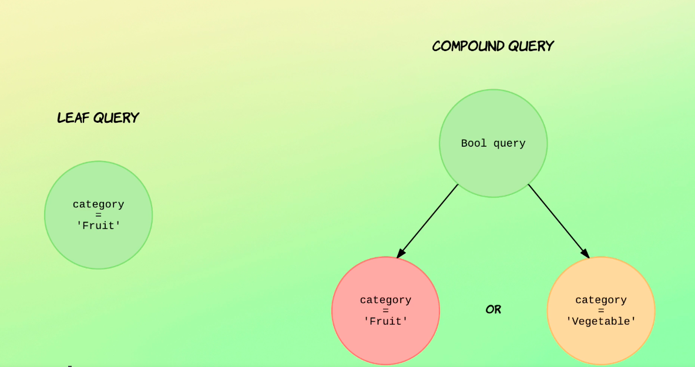

## Introducing the Query DSL

Now that you saw the very basics of searching with the request UI, let's turn our attention to the query dstl.

The way we use to query Dstl is by specifying the search query within a JSON object instead of in the request uri.

This is similar to what we did when we added and updated documents, although the structure of the object is of course different.




There are two main groups of queries in the query DSL, live queries and compound queries.

The terminology is not so important to remember.

The basic idea is that live queries search for values within particular fields, whereas compound queries consists of multiple leaf queries or compound queries themselves.

Compound crews are therefore recursive in nature.

An example of a leaf query could be to search for documents with a category of fruit.

As you see on the diagram, an example of a compound query could be to wrap two leaf queries with a pull query and match documents with a category of fruit or vegetable.

As you can see, a number of leaf queries can be wrapped by a compound query.

We could make a more complex query by adding more leaf queries to the pull query, or we could even nest other compound queries within the bool query.

I'll get back to Boolean queries a bit later in the course, but this was just to give you an example of a compound query so that you can see the difference between those and leaf queries.

Enough talking.

Let's get to business and write our first search query using the query dstl.

## Matching all documents

```
GET /products/_search
{
  "query": {
    "match_all": {}
  }
}
```
The request UI will be the same as when performing crude string searches, except there is no query parameters when searching with the query dstl.

So again, we'll use the jet HTTP verb and the index name and the type and the search API.

On the next line we'll add the query with an adjacent object and within a nested object named query.

Within this object is where we'll be defining the query.

The general structure for defining searches is to specify the name of the query as a key and the value of the query definition as the value.

So start out slow.

Let's use the simplest possible query to match all query.

It does exactly what its name implies matches all documents.

So like I said, as the key will enter the name of the query which will be match all in this case.

Now this particular query being matched all does need in configuration, but this is not the case for other query types, as you'll see soon.

So let's just go ahead and run the query.
```
{
  "took" : 2,
  "timed_out" : false,
  "_shards" : {
    "total" : 1,
    "successful" : 1,
    "skipped" : 0,
    "failed" : 0
  },
  "hits" : {
    "total" : {
      "value" : 1000,
      "relation" : "eq"
    },
    "max_score" : 1.0,
    "hits" : [
      {
        "_index" : "products",
        "_type" : "_doc",
        "_id" : "1",
        "_score" : 1.0,
        "_ignored" : [
          "description.keyword"
        ],
        "_source" : {
          "name" : "Wine - Maipo Valle Cabernet",
          "price" : 152,
          "in_stock" : 38,
          "sold" : 47,
          "tags" : [
            "Beverage",
            "Alcohol",
            "Wine"
          ],
          "description" : "Aliquam augue quam, sollicitudin vitae, consectetuer eget, rutrum at, lorem. Integer tincidunt ante vel ipsum. Praesent blandit lacinia erat. Vestibulum sed magna at nunc commodo placerat. Praesent blandit. Nam nulla. Integer pede justo, lacinia eget, tincidunt eget, tempus vel, pede. Morbi porttitor lorem id ligula".,
          "is_active" : true,
          "created" : "2004/05/13"
        }
      },
      {
        "_index" : "products",
        "_type" : "_doc",
        "_id" : "2",
        "_score" : 1.0,
        "_ignored" : [
          "description.keyword"
        ],
        "_source" : {
          "name" : "Tart Shells - Savory",
          "price" : 99,
          "in_stock" : 10,
          "sold" : 430,
          "tags" : [ ],
          "description" : "Pellentesque at nulla. Suspendisse potenti. Cras in purus eu magna vulputate luctus. Cum sociis natoque penatibus et magnis dis parturient montes, nascetur ridiculus mus. Vivamus vestibulum sagittis sapien. Cum sociis natoque penatibus et magnis dis parturient montes, nascetur ridiculus mus. Etiam vel augue. Vestibulum rutrum rutrum neque. Aenean auctor gravida sem".,
          "is_active" : true,
          "created" : "2007/10/14"
        }
      },
      {
        "_index" : "products",
        "_type" : "_doc",
        "_id" : "3",
        "_score" : 1.0,
        "_source" : {
          "name" : "Chorizo and sausage pasta",
          "price" : 25,
          "in_stock" : 24,
          "sold" : 215,
          "tags" : [
            "Pasta",
            "Meat"
          ],
          "description" : "Fresh egg pasta in a sauce made from Spanish chorizo and Cumberland sausage",
          "is_active" : true,
          "created" : "2000/11/17"
        }
      },
      {
        "_index" : "products",
        "_type" : "_doc",
        "_id" : "4",
        "_score" : 1.0,
        "_source" : {
          "name" : "Martini Glass",
          "price" : 37,
          "in_stock" : 37,
          "sold" : 477,
          "tags" : [ ],
          "description" : "In the mood for a martini, or perhaps a cosmopolitan?",
          "is_active" : false,
          "created" : "2008/08/17"
        }
      },
      {
        "_index" : "products",
        "_type" : "_doc",
        "_id" : "5",
        "_score" : 1.0,
        "_source" : {
          "name" : "Venison - Liver",
          "price" : 87,
          "in_stock" : 24,
          "sold" : 261,
          "tags" : [ ],
          "description" : "Etiam pretium iaculis justo. In hac habitasse platea dictumst. Etiam faucibus cursus urna. Ut tellus".,
          "is_active" : false,
          "created" : "2002/04/26"
        }
      },
      {
        "_index" : "products",
        "_type" : "_doc",
        "_id" : "6",
        "_score" : 1.0,
        "_source" : {
          "name" : "Nestea - Iced Tea",
          "price" : 121,
          "in_stock" : 23,
          "sold" : 431,
          "tags" : [
            "Beverage"
          ],
          "description" : "Donec ut mauris eget massa tempor convallis. Nulla neque libero, convallis eget, eleifend luctus, ultricies eu, nibh. Quisque id justo sit amet sapien dignissim vestibulum".,
          "is_active" : true,
          "created" : "2011/11/06"
        }
      },
      {
        "_index" : "products",
        "_type" : "_doc",
        "_id" : "7",
        "_score" : 1.0,
        "_source" : {
          "name" : "Beets - Pickled",
          "price" : 172,
          "in_stock" : 25,
          "sold" : 290,
          "tags" : [
            "Vegetable",
            "Beets"
          ],
          "description" : "Aliquam erat volutpat. In congue. Etiam justo. Etiam pretium iaculis justo. In hac habitasse platea dictumst. Etiam faucibus cursus urna. Ut tellus. Nulla ut erat id mauris vulputate elementum".,
          "is_active" : false,
          "created" : "2008/09/20"
        }
      },
      {
        "_index" : "products",
        "_type" : "_doc",
        "_id" : "8",
        "_score" : 1.0,
        "_source" : {
          "name" : "Energy Drink Red Bull",
          "price" : 153,
          "in_stock" : 25,
          "sold" : 6,
          "tags" : [
            "Beverage"
          ],
          "description" : "Duis consequat dui nec nisi volutpat eleifend. Donec ut dolor. Morbi vel lectus in quam fringilla rhoncus. Mauris enim leo, rhoncus sed, vestibulum sit amet, cursus id, turpis".,
          "is_active" : false,
          "created" : "2017/05/17"
        }
      },
      {
        "_index" : "products",
        "_type" : "_doc",
        "_id" : "9",
        "_score" : 1.0,
        "_ignored" : [
          "description.keyword"
        ],
        "_source" : {
          "name" : "Onions - Green",
          "price" : 105,
          "in_stock" : 22,
          "sold" : 199,
          "tags" : [
            "Vegetable"
          ],
          "description" : "Ut at dolor quis odio consequat varius. Integer ac leo. Pellentesque ultrices mattis odio. Donec vitae nisi. Nam ultrices, libero non mattis pulvinar, nulla pede ullamcorper augue, a suscipit nulla elit ac nulla. Sed vel enim sit amet nunc viverra dapibus. Nulla suscipit ligula in lacus. Curabitur at ipsum ac tellus semper interdum. Mauris ullamcorper purus sit amet nulla. Quisque arcu libero, rutrum ac, lobortis vel, dapibus at, diam".,
          "is_active" : false,
          "created" : "2005/08/01"
        }
      },
      {
        "_index" : "products",
        "_type" : "_doc",
        "_id" : "10",
        "_score" : 1.0,
        "_source" : {
          "name" : "Ecolab - Hobart Washarm End Cap",
          "price" : 24,
          "in_stock" : 25,
          "sold" : 96,
          "tags" : [ ],
          "description" : "In sagittis dui vel nisl. Duis ac nibh. Fusce lacus purus, aliquet at, feugiat non, pretium quis, lectus. Suspendisse potenti".,
          "is_active" : true,
          "created" : "2006/12/26"
        }
      }
    ]
  }
}
```

And looking at the results, we can see that all 1000 documents have been matched by the query, which is, of course, what we expected.

But what do all of those fields within the search results mean anyways?

That's what we'll be looking at in the next lecture.

Now that we have written our first search query with the query DSL.