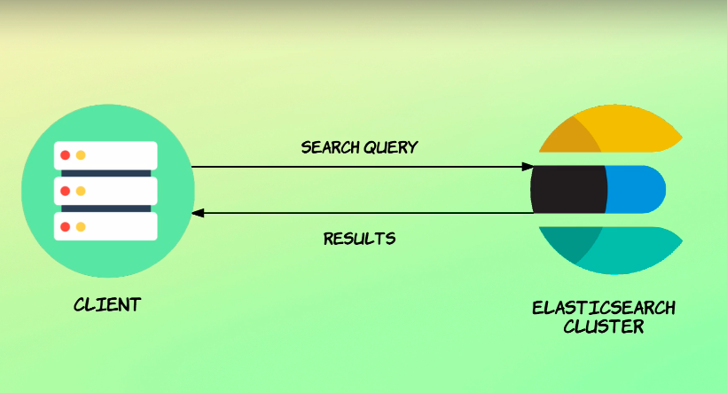
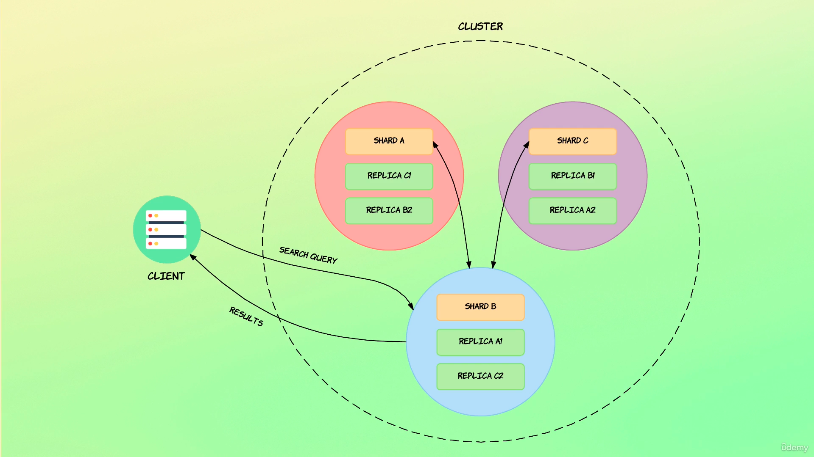

## How searching works

Now that you know how Elasticsearch handles modifying data in a replicated setup, let’s see how it searches for data.

Let’s begin with what you will typically see as a developer running search queries towards an Elasticsearch cluster.

You have some kind of client, which will often be a server.

That client communicates with the Elasticsearch cluster by sending search queries over HTTP.

The cluster then does its magic based on the index and query that you have specified in the HTTP request.

When the results are ready, the cluster responds with the results, and the client can use the results for whatever purpose.

For a lot of people, that’s all they really need to know.

If you just need to run some queries against an Elasticsearch cluster, then this may be sufficient for you, because in that case you are mostly concerned with writing the queries and not how Elasticsearch gathers the results internally.

That being said, I have always been a fan of digging a bit deeper and understanding the tools that you use, because this will often be helpful in the long run.

Let’s therefore take a peek inside the cluster and see what happens when it receives a search query.

Suppose we have a cluster consisting of three nodes containing one index distributed across three shards - shard A, B and C. Each shard has two replicas, so each replication group consists of a primary shard and two replicas.

Then suppose that a client sends a search query to the cluster which ends up on the node containing Shard B.

This node is now the so-called "coordinating node," meaning that this node is responsible for sending queries to other nodes, assembling the results and responding to the client.

So basically coordinating the query, hence the name "coordinating node".

By default, every node may act as the coordinating node and may receive HTTP requests as I mentioned a bit earlier.

Since the coordinating node itself contains a shard which should be searched, the node will perform the query itself.

This may not be the case in other scenarios, but since we only have one index, this will always be the case.

The coordinating node then broadcasts the request to every other shard in the index, being either a primary shard or a replica shard.

In this example I have just shown that the primary shards receive the requests, i.e. Shard A and C, but this could just as well have been replicas for the shards.

Also note that how the coordinating node determines which shards - and thereby nodes - the request should be sent to, is outside the scope of this lecture, so that’s not something that we will look at for now.

Right now, the important thing is to understand the flow of search queries, more than to understand every detail.

When the other shards respond with each of their results, the coordinating node merges them together and sorts them, and lastly returns the results to the client.

Just to quickly repeat the steps to make sure that it is clear.

A search query hits a given node within the cluster.

This node becomes the coordinating node for the query.

It broadcasts the request to all shards in the index that the query refers to.

This can be both primary shards and replica shards.

These shards then respond with the results, and the coordinating node will merge all of the results together into a single result, which is then returned to the client.

As a last thing, I just want to mention that the approach is different if you retrieve a single document by its ID.

When doing this, the request is routed to the appropriate shard instead of being broadcasted to all of the index’ shards.

In the next lecture, I will briefly explain how routing works at a high level.