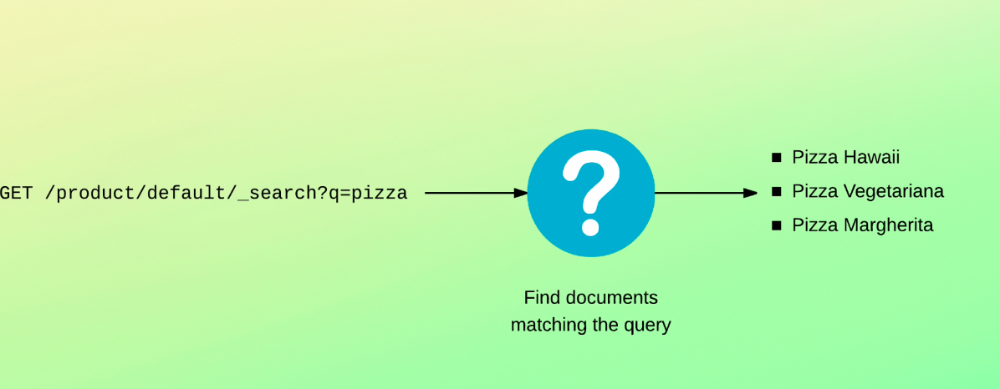
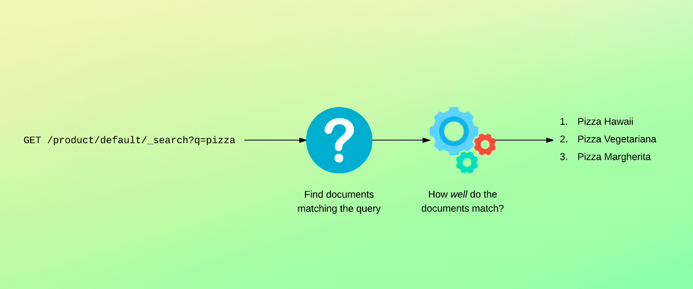
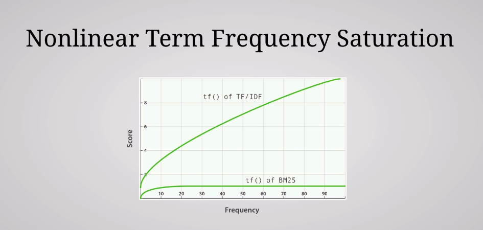

## Understanding relevance scores

We just took a look at some search results which included an underscore score fields for each document.

I already mentioned that search results are ordered by relevance with the most relevant matches being placed first within the search results.

Being able to search results based on relevance is necessary because we're not just interested in including documents that match, but also providing people with relevant results.



This is generally in contrast with database systems such as relational databases, because the return rows that match they don't have to determine how well a row matches Elasticsearch does.



This end determines the relevance of matches.

So before calculating the relevance of matches, Elasticsearch will determine if document matched the query in the first place by using a so called Boolean model.

This is, of course, to avoid having to compute relevant scores for documents that won't be part of the results anyways.

The relevance is, as you have seen, represented with an underscore score field which holds a floating point number.

Now I want to dive a bit deeper into how Elasticsearch calculates the score for matches to a search query.

How this is done differs depending on the type of search query, and you can even change the algorithms yourself.

But I will give you an overall introduction to how it works.

Until fairly recently, Elasticsearch has made use of an algorithm named F slash IDF short for term

frequency.

Inverse document frequency.

Now an algorithm named Okapi BM 25 is used.

This algorithm does share many similarities with the older one, so I will explain how the old algorithm works and then explain the differences that BM 25 adds.

So let's go through some of the factors used when calculating scores.

First, we have something called the term frequency.

It looks at how many times a given term appears in the field that we are searching for a particular document.

The more times the term appears, the more relevant the document is, at least for that term.

For instance, suppose that we have a title field containing the term salad two times, which is the term that we're searching for.

This indicates a higher relevance than if the term salad only appeared once or if it didn't appear in that field at all.

So the more times a term appears within the field, the higher the relevance score.

The second factor is the inverse document frequency.

This refers to how often a term appears within the index.

An example would be how many times the term salad appears within the product index.

The more often the term appears, the lower the score and relevance.

The logic here is that if a term appears in many documents, then it has a lower weight.

This means the words that appear many times are less significant, such as the words der, this, if, etc..

So if a document contains the term and it's not a common term for the field, then this is a signal that the document is relevant.

The first factor is called field length norm.

This simply refers to how long the field is.

The longer the field, the less likely the word within the field are to be relevant.

For example, the term salad in a title of 50 characters is more significant than in a 5000 character description.

Therefore, a term appearing in a short field has more weight than in a long field.

The term frequency, inverse document frequency and field length norm are calculated and stored at index time, i.e. when a document is added or updated.

These stored values are then used to calculate the weight of a given term for particular documents.

Individual queries may include other factors for calculating the score of a match, such as the term proximity or fussiness, for accounting for typos, both of which I'll get back to later in the course.

Those were the basics of the TTF slash IDF algorithm.

Of course, there is more theory to it than this, but let's now turn our attention to how the BM 25 algorithm compares.

For that, we need a bit of context, particularly stop words which we discussed in the previous sections.

Just to refresh your memory.

Stop words are the words that appear many times in documents and provide little input as to how relevant the document is in relation to a search query.

So why am I talking about stop words now?

Because it used to be common practice to remove stop words when analysing text fields, with the reasoning being that they didn't provide any clues for calculating the relevance anyways.

That has since changed because although the value of the stop words are limited, they do have some value.

It's therefore no longer very common to remove stop words.

Which is also why you see the stop token filter being disabled by default for the standard analyzer.

The relevance algorithm then needs to handle this because otherwise we would see the weight of stop words being boosted artificially for large fields that contain many of them.

For example.

A document containing the text of a book will have lots of stop words for fields because the contents will be lodged with the F slash IDF algorithm.

This would often lead to the stop words being boosted more than they should because they occur so many times.



Beam 25, solves this problem by using something super fancy called nonlinear term frequency saturation.

Wow.

That sounded amazing, didn't it?

Luckily, understanding it is nowhere near as complex as it sounds.

The idea is that PM 25 has an upper limit for how much a term can be boosted based on how many times it occurs.

If a term appears 5 to 10 times, it has a significantly larger impact on the relevance than if it just occurred once or twice.

But as the number of occurrences increase, the relevance boost quickly becomes less significant, meaning that the boost for a term that appears 1000 times will almost be the same as if it occurred 30 times,

for example.

You can see this on a diagram.

Would it be m 25 line quickly flattens out while the line for the TF slash IDF algorithm is pretty much linear except for in the beginning.

What this means is that we can keep stop words around because they will not cause problems when calculating relevant scores as they would with the previous algorithm.

Next, we talked about the so called field length norm, which the PM 25 algorithm also improves.

Instead of just treating a field in the same way across all documents, the PM 25 algorithm considers each field separately.

It does this by taking the average field length into account, meaning that it can distinguish a short title field from a long title field, for instance.

Apart from that, you can also configure PM 25 by tuning two parameters, but I won't get into that now.

These improvements may seem subtle, but relevant scoring is something that needs a lot of tweaking and these improvements are actually quite significant, even if they might not sound so impressive.

So just to recap, by default, relevance scores are calculated by taking the term frequency into consideration, i.e. how often the term appears within the particular field.

The more often, the more relevant the document is.

The inverse document frequency looks at how often a given term occurs for a particular field within the index.

So all of the indexes documents.

The more times the term appears, the less relevant the match will be considered.

The third factor is the field length.

The shorter the field, the more significant the term is considered.

This recap was a simplification as the PM 25 algorithm expands a bit on that, but that's the basic idea anyways.

Before ending this lecture, I want to mention two more things.

First, you will see that there are ways in which you can change the relevance by affecting the scoring within queries, but it's also possible to change how Elasticsearch calculates the scores.

That being said, that gets very advanced, and it's rare that you would need to do so.

I won't get into that because I strongly discouraged that you get into that unless you really know what you're doing.

The reason is that it's advanced, but also that you will often find yourself constantly tweaking the relevance, oftentimes without actually getting anywhere before telling you the second thing, I want to show you a query within the console.

```
GET /products/_search
{
  "explain": true,
  "query": {
    "term": {
      "name": "lobster"
    }
  }
}
```

Although it's a query with a syntax you haven't seen before, it's pretty

straightforward.

It searches the name field for value of lobster.

What I want to do is to add a query parameter named explained to the query.

So I'll just add the explain query parameter here.

What this does is that Elasticsearch will return detailed information on how it calculated the score

for each matching document.

So if I run a query, you'll see what I mean.
```
{
  "took" : 16,
  "timed_out" : false,
  "_shards" : {
    "total" : 1,
    "successful" : 1,
    "skipped" : 0,
    "failed" : 0
  },
  "hits" : {
    "total" : {
      "value" : 5,
      "relation" : "eq"
    },
    "max_score" : 5.8983326,
    "hits" : [
      {
        "_shard" : "[products][0]",
        "_node" : "QPJSc3mFRT2VbESDqEB5Bw",
        "_index" : "products",
        "_type" : "_doc",
        "_id" : "19",
        "_score" : 5.8983326,
        "_ignored" : [
          "description.keyword"
        ],
        "_source" : {
          "name" : "Lobster - Live",
          "price" : 79,
          "in_stock" : 43,
          "sold" : 370,
          "tags" : [
            "Meat",
            "Seafood"
          ],
          "description" : "Integer non velit. Donec diam neque, vestibulum eget, vulputate ut, ultrices vel, augue. Vestibulum ante ipsum primis in faucibus orci luctus et ultrices posuere cubilia Curae; Donec pharetra, magna vestibulum aliquet ultrices, erat tortor sollicitudin mi, sit amet lobortis sapien sapien non mi. Integer ac neque. Duis bibendum. Morbi non quam nec dui luctus rutrum".,
          "is_active" : false,
          "created" : "2007/08/10"
        },
        "_explanation" : {
          "value" : 5.8983326,
          "description" : "weight(name:lobster in 18) [PerFieldSimilarity], result of:",
          "details" : [
            {
              "value" : 5.8983326,
              "description" : "score(freq=1.0), computed as boost * idf * tf from:",
              "details" : [
                {
                  "value" : 2.2,
                  "description" : "boost",
                  "details" : [ ]
                },
                {
                  "value" : 5.2040067,
                  "description" : "idf, computed as log(1 + (N - n + 0.5) / (n + 0.5)) from:",
                  "details" : [
                    {
                      "value" : 5,
                      "description" : "n, number of documents containing term",
                      "details" : [ ]
                    },
                    {
                      "value" : 1000,
                      "description" : "N, total number of documents with field",
                      "details" : [ ]
                    }
                  ]
                },
                {
                  "value" : 0.51519156,
                  "description" : "tf, computed as freq / (freq + k1 * (1 - b + b * dl / avgdl)) from:",
                  "details" : [
                    {
                      "value" : 1.0,
                      "description" : "freq, occurrences of term within document",
                      "details" : [ ]
                    },
                    {
                      "value" : 1.2,
                      "description" : "k1, term saturation parameter",
                      "details" : [ ]
                    },
                    {
                      "value" : 0.75,
                      "description" : "b, length normalization parameter",
                      "details" : [ ]
                    },
                    {
                      "value" : 2.0,
                      "description" : "dl, length of field",
                      "details" : [ ]
                    },
                    {
                      "value" : 2.808,
                      "description" : "avgdl, average length of field",
                      "details" : [ ]
                    }
                  ]
                }
              ]
            }
          ]
        }
      },
      {
        "_shard" : "[products][0]",
        "_node" : "QPJSc3mFRT2VbESDqEB5Bw",
        "_index" : "products",
        "_type" : "_doc",
        "_id" : "55",
        "_score" : 5.0624013,
        "_source" : {
          "name" : "Lobster - Baby Boiled",
          "price" : 134,
          "in_stock" : 41,
          "sold" : 207,
          "tags" : [
            "Meat",
            "Seafood"
          ],
          "description" : "Nulla tellus. In sagittis dui vel nisl. Duis ac nibh. Fusce lacus purus, aliquet at, feugiat non, pretium quis, lectus. Suspendisse potenti. In eleifend quam a odio".,
          "is_active" : false,
          "created" : "2016/01/19"
        },
        "_explanation" : {
          "value" : 5.0624013,
          "description" : "weight(name:lobster in 54) [PerFieldSimilarity], result of:",
          "details" : [
            {
              "value" : 5.0624013,
              "description" : "score(freq=1.0), computed as boost * idf * tf from:",
              "details" : [
                {
                  "value" : 2.2,
                  "description" : "boost",
                  "details" : [ ]
                },
                {
                  "value" : 5.2040067,
                  "description" : "idf, computed as log(1 + (N - n + 0.5) / (n + 0.5)) from:",
                  "details" : [
                    {
                      "value" : 5,
                      "description" : "n, number of documents containing term",
                      "details" : [ ]
                    },
                    {
                      "value" : 1000,
                      "description" : "N, total number of documents with field",
                      "details" : [ ]
                    }
                  ]
                },
                {
                  "value" : 0.44217688,
                  "description" : "tf, computed as freq / (freq + k1 * (1 - b + b * dl / avgdl)) from:",
                  "details" : [
                    {
                      "value" : 1.0,
                      "description" : "freq, occurrences of term within document",
                      "details" : [ ]
                    },
                    {
                      "value" : 1.2,
                      "description" : "k1, term saturation parameter",
                      "details" : [ ]
                    },
                    {
                      "value" : 0.75,
                      "description" : "b, length normalization parameter",
                      "details" : [ ]
                    },
                    {
                      "value" : 3.0,
                      "description" : "dl, length of field",
                      "details" : [ ]
                    },
                    {
                      "value" : 2.808,
                      "description" : "avgdl, average length of field",
                      "details" : [ ]
                    }
                  ]
                }
              ]
            }
          ]
        }
      },
      {
        "_shard" : "[products][0]",
        "_node" : "QPJSc3mFRT2VbESDqEB5Bw",
        "_index" : "products",
        "_type" : "_doc",
        "_id" : "373",
        "_score" : 4.4339995,
        "_ignored" : [
          "description.keyword"
        ],
        "_source" : {
          "name" : "Appetizer - Lobster Phyllo Roll",
          "price" : 153,
          "in_stock" : 32,
          "sold" : 92,
          "tags" : [
            "Meat",
            "Seafood"
          ],
          "description" : "Ut tellus. Nulla ut erat id mauris vulputate elementum. Nullam varius. Nulla facilisi. Cras non velit nec nisi vulputate nonummy. Maecenas tincidunt lacus at velit. Vivamus vel nulla eget eros elementum pellentesque. Quisque porta volutpat erat. Quisque erat eros, viverra eget, congue eget, semper rutrum, nulla. Nunc purus".,
          "is_active" : true,
          "created" : "2012/10/10"
        },
        "_explanation" : {
          "value" : 4.4339995,
          "description" : "weight(name:lobster in 372) [PerFieldSimilarity], result of:",
          "details" : [
            {
              "value" : 4.4339995,
              "description" : "score(freq=1.0), computed as boost * idf * tf from:",
              "details" : [
                {
                  "value" : 2.2,
                  "description" : "boost",
                  "details" : [ ]
                },
                {
                  "value" : 5.2040067,
                  "description" : "idf, computed as log(1 + (N - n + 0.5) / (n + 0.5)) from:",
                  "details" : [
                    {
                      "value" : 5,
                      "description" : "n, number of documents containing term",
                      "details" : [ ]
                    },
                    {
                      "value" : 1000,
                      "description" : "N, total number of documents with field",
                      "details" : [ ]
                    }
                  ]
                },
                {
                  "value" : 0.38728893,
                  "description" : "tf, computed as freq / (freq + k1 * (1 - b + b * dl / avgdl)) from:",
                  "details" : [
                    {
                      "value" : 1.0,
                      "description" : "freq, occurrences of term within document",
                      "details" : [ ]
                    },
                    {
                      "value" : 1.2,
                      "description" : "k1, term saturation parameter",
                      "details" : [ ]
                    },
                    {
                      "value" : 0.75,
                      "description" : "b, length normalization parameter",
                      "details" : [ ]
                    },
                    {
                      "value" : 4.0,
                      "description" : "dl, length of field",
                      "details" : [ ]
                    },
                    {
                      "value" : 2.808,
                      "description" : "avgdl, average length of field",
                      "details" : [ ]
                    }
                  ]
                }
              ]
            }
          ]
        }
      },
      {
        "_shard" : "[products][0]",
        "_node" : "QPJSc3mFRT2VbESDqEB5Bw",
        "_index" : "products",
        "_type" : "_doc",
        "_id" : "471",
        "_score" : 4.4339995,
        "_source" : {
          "name" : "Lobster - Tail 6 Oz",
          "price" : 197,
          "in_stock" : 9,
          "sold" : 47,
          "tags" : [
            "Meat",
            "Seafood"
          ],
          "description" : "Aenean lectus. Pellentesque eget nunc. Donec quis orci eget orci vehicula condimentum. Curabitur in libero ut massa volutpat convallis. Morbi odio odio, elementum eu, interdum eu, tincidunt in, leo".,
          "is_active" : true,
          "created" : "2014/10/01"
        },
        "_explanation" : {
          "value" : 4.4339995,
          "description" : "weight(name:lobster in 470) [PerFieldSimilarity], result of:",
          "details" : [
            {
              "value" : 4.4339995,
              "description" : "score(freq=1.0), computed as boost * idf * tf from:",
              "details" : [
                {
                  "value" : 2.2,
                  "description" : "boost",
                  "details" : [ ]
                },
                {
                  "value" : 5.2040067,
                  "description" : "idf, computed as log(1 + (N - n + 0.5) / (n + 0.5)) from:",
                  "details" : [
                    {
                      "value" : 5,
                      "description" : "n, number of documents containing term",
                      "details" : [ ]
                    },
                    {
                      "value" : 1000,
                      "description" : "N, total number of documents with field",
                      "details" : [ ]
                    }
                  ]
                },
                {
                  "value" : 0.38728893,
                  "description" : "tf, computed as freq / (freq + k1 * (1 - b + b * dl / avgdl)) from:",
                  "details" : [
                    {
                      "value" : 1.0,
                      "description" : "freq, occurrences of term within document",
                      "details" : [ ]
                    },
                    {
                      "value" : 1.2,
                      "description" : "k1, term saturation parameter",
                      "details" : [ ]
                    },
                    {
                      "value" : 0.75,
                      "description" : "b, length normalization parameter",
                      "details" : [ ]
                    },
                    {
                      "value" : 4.0,
                      "description" : "dl, length of field",
                      "details" : [ ]
                    },
                    {
                      "value" : 2.808,
                      "description" : "avgdl, average length of field",
                      "details" : [ ]
                    }
                  ]
                }
              ]
            }
          ]
        }
      },
      {
        "_shard" : "[products][0]",
        "_node" : "QPJSc3mFRT2VbESDqEB5Bw",
        "_index" : "products",
        "_type" : "_doc",
        "_id" : "500",
        "_score" : 3.9443793,
        "_source" : {
          "name" : "Lobster - Tail 3 - 4 Oz",
          "price" : 46,
          "in_stock" : 33,
          "sold" : 188,
          "tags" : [
            "Meat",
            "Seafood"
          ],
          "description" : "Integer a nibh. In quis justo. Maecenas rhoncus aliquam lacus. Morbi quis tortor id nulla ultrices aliquet. Maecenas leo odio, condimentum id, luctus nec, molestie sed, justo. Pellentesque viverra pede ac diam".,
          "is_active" : false,
          "created" : "2015/08/26"
        },
        "_explanation" : {
          "value" : 3.9443793,
          "description" : "weight(name:lobster in 499) [PerFieldSimilarity], result of:",
          "details" : [
            {
              "value" : 3.9443793,
              "description" : "score(freq=1.0), computed as boost * idf * tf from:",
              "details" : [
                {
                  "value" : 2.2,
                  "description" : "boost",
                  "details" : [ ]
                },
                {
                  "value" : 5.2040067,
                  "description" : "idf, computed as log(1 + (N - n + 0.5) / (n + 0.5)) from:",
                  "details" : [
                    {
                      "value" : 5,
                      "description" : "n, number of documents containing term",
                      "details" : [ ]
                    },
                    {
                      "value" : 1000,
                      "description" : "N, total number of documents with field",
                      "details" : [ ]
                    }
                  ]
                },
                {
                  "value" : 0.34452295,
                  "description" : "tf, computed as freq / (freq + k1 * (1 - b + b * dl / avgdl)) from:",
                  "details" : [
                    {
                      "value" : 1.0,
                      "description" : "freq, occurrences of term within document",
                      "details" : [ ]
                    },
                    {
                      "value" : 1.2,
                      "description" : "k1, term saturation parameter",
                      "details" : [ ]
                    },
                    {
                      "value" : 0.75,
                      "description" : "b, length normalization parameter",
                      "details" : [ ]
                    },
                    {
                      "value" : 5.0,
                      "description" : "dl, length of field",
                      "details" : [ ]
                    },
                    {
                      "value" : 2.808,
                      "description" : "avgdl, average length of field",
                      "details" : [ ]
                    }
                  ]
                }
              ]
            }
          ]
        }
      }
    ]
  }
}
```

So scrolling down a bit, you will see a new property named underscore explanation.

I won't get into the details of what all of this means because the syntax is a bit clunky.

But I want to focus your attention on the part that mentions the document count.

Notice how it says 196.

Even though there are 5000 documents in the index.

This is because the free factors that I mentioned earlier are actually on a per share basis.

This means that when determining how many documents contain a given term, for instance, 
then this will be based on the documents that are stored within this chart that stores the matching documents, because our index has five charts by default, and the relevance chart for this particular match contains 196 documents.

The relevance will be based on these documents and not all of the 1000 documents.

So does this make any difference?

It does, because the statistics that are used for calculating the relevance differ between the sets.

Unless you use custom routing, the document count will be pretty much the same across the charts.

But the inverse document frequency may not be entirely accurate.

That's because how many times the term occurs within the index depends on the documents on a particular chart.

What if one charts only contains one document with the term salad and another chart contains ten such documents that would affect the relevance and make it slightly less accurate.

Although the chances of this being significant are lower, the more documents you add per chart.

In most cases, this is not going to be any problem for you, but I just wanted to mention it anyways.

There are ways to get around it, but that's a more advanced topic that I won't get into for now.

