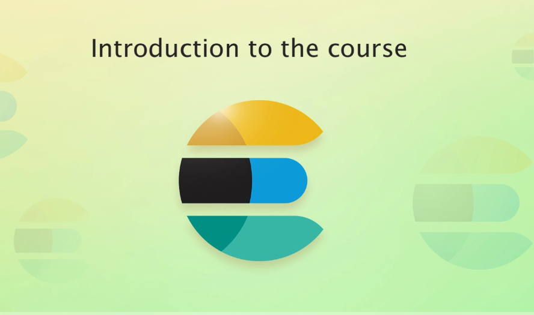

# complete-guide-to-elasticsearch

This repository contains my summary, my comprehension, and all of the queries used within the [Complete Guide to Elasticsearch course](https://l.codingexplained.com/r/elasticsearch-course?src=github) by **Bo Andersen**.

## content

- Introduction
- Adding Boolean Logic to Queries
- Getting Started
- Managing Documents
- Mapping & Analysis
- Introduction to Searching
- Term Level Queries 
- Full Text Queries
- Adding Boolean Logic to Queries
- Joining Queries
- Controlling Query Results
- Aggregations
- Improving Search Results
